This README file describes how to build and use the **iis2iclx_tilt_angle_DT_generator.c** program to generate two decision trees for tilt sensing, how to create from the decision trees a **UCF** configuration file (.ucf) for the **Machine Learning Core (MLC)** of the [**IIS2ICLX**](https://www.st.com/en/mems-and-sensors/iis2iclx.html) and finally how to evaluate the result.

In particular, this tutorial describes the following:

- How to build the *iis2iclx_tilt_angle_DT_generator.c* program
- How to run the program to generate customized decision trees for inclination angle measurement
- How to use the *Unico GUI* to generate a sensor configuration file (*UCF* file) from the previously generated decision tree files
- How to use the *UCF file* and evaluate the MLC results


## **Software**

The main and mandatory software tool for this tutorial is [**Unico GUI**](https://www.st.com/en/development-tools/unico-gui.html), a graphical user interface (available for Linux, MacOS and Windows) that supports the **ProfiMEMSTool** motherboard and allows building an **MLC** program (even without any board connected = offline mode) and generating a sensor configuration file (**UCF** file).

For the tutorial it is also necessary to install a C compiler. This tutorial describes the procedure of compilation with the GCC compiler on Windows (using [**Cygwin**](https://www.cygwin.com/)). Please note that the Cygwin *bin* directory (typically "*C:\cygwin64\bin*") should be added to the Windows PATH environment variable. Successful GCC installation can be checked by writing the `gcc -v` command in the Windows Command prompt (it should display the GCC configuration and its version).

To further evaluate the output of this tutorial, it is worth mentioning the following software tools:
- [**Unicleo-GUI**](https://www.st.com/en/development-tools/unicleo-gui.html), a PC application that supports **STM32 Nucleo boards** coupled with an STM32 Nucleo **MEMS expansion board** for data visualization and demonstration of functionality of ST sensors and algorithms.
- [**AlgoBuilder**](https://www.st.com/content/st_com/en/products/embedded-software/mems-and-sensors-software/inemo-engine-software-libraries/algobuilder.html), a PC application to design a custom processing flow and build the firmware for STM32 Nucleo boards coupled with the MEMS expansions boards, or for form-factor evaluation boards such as the [SensorTile.box](https://www.st.com/en/evaluation-tools/steval-mksbox1v1.html) or the [STWIN](https://www.st.com/en/evaluation-tools/steval-stwinkt1b.html).
- [**X-CUBE-MEMS1**](https://www.st.com/en/embedded-software/x-cube-mems1.html), an expansion software package for **STM32 Nucleo boards** that includes drivers, various sensor sample applications and advanced motion libraries.
- [**STM32CubeMX**](https://www.st.com/en/development-tools/stm32cubemx.html), a graphical tool (available for Linux, MacOS and Windows) that allows a very easy configuration of STM32 microcontrollers and microprocessors, as well as the generation of the corresponding initialization C code through a step-by-step process.


## **Hardware**

The [**IIS2ICLX**](https://www.st.com/en/mems-and-sensors/iis2iclx.html), a dual-axis high-accuracy digital inclinometer with embedded Machine Learning Core (MLC), will be used in this tutorial. In particular, the [**STEVAL-MKI209V1K**](https://www.st.com/en/evaluation-tools/steval-mki209v1k.html), a dedicated DIL24 adapter board for the IIS2ICLX is included. The same procedure shown in this tutorial also applies to other ST sensors with MLC support.

ST provides many evaluation boards for ST MEMS sensors. In this case, the following boards are selected, from which the user can select one (utilization of both boards is described in the last section):
1. [**STEVAL-MKI109V3**](https://www.st.com/en/evaluation-tools/steval-mki109v3.html), also known as **ProfiMEMSTool** motherboard, that is compatible with all ST MEMS sensors on a DIL24 adapter board. The board is supported by the **Unico GUI** PC application and is used for sensor performance evaluation.
2. One of our [**STM32 Nucleo boards**](https://www.st.com/en/evaluation-tools/stm32-nucleo-boards.html), for example the [**NUCLEO-F401RE**](https://www.st.com/en/evaluation-tools/nucleo-f401re.html), with a MEMS expansion board, e.g. the [**X-NUCLEO-IKS02A1**](https://www.st.com/en/ecosystems/x-nucleo-iks02a1.html). This set of boards is supported by the **X-CUBE-MEMS1** software package *(only selected Nucleo boards are supported)* and the results can be visualized in **Unicleo-GUI**.

For more hardware details, visit:
- ST resource page on [MEMS sensor](https://www.st.com/mems)
- ST resource page on [Explore Machine Learning Core in MEMS sensors](https://www.st.com/content/st_com/en/campaigns/machine-learning-core.html)
- Application note [AN5536](https://www.st.com/resource/en/application_note/an5536-iis2iclx-machine-learning-core-stmicroelectronics.pdf) on the Machine Learning Core embedded in the [IIS2ICLX](https://www.st.com/en/mems-and-sensors/iis2iclx.html)


# 1. Build the C program

Download the **iis2iclx_tilt_angle_DT_generator.c** file to your PC. The program may be modified according to the user's needs in a text editor. However, in many cases or for a basic evaluation, the program is sufficient without any modifications.

Open the Windows Command Prompt (e.g. press Win+R, type cmd and press the Enter key) and go to the folder where the *iis2iclx_tilt_angle_DT_generator.c* is located. For instance, if the file is located in 

*"C:\tilt_angle_dual_plan\angle_customization_script"*, then you can use the following command:

```
cd C:\tilt_angle_dual_plan\angle_customization_script
```

The correct location can be verified by writing the command `dir` or `ls` as shown in the picture below (the *iis2iclx_tilt_angle_DT_generator.c* must be listed):

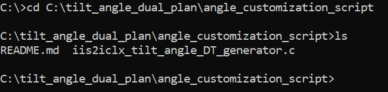

Execute the following command to build the **iis2iclx_tilt_angle_DT_generator.c**:
```
gcc iis2iclx_tilt_angle_DT_generator.c -lm -o iis2iclx_tilt_angle_DT_generator
```

The command creates an executable file in the current folder (in this case "**iis2iclx_tilt_angle_DT_generator.exe**").


# 2. Generate decision trees with the built program
After building the program, you can run it simply with the following command (the default parameter settings will be used):
```
iis2iclx_tilt_angle_DT_generator.exe
```

This program creates two text files (in the "*./dec_tree*" folder), each of which contains a decision tree (one for the x-axis and one for y-axis of the accelerometer) in the format required by Unico GUI to generate the MLC. Each decision tree contains 255 acceleration threshold levels to be detected, symmetrically spaced around zero in the specified angular range (default is +/- 20 degrees). The acceleration threshold levels correspond to the respective angles of inclination.

*Please note that typical sensor errors (such as zero-g offset, sensitivity error, etc.) are not taken into account in this tutorial. If a more accurate measurement is required, a calibration must be performed and then projected into the calculated threshold levels (then a program adjustment is required).*

The program also displays useful information in the Command Prompt, which is then needed to generate the *UCF* file (described in the following section).

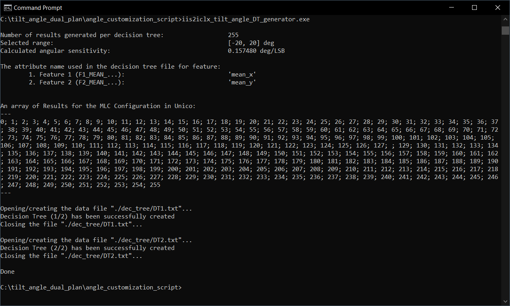

The following program parameters can be configured from the Windows Command Prompt:

- **Angle range** *(default: +/- 20 degrees)*. It must be an integer in the range of 2 to 90 [deg]. The final angle range is symmetrical around zero.
- **Output folder name**, where the two text files with the decision trees should be stored *(default: "dec_tree")*. The folder will be created in the same directory where the program is run and its name cannot contain any of the following characters: `\/:*?\"<>|`.


The program supports the following options:

| Option | Description |
| --- | --- |
| `-a` | Set the *Angle range* |
| `-o` | Set the *Output folder* name |
| `-h` | Display *help* message |

**Example usages:**

1. The following command prints only the program help:
```
iis2iclx_tilt_angle_DT_generator.exe -h
```

2. The following command executes the program with the modified parameters:
```
iis2iclx_tilt_angle_DT_generator.exe -a 25 -o my_folder
```
The parameters will be then configured as:

**Angle range** = *+/- 25 degrees*

**Folder name** = "*my_folder*"


# 3. Generate the Unico Configuration File (UCF file)

Once the decision tree files are generated by the *iis2iclx_tilt_angle_DT_generator.exe* program, keep the Command prompt with the useful program output information open.

Run **Unico GUI** and select the "*STEVAL-MKI209V1K (IIS2ICLX)*" item from the list of Device Names. The *"Communication with the motherboard [Enabled]"* option box may be unchecked to enable the offline mode (no HW is required). Then click on the *"Select Device button"* or double click "*STEVAL-MKI209V1K (IIS2ICLX)*".

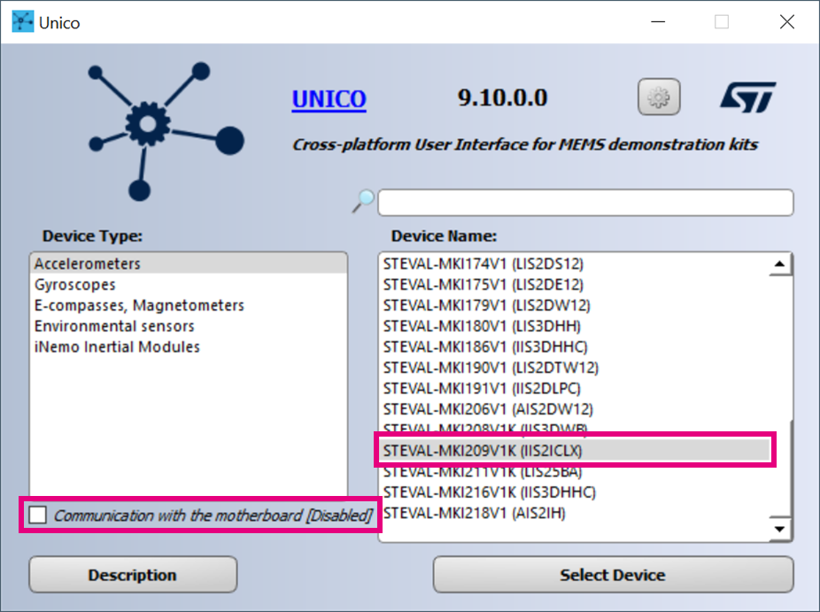

Confirm the message about limited functionality (only if the offline mode was selected) and open the MLC window:

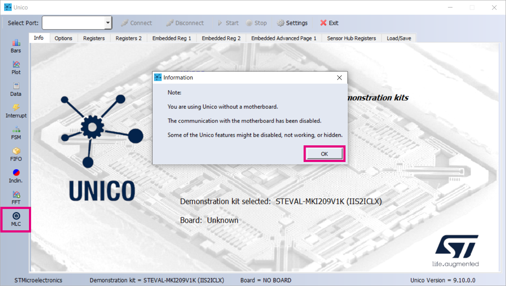

Go directly to the Configuration tab:

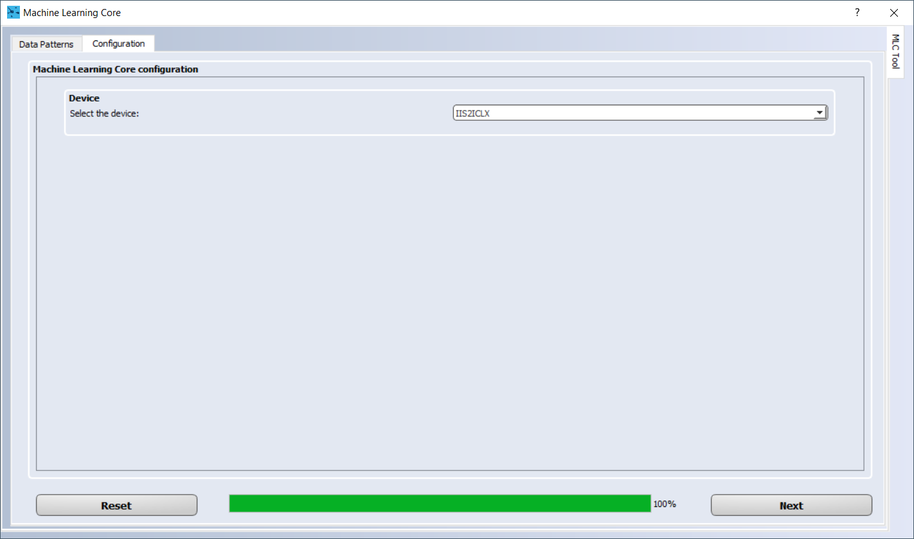

Select **IIS2ICLX** and choose the required parameters of the **MLC** and sensor. The chosen configuration of the sensor and MLC Output Data Rate (**ODR**) for this tutorial is visible in the picture below:

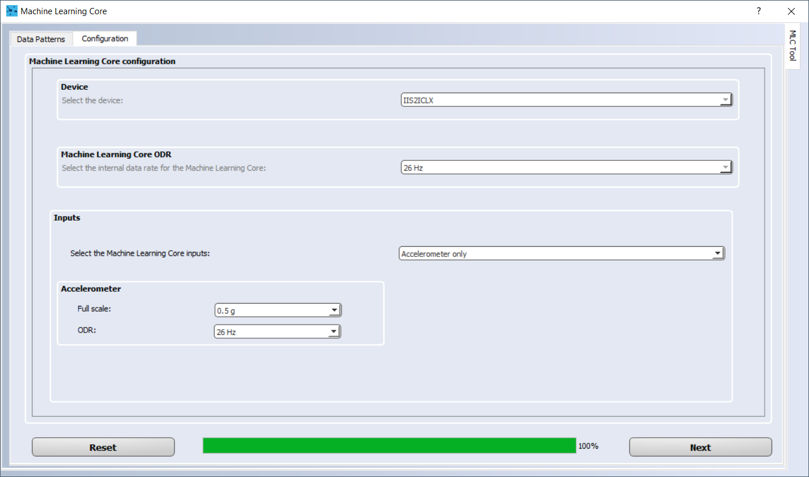


Select two decision trees from the list and continue configuring the MLC. To suppress high-frequency components of the signal, the IIR2 filter was configured as a low-pass filter (f_cut = 5 Hz, ODR = 26 Hz) with the following filter coefficients:


Further examples of filter coefficients can be found in Table 3 in [AN5536](https://www.st.com/resource/en/application_note/an5536-iis2iclx-machine-learning-core-stmicroelectronics.pdf).

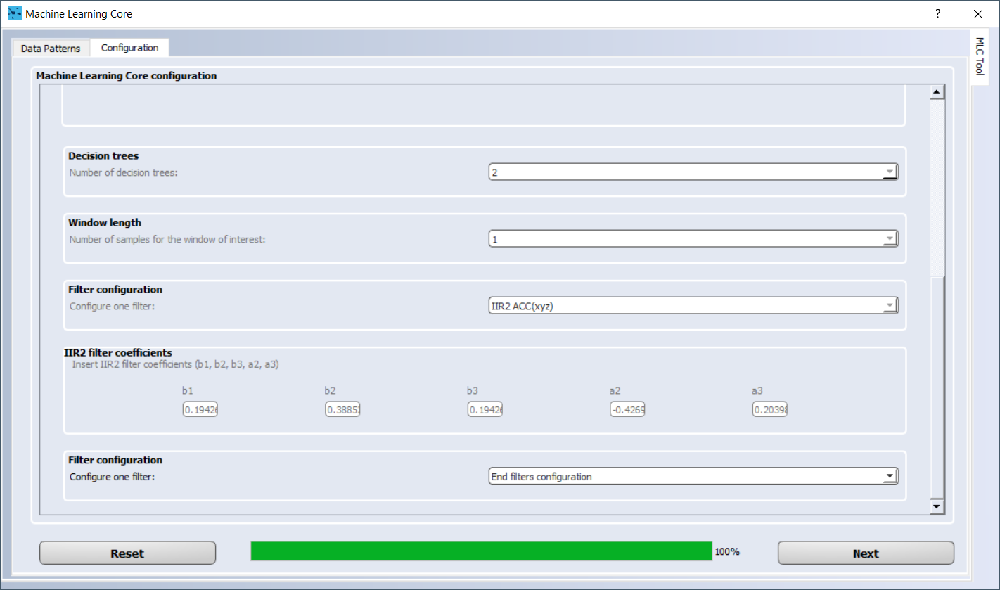

In the next step select only the **Mean** feature for the **ACC_X** and **ACC_Y** inputs (or only the **Mean** feature for the "**filter IIR2 on ACC X**" and "**filter IIR2 on ACC Y**" inputs if the IIR2 filter was used - as in this tutorial). In this tutorial, the Window length was set to 1, which means that the filtered output acceleration samples are not processed any further.

The next few steps will use the output of the *iis2iclx_tilt_angle_DT_generator.exe* program that was printed on the Command Prompt. Unico GUI will ask to "*Insert the attribute name used in the decision tree file for the feature 1*". Copy and paste the appropriate text from the Command Prompt into Unico GUI. The same procedure should be repeated for feature 2. In this tutorial, the attribute name for feature 1 is "*mean_x*" and for feature 2 "*mean_y*" (text between the quotation marks).

The same must be done for the Decision Tree #1 and #2 Results. The difference is that the whole string between the three dashes ("*---*") must be copied and pasted into Unico GUI. See below the settings of the described steps done for this tutorial:

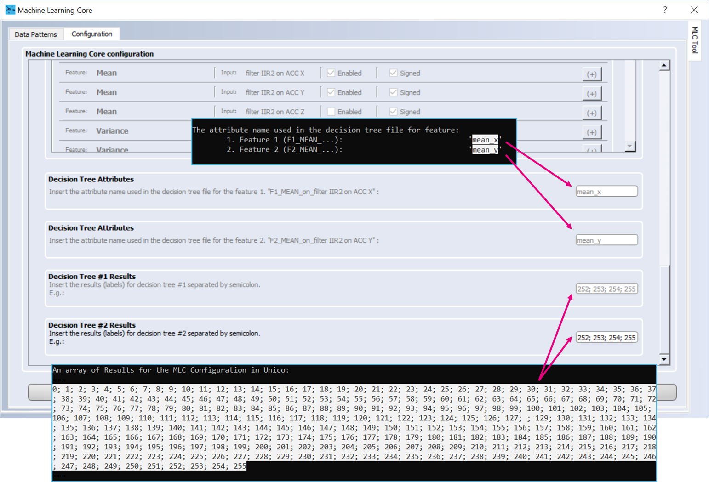

Then browse to the two generated text files that contain the decision trees. The default location is "*./dec_tree*" with respect to the directory where the program was run.

The meta-classifier is not necessary for the purpose of this tutorial, so it was left at 0 in both cases (decision tree #1 and decision tree #2).

Finally, select the location and name of the UCF file and it will be automatically generated by Unico GUI by clicking on the **Next** button.

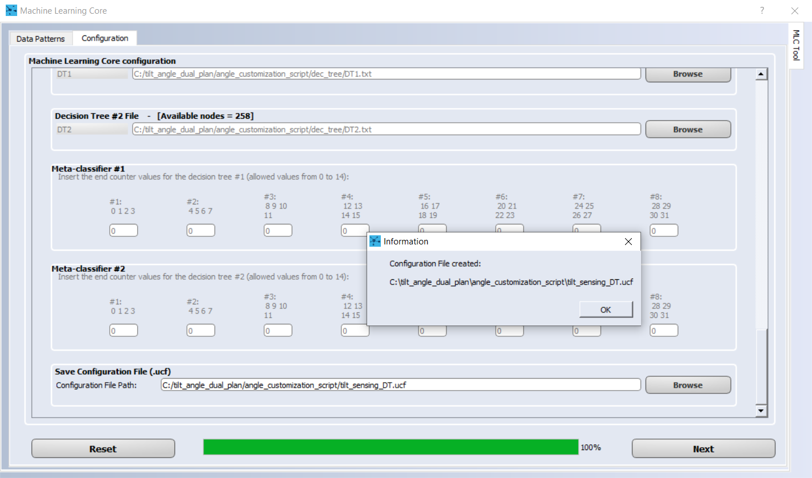

**UCF** stands for Unico Configuration File. It is a text file with a sequence of register addresses and corresponding values. It contains the full sensor configuration, including the MLC configuration.

Please note that the UCF file, after it is generated by Unico GUI, usually contains a line that configures the routing of the interrupt event for decision tree 1 (MLC1) to the INT1 pin (**INT1_MLC1** bit of the **MLC_INT1 (0Dh)** register is set to 1).

If the interrupt event for both decision trees has to be routed to pin INT1, then the UCF file must be modified. This can be done simply with a text editor by searching for the line `Ac 0D 01` (the line must come after `Ac 01 80` and before `Ac 01 00`) and replacing it with `Ac 0D 03` (write 0x03 instead of 0x01 to 0x0D [MLC_INT1] - see the [datasheet of the IIS2ICLX](https://www.st.com/resource/en/datasheet/iis2iclx.pdf) for more information on sensor configuration):

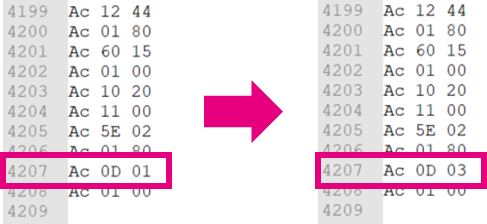

The UCF file can be used as-is by the following software tools provided by ST: Unico GUI, Unicleo GUI, AlgoBuilder GUI.
Moreover, the **UCF files can also be converted into C source code** and saved as header *.h* files to be conveniently included in C projects. It can be done from the main window of Unico GUI: click on the *Options tab*, select *Browse* and load the UCF file and then click on *Generate C code*.


In summary, the following configuration has been set in this section:

- Device: `IIS2ICLX`
- Machine Learning Core ODR: `26 Hz`
- Inputs: `Accelerometer only`
	- Full scale: `0.5 g`
	- ODR: `26 Hz`
- Number of decision trees: `2`
- Window length: `1`
- Filter configuration: `IIR2 ACC(xyz)`
	- `b1 = 0.194261, b2 = 0.388522, b3 = 0.194261, a2 = -0.426937, a3 = 0.203981` (Low-pass IIR2, f_cut = 5 Hz, ODR = 26 Hz, Gain = 1)
- No other filter was used (*End filters configuration*)
- Features:
	- Mean of filtered data of X-axis (`F1_MEAN_on_filter IIR2 on ACC X`) and Mean of filtered data of Y-axis (`F2_MEAN_on_filter IIR2 on ACC Y`)
	- (Note: if no filters were selected, use mean of accelerometer X-axis -`F1_MEAN_on_ACC_X`- and mean of accelerometer Y-axis -`F2_MEAN_on_ACC_Y`- should be used instead)
- Decision Tree Attributes:
	- Attribute name, feature 1: `mean_x`
	- Attribute name, feature 2: `mean_y`
	- Results for both, DT1 and DT2 (the results are the same if no modification is made to the program): 

```
0; 1; 2; 3; 4; 5; 6; 7; 8; 9; 10; 11; 12; 13; 14; 15; 16; 17; 18; 19; 20; 21; 22; 23; 24; 25; 26; 27; 28; 29; 30; 31; 32; 33; 34; 35; 36; 37; 38; 39; 40; 41; 42; 43; 44; 45; 46; 47; 48; 49; 50; 51; 52; 53; 54; 55; 56; 57; 58; 59; 60; 61; 62; 63; 64; 65; 66; 67; 68; 69; 70; 71; 72; 73; 74; 75; 76; 77; 78; 79; 80; 81; 82; 83; 84; 85; 86; 87; 88; 89; 90; 91; 92; 93; 94; 95; 96; 97; 98; 99; 100; 101; 102; 103; 104; 105; 106; 107; 108; 109; 110; 111; 112; 113; 114; 115; 116; 117; 118; 119; 120; 121; 122; 123; 124; 125; 126; 127; ; 129; 130; 131; 132; 133; 134; 135; 136; 137; 138; 139; 140; 141; 142; 143; 144; 145; 146; 147; 148; 149; 150; 151; 152; 153; 154; 155; 156; 157; 158; 159; 160; 161; 162; 163; 164; 165; 166; 167; 168; 169; 170; 171; 172; 173; 174; 175; 176; 177; 178; 179; 180; 181; 182; 183; 184; 185; 186; 187; 188; 189; 190; 191; 192; 193; 194; 195; 196; 197; 198; 199; 200; 201; 202; 203; 204; 205; 206; 207; 208; 209; 210; 211; 212; 213; 214; 215; 216; 217; 218; 219; 220; 221; 222; 223; 224; 225; 226; 227; 228; 229; 230; 231; 232; 233; 234; 235; 236; 237; 238; 239; 240; 241; 242; 243; 244; 245; 246; 247; 248; 249; 250; 251; 252; 253; 254; 255
```

- Meta-classifier (#1 and #2): all values left equal to 0


# 4. Evaluate the MLC results

There are many options to evaluate the results with ST tools. This section describes the utilization of the **STEVAL-MKI209V1K** with the **ProfiMEMSTool** (*STEVAL-MKI109V3*) and with an **STM32 Nucleo** board and a **MEMS expansion** board.

## 1. ProfiMEMSTool

The easiest way to evaluate the results is using the **ProfiMEMSTool** with the **STEVAL-MKI209V1K** and **Unico GUI**.

Run Unico GUI and connect the ProfiMEMSTool with inserted STEVAL-MKI209V1K board to the PC by using a micro USB cable. Select IIS2ICLX from the list of Device Names, keep the *"Communication with the motherboard [Enabled]"* option box checked and click the *Select Device* button.

Go to the *Load/Save* tab, click the *Load* button, browse for the generated UCF file and then click the *Open* button. Wait until the file is ***Loaded***, click the *Start* button and open the *Data* window by clicking the *Data* button from the option panel on the left side.

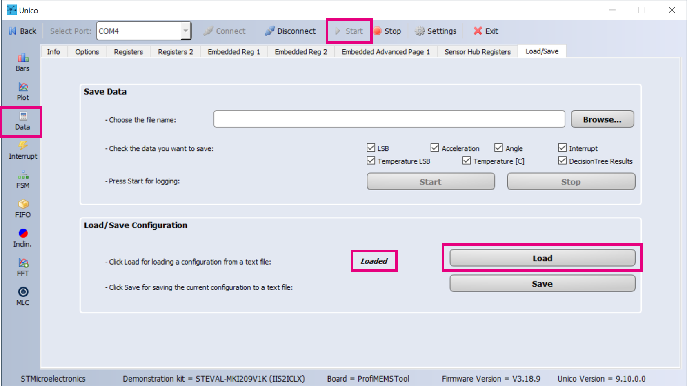

The MLC output is displayed in the text field 1 and 2 in the Decision Tree results section of the *Data* window:

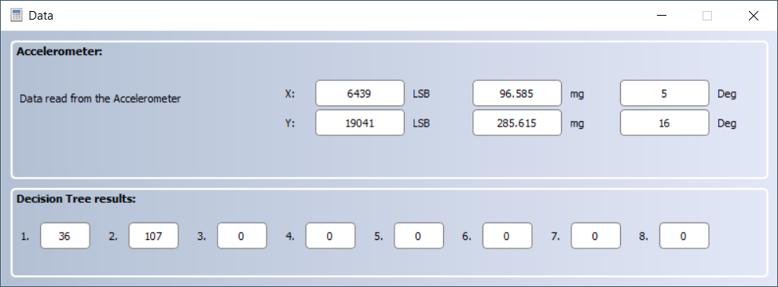

The MLC output value is expressed as an 8-bit value in two’s complement and must be multiplied by the **angular sensitivity** mentioned in the output of the *iis2iclx_tilt_angle_DT_generator.exe* program (default is 0.15748 deg/LSB).

For example, in the figure above, text box 1 shows a value of 36 and text box 2 shows a value of 107. These values correspond to an inclination in the x and y axes. The values are represented as a two’s complement number, from which it can be determined that both are positive numbers. Therefore, they can be directly converted to the inclination angle value in degrees by multiplying them by the angular sensitivity:

```
36 * 0.15748 = 5.67 degrees
107 * 0.15748 = 16.85 degrees
```


## 2. STM32 Nucleo

This option requires a C project that handles the communication between the STM32 MCU and the **IIS2ICLX**. This task can be quite easily done in the STM32CubeMX, the initialization C code generator for STM32 microcontrollers and microprocessors.

For example, when the **NUCLEO-F401RE** with the **X-NUCLEO-IKS02A1** is used, the user can connect the NUCLEO-F401RE to X-NUCLEO-IKS02A1 by using the Arduino connector and then connect the STEVAL-MKI209V1K (DIL24 adapter board) to the X-NUCLEO-IKS02A1 by using its DIL24 socket.

As described in the previous section, Unico GUI can generate a header file (*.h*) from the generated *UCF* file. In this case, it is advantageous to use it.

The header file content is very simple: it contains an array of structures with register addresses and corresponding values. The data structure is defined as:

```c
/** Common data block definition **/
typedef struct {
  uint8_t address;
  uint8_t data;
} ucf_line_t;
```

The whole array might look as follows:

```c
/** Configuration array generated from Unico Tool **/
const ucf_line_t tilt_sensing_DT[] = {
  {.address = 0x10, .data = 0x00,},
  {.address = 0x11, .data = 0x00,},
  {.address = 0x01, .data = 0x80,},
  {.address = 0x05, .data = 0x00,},
  {.address = 0x17, .data = 0x40,},
  .
  .
  .
  {.address = 0x0D, .data = 0x03,},
  {.address = 0x01, .data = 0x00,}
};
```

To configure the sensor (including the MLC part), it is therefore necessary to read the entire array and write the defined values to the corresponding addresses. Below is the pseudocode for this task:

```c
int length = sizeof(tilt_sensing_DT) / sizeof(ucf_line_t); // get the length of the structure array

for (i = 0; i < length; i++)
{
  write(fsm_mlc_config[i].address, fsm_mlc_config[i].data); // write the defined value to the corresponding address 
}
```

After the sensor is configured, it is only necessary to check the sensor interrupt line on which the MLC interrupt status signal is enabled (**INT1** by default). If an interrupt is triggered, it means that the result of the decision tree, i.e. the angle of inclination, has changed (in either of the two sensor axes) and the updated value of the result is available in the output register of the decision trees (**MLC0_SRC (70h)** and **MLC1_SRC (71h)**).

The following pseudocode can be used to read the MLC output value:

```c
uint8_t x_axis, y_axis;

if (INT_received)
{
  write(0x01, 0x80); // set the FUNC_CFG_ACCESS bit in the FUNC_CFG_ACCESS register to 1 to enable access to embedded functions registers
  read(0x70, &x_axis); // read the content of the MLC0_SRC register and store the value to variable x_axis
  read(0x71, &y_axis); // read the content of the MLC1_SRC register and store the value to variable y_axis
  write(0x01, 0x00); // set the FUNC_CFG_ACCESS bit in the FUNC_CFG_ACCESS register to 0 to disable access to embedded functions registers
}
```

Finally, the conversion from raw data to the value of the angle of inclination in degrees can be performed using the following pseudocode:

```c
#define ANGULAR_SENSITIVITY (0.15748f)
.
.
.

float angle_x, angle_y;

angle_x = x_axis * ANGULAR_SENSITIVITY;
angle_y = y_axis * ANGULAR_SENSITIVITY;

```

------

**Copyright © 2021 STMicroelectronics**