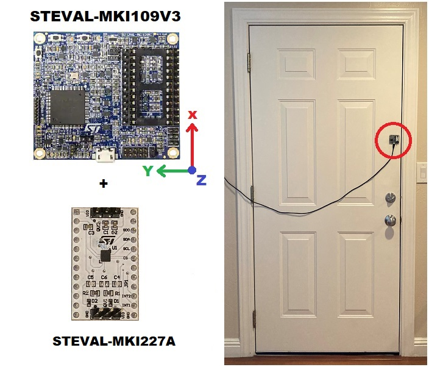

## 1 - Introduction

The door opening/closing/still recognition algorithm described in this example is intended for door-mounted devices. All the data logs have been acquired with the device placed on a door with the orientation described in section 2. Three different classes are recognized as described in section 3. 

A limited subset of data logs for this example is available [here](./datalogs/).

For information on how to integrate this algorithm in the target platform, follow the instructions available in the README file of the [application_examples]( https://github.com/STMicroelectronics/STMems_Machine_Learning_Core/tree/master/application_examples ) folder. 

For information on how to create similar algorithms, follow the instructions provided in the [configuration_examples]( https://github.com/STMicroelectronics/STMems_Machine_Learning_Core/tree/master/configuration_examples ) folder. 

## 2 - Sensor configuration and orientation

The gyroscope is configured with ±250 dps full scale and 60 Hz output data rate.

The [STEVAL-MKI109V3](https://www.st.com/en/evaluation-tools/steval-mki109v3.html) with the LSM6DSV16X on DIL24 is placed on the door as shown in the picture below. Other devices can be used as well, provided that the orientation of the sensor axes is correct.

- X-axis parallel to the door, pointing up.
- Y-axis parallel to the door, pointing to the door hinges.
- Z-axis pointing towards the direction of the door opening.

## 3 - Machine learning core configuration

The **machine learning core (MLC)** is configured to run at 60 Hz, computing features on windows of 15 samples, therefore the decision tree classifier output is updated 4 times per second (60 Hz / 15 = 4 Hz).

Only one feature is computed:

- Mean on gyroscope X-axis

One decision tree with around 4 nodes has been configured to detect the different classes.
A meta-classifier has not been used.  

The decision tree classifiers detect 3 different classes corresponding to 3 different door states. The output of the decision tree classifier is stored in the register MLC1_SRC (address 70h).  

- MLC1_SRC (70h) register values
  - 0 = Closing
  - 4 = Opening
  - 8 = Still

## 4 - Interrupts

The configuration generates an interrupt (pulsed and active high) on the INT1 pin every time the register MLC1_SRC (70h) is updated with a new value. The duration of the interrupt pulse is 16.6 ms in this configuration.

------

**More information: [http://www.st.com](http://st.com/MEMS)**

**Copyright © 2022 STMicroelectronics**
