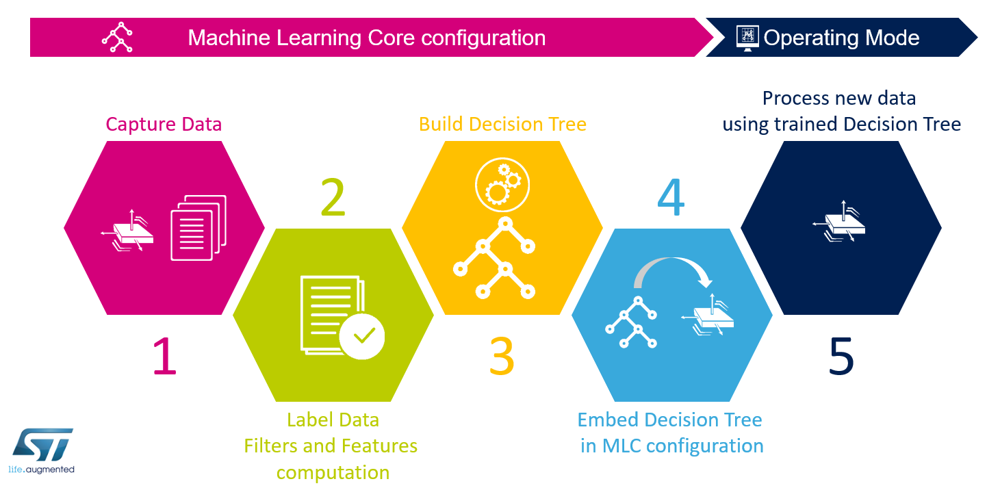

This configuration example shows all the steps of the Machine Learning Core (MLC) configuration, from data logging to the device configuration. The use-case is the LSM6DSOX device, but this example is similarly applicable to other ST devices embedding the MLC feature. For further details on the MLC configuration procedure, please refer to the application notes available at www.st.com

## 1 - Capturing Data

LSM6DSOX has been configured with the accelerometer enabled at 26 Hz data rate. 
Three data logs have been acquired in three different conditions: 

- board face-up (accelerometer Z-axis pointing up) - File *1_Log1.txt* 
- board face-down (accelerometer Z-axis pointing down) - File *1_Log2.txt* 
- board shaking - File *1_Log3.txt* 

## 2 - Labeling Data and Computing Features

In the MLC tool of Unico, the three data logs of step 1 have been labeled respectively as

- *face_up*
- *face_down* 
- *shaking* 

Three features have been configured: 

- mean of the accelerometer Z-axis

- mean of the accelerometer norm filtered with a high-pass filter (bandwidth ODR/4)

- variance of the accelerometer norm

The MLC is configured at 26 Hz data rate, computing features in windows of 26 samples (1 per second). The computed features are available in the file *2_features.arff*.

## 3 - Building the Decision Tree

Weka has been used to build the decision tree (with the J48 classifier).  

The file *3_weka_classifier_J48_output.txt* contains the complete Weka output, while the file *3_decision_tree.txt* contains the decision tree to be imported in Unico to complete the MLC configuration.

## 4 - Embedding the Decision Tree in MLC configuration

The MLC results have been configured with the following three values in the MLC0_SRC register (when the corresponding class is detected):

- 0 = *face_up*
- 4 = *face_down*
- 8 = *shaking*

No meta-classifier has been configured for this simple example. 

The MLC tool in Unico has generated the following configuration (UCF) file: *4_LSM6DSOX_configuration.ucf*

## 5 - Processing new data using the trained Decision tree

The UCF file generated in the previous step can be used to configure the LSM6DSOX to work with the trained decision tree.

------

**More Information: [http://www.st.com](http://st.com/MEMS)**

**Copyright © 2019 STMicroelectronics**