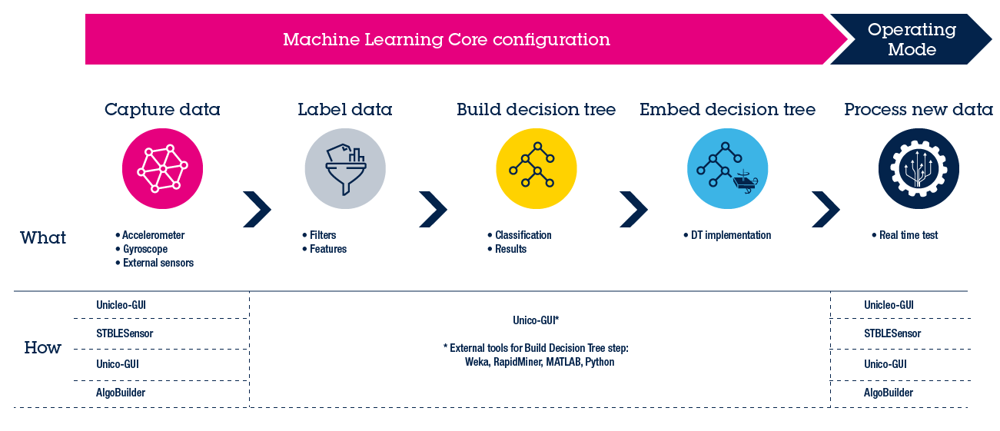
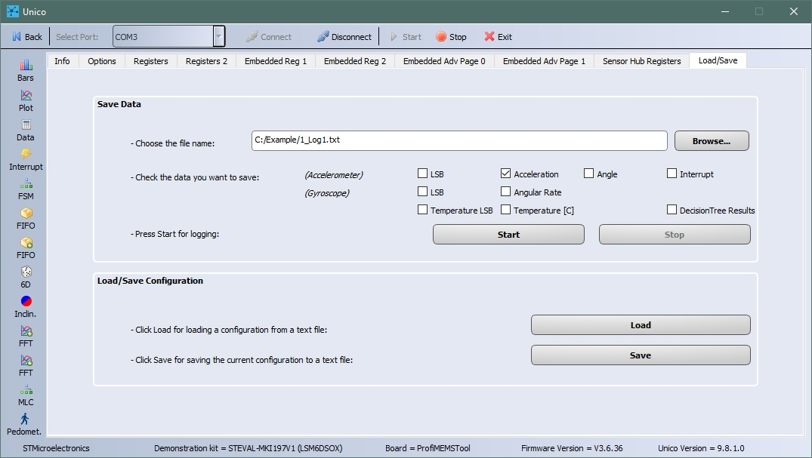
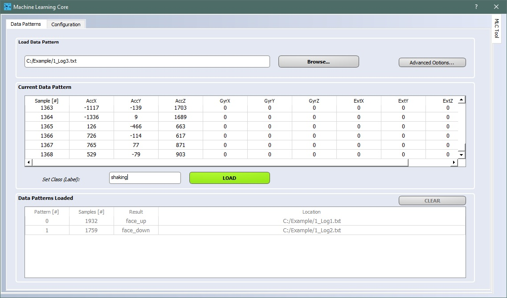
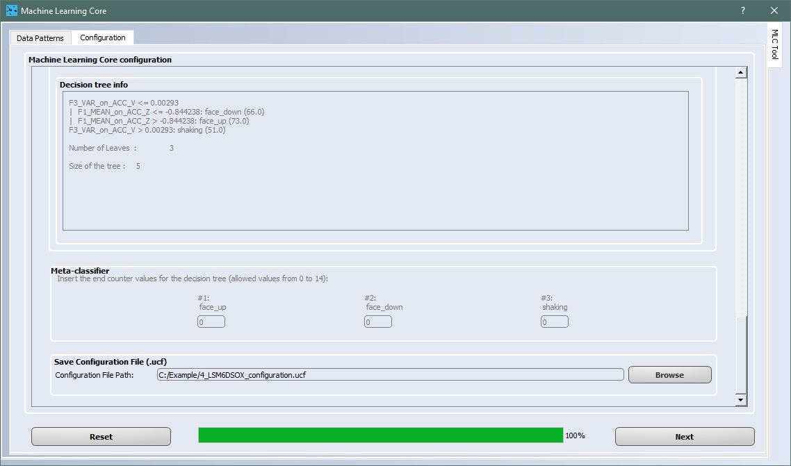
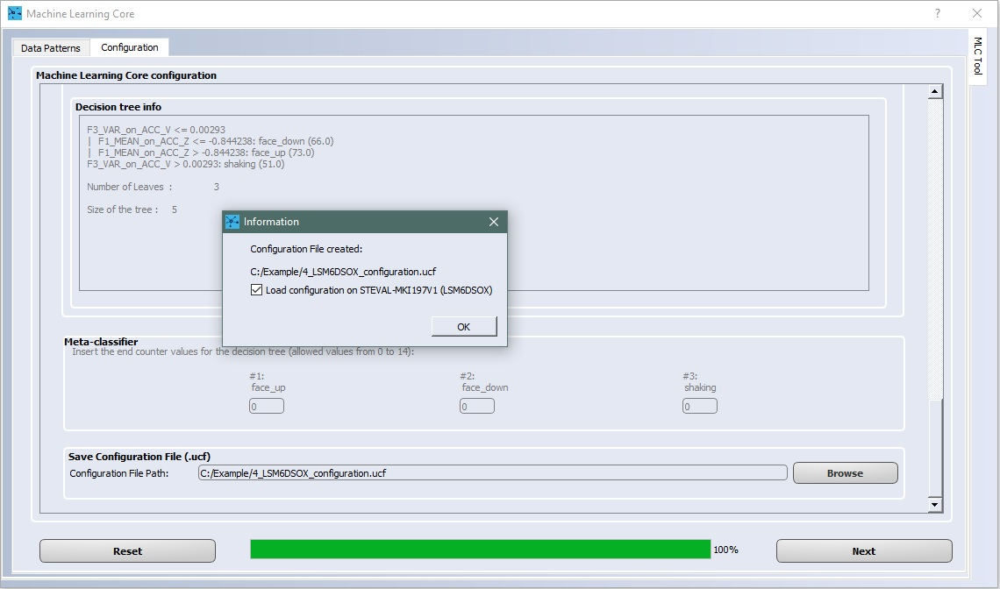
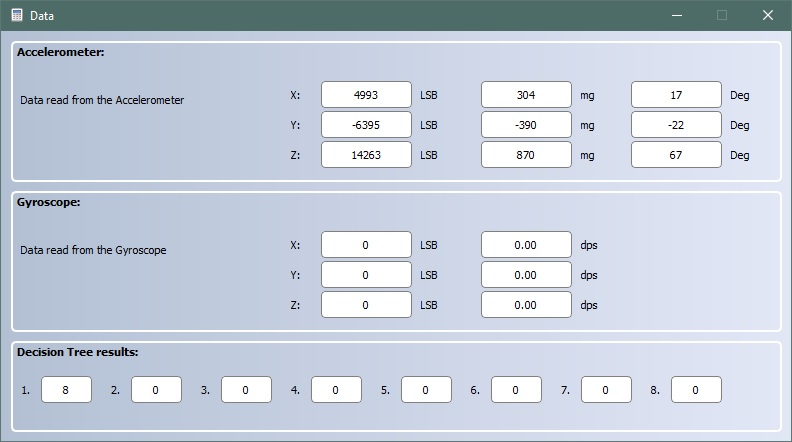

This ReadMe file describes how to use the **Machine Learning Core (MLC)** configuration in the ST MEMS sensors

**MLC** is a highly configurable and power-efficient hardware logic offered on ST sensors with part number ending with X (e. g. LSM6DSOX) supporting multiple Decision Tree classifiers.

This example explains the following steps:

1. How to capture the data log for each class to be classified
2. How to label each data log
3. How to design the decision tree classifier
4. How to configure the MLC to run the generated decision tree
5. How to check the decision tree output in real-time when it is running in the MLC

**Software** Tools:

The picture below shows the workflow to implement the five steps above and the different software tools that can be used.

For the example discussed here, the **Unico GUI** software tool will be used.

For more details on the software tools:

- [Unico GUI](https://www.st.com/content/st_com/en/products/embedded-software/evaluation-tool-software/unico-gui.html) software tool to work with ProfiMEMS evaluation board (see the next paragraph for more details).
- [Unicleo GUI](https://www.st.com/content/st_com/en/products/embedded-software/evaluation-tool-software/unicleo-gui.html) software tool to work with [Nucleo](https://www.st.com/content/st_com/en/products/evaluation-tools/product-evaluation-tools/mcu-mpu-eval-tools/stm32-mcu-mpu-eval-tools/stm32-nucleo-boards.html) motherboards coupled with X-Nucleo expansion boards, and in particular the MEMS expansions (the latest is [X-Nucleo-IKS01A3](https://www.st.com/content/st_com/en/products/ecosystems/stm32-open-development-environment/stm32-nucleo-expansion-boards/stm32-ode-sense-hw/x-nucleo-iks01a3.html))
- [AlgoBuilder GUI](https://www.st.com/content/st_com/en/products/embedded-software/mems-and-sensors-software/inemo-engine-software-libraries/algobuilder.html) software tool to design a custom processing flow and build the firmware for Nucleo boards coupled with the MEMS expansions, or form-factor evaluation boards such as [SensorTile.Box](https://www.st.com/content/st_com/en/products/evaluation-tools/product-evaluation-tools/mems-motion-sensor-eval-boards/steval-mksbox1v1.html)

**Hardware**: 

In this example we will be using the **LSM6DSOX inertial measurement unit (IMU)**, with an accelerometer and a gyroscope sensor (see the next paragraph for more details). However, the same procedure also applies to other sensors with MLC support.

For more details on the hardware:

- ST resource page on [MEMS sensor](  https://www.st.com/mems  )
- ST resource page on [Explore Machine Learning Core in MEMS sensors]( https://www.st.com/content/st_com/en/campaigns/machine-learning-core.html )
- Application note [AN5259](  https://www.st.com/resource/en/application_note/dm00563460-lsm6dsox-machine-learning-core-stmicroelectronics.pdf  ) on MLC embedded in [LSM6DSOX](https://www.st.com/content/st_com/en/products/mems-and-sensors/inemo-inertial-modules/lsm6dsox.html) 

# 1. Capture Data Logs

In this example the MLC will be configured to recognize three different classes: 

- *face_up*
- *face_down* 
- *shaking* 

Each class to be classified by the decision tree must be characterized by one or more data logs.

**Hardware** needed:

- [STEVAL-MKI109V3]( https://www.st.com/content/st_com/en/products/evaluation-tools/product-evaluation-tools/mems-motion-sensor-eval-boards/steval-mki109v3.html ), professional evaluation board for MEMS sensors, referenced as **ProfiMEMS** in ST docs. It is based on the STM32F401 microcontroller and features a DIL24 connector to plug the daughterboard with the sensor under test. Check that the firmware is up to date (version 3.6.36 or later).

- [STEVAL-MKI197V1](  https://www.st.com/content/st_com/en/products/evaluation-tools/product-evaluation-tools/mems-motion-sensor-eval-boards/steval-mki197v1.html  ), daughterboard with **LSM6DSOX** IMU sensor (referenced as **DIL24 adapter** in the ST docs). It must be plugged into the ProfiMEMS motherboard.

- Micro USB cable to connect the ProfiMEMS motherboard to the PC

  **Note**: Even if ProfiMEMS has been used in this example other platforms are supported (see [Getting started with ST development kit and GUI](https://www.st.com/content/ccc/resource/sales_and_marketing/presentation/product_presentation/group0/f6/ab/59/ed/d8/d0/4a/47/MLC_tools_and_GUI/files/MLC_tools_and_GUI.pdf/_jcr_content/translations/en.MLC_tools_and_GUI.pdf)).

**Software** needed:

- [STSW-MKI109W](  https://www.st.com/content/st_com/en/products/embedded-software/evaluation-tool-software/stsw-mki109w.html  ), referenced as **Unico GUI**, companion software to work with the ProfiMEMS motherboard. This software tool includes the J48 algorithm to design decision trees (version 9.8.1.0 or later).
- [Weka](  https://waikato.github.io/weka-wiki/downloading_weka/   ) Machine Learning tool to design decision trees (version 3.8.3 or later). 

  **Note**: Even if Unico offers the possibility to design the decision tree using a built-in algorithm, in this example Weka has been used.  Other third-party tools can also be used: Python SciKit, Matlab, and RapidMiner.

Procedure to capture data:

1. Plug the DIL24 LSM6DSOX adapter on the ProfiMEMS motherboard, and connect the motherboard to the PC. 
2. Run the Unico GUI. **Type** **"OX" in the search field, select LSM6DSOX** and confirm by pressing the corresponding button.
3. Click on the **Options tab** and configure the **accelerometer:** **2g full scale, 26Hz output data rate**, low-power mode disabled.
4. Click on the **Start** button on the top bar and click **Plot** to check the data in real-time. Close the Plot window but **do not click the Stop button** otherwise the log will be empty.
5. Click on the **Load/Save tab**, select the Accelerometer, type the filename for the log; it is very convenient to include the label as part of the filename (example: "1_Log1_FaceUp.txt").
6. When ready, click **Start** in the Load/Save window to start writing to the log file. When the log is complete, click **Stop** to stop writing and close the log file. The log is a tab-separated-value file which can be opened with any text editor.

In this example three logs have been collected

- **1_Log1_FaceUp.txt** with device standing still, Z axis pointing up.
- **1_Log2_FaceDown.txt** with device standing still, Z axis pointing down.
- **1_Log3_Shaking.txt** with device subject to shacking motion.

**Note**: For this simple example, just one data log per class has been acquired. In general, it is suggested to acquire multiple data logs for each class since different people might execute the movements in different ways.

# 2. Load and Label Data Logs

Procedure to label the data logs:

1. The ProfiMEMS board doesn't need to be plugged to the PC. Unico GUI can work stand-alone in "offline" mode: run the Unico GUI, and uncheck "communication with the motherboard".
2. **Type "OX" in the search field, select LSM6DSOX** and confirm by pressing the corresponding button.
3. Click on the **MLC button** on the side bar. Select the **Data Patterns tab** (it should already be selected).
4. For each class, click on **Browse** to select the corresponding data log files (multiple files can be selected simultaneously in the dialog), type the label for the class, and click **Load**. Repeat for each class.
5. When all data logs are loaded, select the **Configuration tab**. For each step, select the desired configuration, then click **Next**.

In this example the accelerometer settings are the same as used for data capture (2g, 26Hz). The MLC is configured to run at the same speed as the accelerometer sensor (26Hz), and compute a new set of features every second (window length of 26 samples has been chosen to get a good tradeoff between latency and time necessary to recognize the movements).

Settings selected in the Configuration tab:

1. LSM6DSOX sensor
2. MLC running at 26Hz
3. Accelerometer only
4. Accelerometer configured for 2g full scale and 26Hz data rate
5. One decision tree only
6. Window length of 26 samples
7. High-pass filter (HP) on accelerometer vector norm (V), this is a difference filter (DIFF)
8. Select the following features and click Next when done:
   - **Mean** for Z-axis, **ACC_Z**, useful to discriminate FaceUp and FaceDown
   - **Mean** for filtered norm, **DIFF on ACC V**, useful to discriminate Shaking
   - **Variance** for norm, **ACC_V**, useful to discriminate Shaking
9. Click on **Browse** to select or type the name of the ARFF file where computed features will be  saved. Click Next to save the file. For this example, features have been saved in **2_Features.arff**. 
10. Insert the numeric code associated with each label. This is the numeric output of the decision tree when it is run on the MLC (see the note below for details). Then click Next. 
    - FaceUp = 0
    - FaceDown = 4
    - Shaking = 8

**ARFF** files are text files: the first few lines describe the attributes (extracted features), the rest of the file has one line for every window (data segment) of every log file processed by Unico. Each line is made of the listed attributes (a number, or numeric class) and the corresponding label (a string, or nominal class). This file is the input for the algorithm which designs the decision tree classifier (see next paragraph).

**Note**: one can create groups of at most 4 labels and then use the meta-classifier functionality of the MLC core. The first group uses numeric codes from 0 to 3, the second group uses codes from 4 to 7, the third group uses codes from 8 to 11, and so on. In this example, each label is in a different group, this is why the numeric code is a multiple of 4.

# 3. Design the Decision Tree Classifier

Even if Unico offers the possibility to design the decision tree using a built-in algorithm, in this example Weka has been used.  Other third-party tools can also be used: Python SciKit, Matlab, and RapidMiner.

Procedure to design the decision tree classifier with Weka:

1. Run Weka and click the **Explorer** button

2. Select the **Preprocess tab** (it should already be selected) and click on **Open File**. Browse to select and load the **2_Features.arff** file generated in the previous paragraph

3. Select the **Classify tab**, click on **Choose** to select the design algorithm. Expand the **trees** item and select the **J48 algorithm**. You can also tune validation and other options

4. Select the output of the classifier (the label, referenced as "nominal class" should already be selected) and click on **Start**

5. When the design is completed, the generated decision tree and the corresponding performance report is printed on the console.  For this example, the whole console output is saved in **3_Weka_Classifier_J48.txt**

6. Copy the generated decision tree and save it into a text file. This file will be fed into Unico GUI to generate the corresponding MLC configuration file. For this example, the decision tree is saved in **3_Decision_Tree.txt**. The corresponding section is highlight in the following picture.

   

For more details on the decision tree generation using third party tools, check the application note [AN5259](  https://www.st.com/resource/en/application_note/dm00563460-lsm6dsox-machine-learning-core-stmicroelectronics.pdf  ):

- Appendix A for Weka
- Appendix B for RapidMiner
- Appendix C for Matlab
- Appendix D for Python SciKit

# 4. Generate the MLC configuration file

One can click on Generate to design the decision tree classifier using the built-in algorithm in Unico. However, in this example Weka has been used.

Procedure to load the decision tree and generate the configuration file:

1. Click on **Browse** to select the file corresponding to the decision tree. For this example, this is the **3_Decision_Tree.txt** file generated in the previous paragraph. Then click **Next**.
2. Insert the value of the end counter for the meta-classifier and click **Next**. The end counter is the minimum number of consecutive outputs from the same group before the final output is updated. For this example, it is set to 0 so the final output is immediately updated.
   - End counter for FaceUp = 0
   - End counter for FaceDown = 0
   - End counter for Shaking = 0
3. Click on **Browse** to select or type the name of the UCF file where the MLC configuration will be saved. Click **Next** to save the file. In this example, the configuration is saved in **4_LSM6DSOX_configuration.ucf**
4. If the ProfiMEMS board with the LSM6DSOX DIL24 adapter is connected, and Unico is not working in "offline" mode, it will be possible to immediately program this configuration into the sensor: just select the checkbox "Load configuration..." in the dialog window.

**UCF** stands for Unico Configuration File. It is a text file with a sequence of register addresses and corresponding values. It contains the full sensor configuration, including of course the MLC configuration. 

The UCF file can be used as-is by several software tools provided by ST: Unico GUI, Unicleo GUI, AlgoBuilder GUI.

**UCF files can also be converted to C source code** and saved as a header *.h* files to be conveniently included in C projects: click on the Options tab, select Browse and load the UCF file, then click on Generate C code.

An example on how to use the generated *.h* file in a standard C driver is available in the [STMems_Standard_C_drivers repository]( https://github.com/STMicroelectronics/STMems_Standard_C_drivers/blob/master/lsm6dsox_STdC/example/lsm6dsox_mlc.c ).

# 5. Use the MLC configuration file

Procedure to program the UCF configuration file in LSM6DSOX:

1. Plug the DIL24 adapter on the ProfiMEMS motherboard, and connect the motherboard to the PC. 
2. Run the Unico GUI. **Type "OX" in the search field, select LSM6DSOX** and confirm by pressing the corresponding button.
3. Click on the **Load/Save tab**, click on **Load**, browse and select the UCF file. In this example, this is **4_LSM6DSOX_configuration.ucf**. The MLC is now configured. In this example.
4. Click on **Start** button on the top bar. The MLC is now up and running.
5. Click  on **Data** in the side bar and look at the accelerometer data and decision tree output. 

Verify that the numeric output of the decision tree does correspond to what is happening to the device. Put the device upside-down. Shake the device. 

The decision tree result is updated at every window. In this example the window is 26 samples long, the data rate is 26Hz, hence the output is updated every second.

------

**More Information: [http://www.st.com](http://st.com/MEMS)**

**Copyright © 2020 STMicroelectronics**

