This ReadMe file describes how to use the **Machine Learning Core (MLC)** embedded in the IMU MEMS sensor in the [**SensorTile.box**](https://www.st.com/content/st_com/en/products/evaluation-tools/product-evaluation-tools/mems-motion-sensor-eval-boards/steval-mksbox1v1.html). This example shows how the MLC can be used for Yoga Pose recognition.

This example is intended for wearable devices, since all the data logs have been acquired with the device placed on the left leg, with the orientation described in section 1. Fourteen different classes are recognized.

The **MLC** is a highly configurable and power-efficient hardware logic offered on ST sensors with part numbers ending with X (e. g. the IMU LSM6DSOX, accelerometer and gyroscope) supporting multiple Decision Tree classifiers.

This example explains the following steps:

1. How to capture the data log for each class to be classified
2. How to label each data log
3. How to design the decision tree classifier
4. How to configure the MLC to run the generated decision tree
5. How to check the decision tree output in real-time when it is running in the MLC

**Software** Tools:

The picture below shows the five-step workflow mentioned above, and presents the software tools that can be used at each step. For the example discussed here: the [**UNICO_GUI**](https://www.st.com/en/embedded-software/unico-gui.html) software tool, and the [**STBLESensor**](https://www.st.com/content/st_com/en/products/embedded-software/wireless-connectivity-software/stblesensor.html)  app for Android and iOS.

For more details on the software tools:

- [STBLESensor](https://www.st.com/content/st_com/en/products/embedded-software/wireless-connectivity-software/stblesensor.html) app available for Android and iOS, enables real-time wireless Bluetooth LE connectivity with the target platform (e.g. SensorTile.box); can be used for data capture (step 1 above) and MLC configuration and test (step 5 above).
- [Unico GUI](https://www.st.com/content/st_com/en/products/embedded-software/evaluation-tool-software/unico-gui.html) software tool to work with the ProfiMEMS evaluation board (see the next paragraph for more details).
- [Unicleo GUI](https://www.st.com/content/st_com/en/products/embedded-software/evaluation-tool-software/unicleo-gui.html) software tool to work with [Nucleo](https://www.st.com/content/st_com/en/products/evaluation-tools/product-evaluation-tools/mcu-mpu-eval-tools/stm32-mcu-mpu-eval-tools/stm32-nucleo-boards.html) motherboards coupled with X-Nucleo expansion boards, and in particular the MEMS expansions (the latest is [X-Nucleo-IKS01A3](https://www.st.com/content/st_com/en/products/ecosystems/stm32-open-development-environment/stm32-nucleo-expansion-boards/stm32-ode-sense-hw/x-nucleo-iks01a3.html))
- [AlgoBuilder GUI](https://www.st.com/content/st_com/en/products/embedded-software/mems-and-sensors-software/inemo-engine-software-libraries/algobuilder.html) software tool to design a custom processing flow and build the firmware for Nucleo boards coupled with the MEMS expansions, or for form-factor evaluation boards such as the [SensorTile.box](https://www.st.com/content/st_com/en/products/evaluation-tools/product-evaluation-tools/mems-motion-sensor-eval-boards/steval-mksbox1v1.html)

**Hardware**:

In this example we will be using the **LSM6DSOX inertial measurement unit (IMU)**, with an accelerometer and a gyroscope sensor (see the next paragraph for more details), and it is mounted on the [**SensorTile.box**](https://www.st.com/content/st_com/en/products/evaluation-tools/product-evaluation-tools/mems-motion-sensor-eval-boards/steval-mksbox1v1.html) evaluation board. However, the same procedure also applies to other sensors with MLC.

For more details on the hardware:

- ST resource page on [MEMS sensor](https://www.st.com/mems)
- ST resource page on [Explore Machine Learning Core in MEMS sensors](https://www.st.com/content/st_com/en/campaigns/machine-learning-core.html)
- Application note [AN5259](https://www.st.com/resource/en/application_note/dm00563460-lsm6dsox-machine-learning-core-stmicroelectronics.pdf) on MLC embedded in [LSM6DSOX](https://www.st.com/content/st_com/en/products/mems-and-sensors/inemo-inertial-modules/lsm6dsox.html)

# 1. Capture Data Logs

The Yoga Pose recognition algorithm described in this example is intended for wearable devices, since all the data logs have been acquired with the device placed on the left leg, with the orientation described in this paragraph. Fourteen different classes are recognized, as described below. The example can be tested on [SensorTile.box](https://www.st.com/content/st_com/en/products/evaluation-tools/product-evaluation-tools/mems-motion-sensor-eval-boards/steval-mksbox1v1.html) as explained in section 4.

The MLC will be configured to recognize 14 different classes corresponding to 12 different Yoga positions (see picture below) and 2 Non-Yoga positions (standing still and in motion). The output of the Decision Tree classifier is stored in the register MLC0_SRC (address 70h).

The **Machine Learning Core (MLC)** is configured to run at 104 Hz, features are extracted using windows of 52 samples, therefore the Decision Tree classifier output is updated two times per second (104 Hz / 52 = 2 Hz).

Only accelerometer data is used. The full-scale is set to 2 g. Three different features are computed:

- Mean on accelerometer X-axis: F1_MEAN_on_ACC_X
- Mean on accelerometer Y-axis: F2_MEAN_on_ACC_Y
- Mean on accelerometer Z-axis: F3_MEAN_on_ACC_Z

This is the list of values that the MLC0_SRC register can have and the corresponding class label:

- 0 = Boat Pose
- 1 = Bow Pose
- 2 = Bridge
- 3 = Child's Pose
- 4 = Cobra's Pose
- 5 = Downward-Facing Dog
- 6 = Meditation Pose
- 7 = Plank
- 8 = Seated Forward Bend
- 9 = Standing in Motion
- 10 = Standing Still
- 11 = The Extended Side Angle
- 12 = The Tree
- 13 = Upward Plank

Each class to be classified by the decision tree must be characterized by one or more data logs.

*Source of images: Wikipedia and Pixabay. [Boat Pose](https://en.wikipedia.org/wiki/File:Paripurna-Navasana_Yoga-Asana_Nina-Mel.jpg), [Bow Pose](https://commons.wikimedia.org/wiki/File:Tadasana_Yoga-Asana_Nina-Mel.jpg), [Bridge](https://commons.wikimedia.org/wiki/File:Setubandhasana_oblique_view.JPG), [Child's Pose](https://pixabay.com/it/photos/yoga-childs-posa-asana-2959214/), [Cobra Pose](https://commons.wikimedia.org/wiki/File:Bhujangasana_Yoga-Asana_Nina-Mel.jpg), [Downward-Facing Dog,](https://commons.wikimedia.org/wiki/File:Downward-Facing-Dog.JPG) [Meditation Pose](https://commons.wikimedia.org/wiki/File:Siddhasana_mulher.jpg), [Plank](https://commons.wikimedia.org/wiki/File:Chaturanga-Dandasana_low_Yoga-Asana_Nina-Mel.jpg), [Seated Forward Bend](https://commons.wikimedia.org/wiki/File:Janusirsasana_Yoga-Asana_Nina-Mel.jpg), [The Extended Side Angle](https://upload.wikimedia.org/wikipedia/commons/b/b5/Utthita-Parshvakonasana_Yoga-Asana_Nina-Mel.jpg), [The Tree](https://pl.m.wikipedia.org/wiki/Plik:Vriksasana_Yoga-Asana_Nina-Mel.jpg), [Upward Planck](https://commons.wikimedia.org/wiki/File:Putvottanasana_-_Upward_Plank_Pose_1_-_Diagonal_View.jpg), [Standing in Motion and Standing Still](https://commons.wikimedia.org/wiki/File:Tadasana_Yoga-Asana_Nina-Mel.jpg).*

**Hardware** needed:

- [STEVAL-MKSBOX1V1](https://www.st.com/content/st_com/en/products/evaluation-tools/product-evaluation-tools/mems-motion-sensor-eval-boards/steval-mksbox1v1.html), referenced as SensorTile.box, is a ready-to-use box kit with a wireless IoT and wearable sensor platform to help you use and develop apps based on remote motion and environmental sensor data, regardless of your level of expertise
- Micro USB cable to connect the SensorTile.box to the PC 

**Software** needed:

- [STBLESensor](https://www.st.com/content/st_com/en/products/embedded-software/wireless-connectivity-software/stblesensor.html) Android and iOS app that allows capturing data using Bluetooth LE and running the MLC example on the target hardware with Bluetooth LE.
- [STSW-MKI109W](https://www.st.com/content/st_com/en/products/embedded-software/evaluation-tool-software/stsw-mki109w.html), referenced as **Unico-GUI**. This software tool includes the J48 algorithm to design decision trees (version 9.8.1.0 or later).
- **Note**: Even if Unico-GUI has been chosen to design the decision tree using a built-in algorithm, other third-party tools can also be used: Python SciKit, Matlab, Weka and RapidMiner.

**Procedure to capture data:**

The [SensorTile.box](https://www.st.com/content/st_com/en/products/evaluation-tools/product-evaluation-tools/mems-motion-sensor-eval-boards/steval-mksbox1v1.html) is placed on the left leg (see picture below). Other devices can be used as well, provided that the orientation of the sensor axes is as follows:

- X-axis parallel to the leg, pointing up.
- Y-axis perpendicular to the leg, pointing to the inside.
- Z-axis pointing forward.

[^Fig. A]: Se

*Source of images: Wikipedia. [Front view](https://commons.wikimedia.org/wiki/File:Tadasana_Yoga-Asana_Nina-Mel.jpg) and [Side view](https://commons.wikimedia.org/wiki/File:Chaturanga-Dandasana_low_Yoga-Asana_Nina-Mel.jpg).*

For each class repeat the steps below.

1. Download and install [STBLESensor](https://www.st.com/content/st_com/en/products/embedded-software/wireless-connectivity-software/stblesensor.html)  on your mobile device and follow the instructions below:

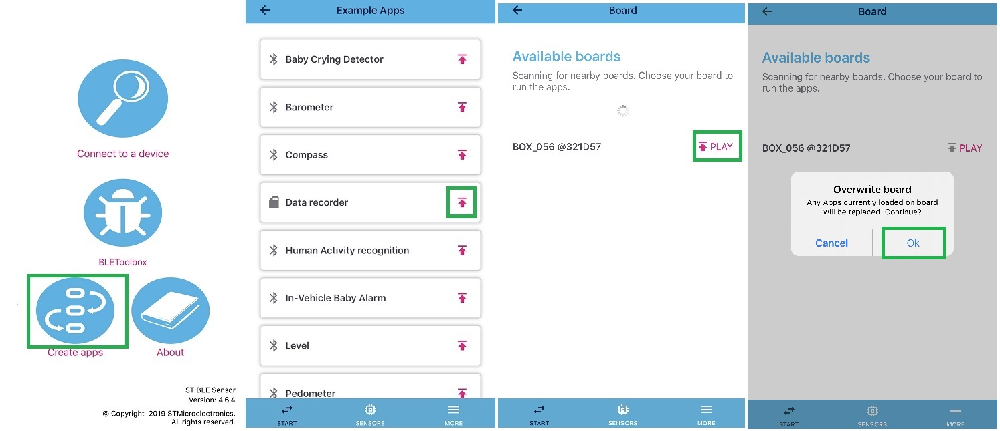

[^Fig.1]: Open the app, click on "Create apps", select the "Data recorder" app, play it on your SensorTile.box, click "ok" to overwrite the board.

By default, the accelerometer needed to build this model is configured at 104 Hz in the app.

If you want to change this setting, please refer to "Appendix A" at the end of these instructions.

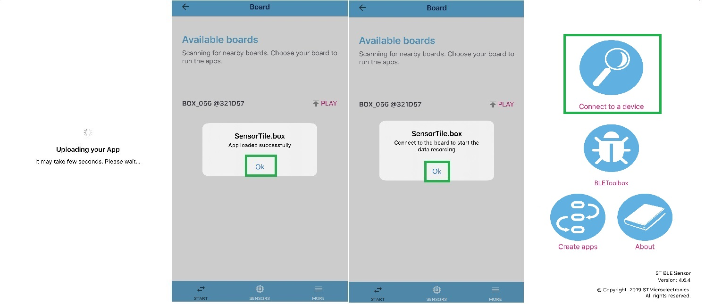

[^Fig.2]: Wait for the app to be uploaded, click "Ok" when done, go back to the main menu and click "Connect to a device".

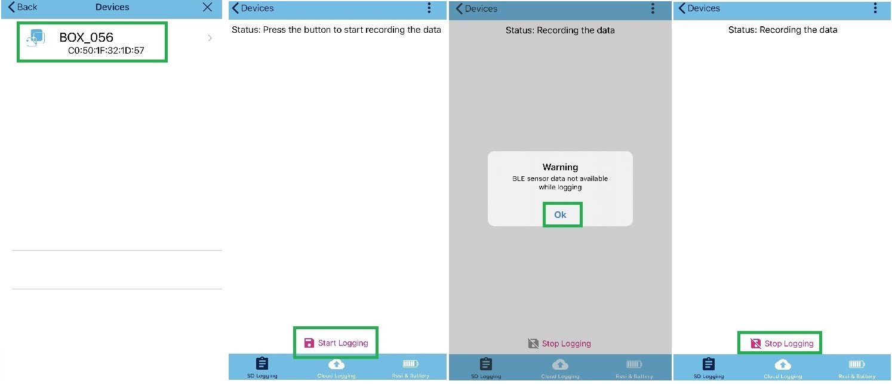

[^Fig.3]: Select your SensorTile.box to connect; once connected click on "Start Logging" to start logging data; while logging, the app is not able to display data: press "Ok" in the warning pop-up window; press "Stop Logging" when you are finished logging data.

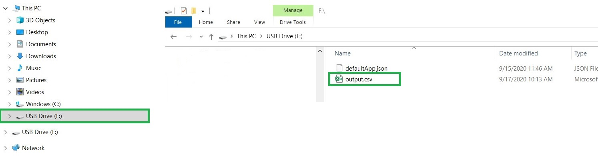

[^Fig.4]: With your SensorTile.box connected using the USB to your PC or laptop, open "File Explorer"; your SensorTile.box will show up as a "USB driver"; open it and copy the output.csv file to a project folder on your PC or laptop.

When completed you should have a minimum of 14 .csv files, one per each class.

Data logs for this example are available [here](./1_datalogs/).

# 2. Load and Label Data Logs

Procedure to label the data logs:

1. The SensorTile.box board doesn't need to be plugged into the PC. Unico GUI can work in standalone in "offline" mode: run the Unico GUI, and uncheck "Communication with the motherboard".
2. **Type "OX" in the search field, select LSM6DSOX** and confirm by pressing the corresponding button.
3. Click on the **MLC button** in the side bar. Select the **Data Patterns tab** (it should already be selected).
4. For each class, click on **Browse** to select the corresponding data log files (multiple files can be selected simultaneously in the dialog), type the label for the class, and click **Load**. Repeat for each class.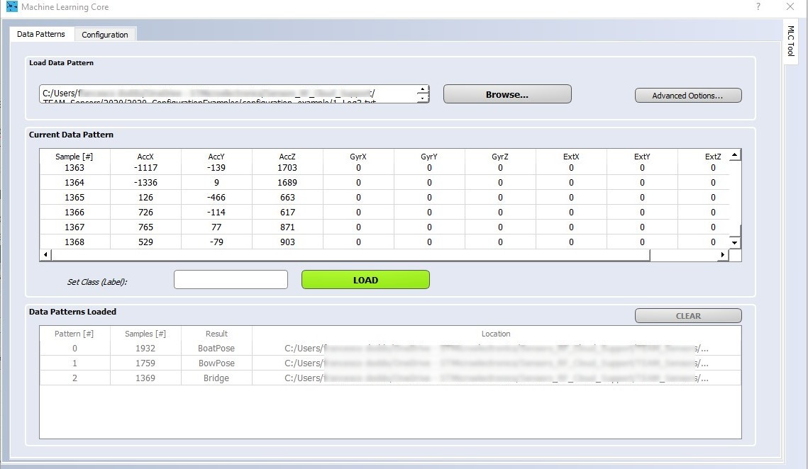
5. When all data logs are loaded, select the **Configuration tab**. For each step, select the desired configuration, then click **Next**.

In this example the accelerometer settings are the same as those used for data capture (2 g, 104 Hz). The MLC is configured to run at the same speed as the accelerometer sensor (104 Hz), and compute a new set of features two times per second (window length of 52 samples has been chosen to get a good tradeoff between latency and time necessary to recognize the movements).

Settings selected in the Configuration tab:

1. LSM6DSOX sensor

2. MLC running at 104Hz

3. Accelerometer only

4. Accelerometer configured for 2g full scale and 104Hz data rate

5. One decision tree only

6. Window length of 52 samples

7. No filter (select "End filters configuration")

8. Select the following features and click Next when done:

   - Mean on accelerometer X-axis: F1_MEAN_on_ACC_X
   - Mean on accelerometer Y-axis: F2_MEAN_on_ACC_Y
   - Mean on accelerometer Z-axis: F3_MEAN_on_ACC_Z

   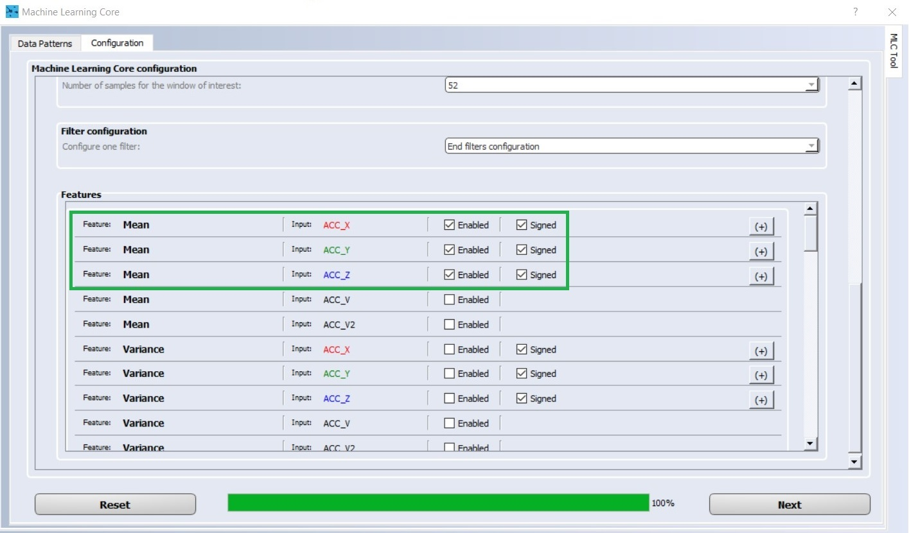

1. Click on **Browse** to select or type the name of the ARFF file where the computed features will be saved. Click Next to save the file. For this example, the features have been saved in [Yoga_Poses.arff](./2_features/Yoga_Poses.arff).
2. Insert the numeric code associated with each label. This is the numeric output of the decision tree when it is run on the MLC (see the note below for details). Then click Next.
   - 0 = Boat Pose
   - 1 = Bow Pose
   - 2 = Bridge
   - 3 = Child's Pose
   - 4 = Cobra's Pose
   - 5 = Downward-Facing Dog
   - 6 = Meditation Pose
   - 7 = Plank
   - 8 = Seated Forward Bend
   - 9 = Standing in Motion
   - 10 = Standing Still
   - 11 = The Extended Side Angle
   - 12 = The Tree
   - 13 = Upward Plank

**ARFF** files are text files: the first few lines describe the attributes (extracted features), the rest of the file has one line for every window (data segment) of every log file processed by Unico. Each line consists of the listed attributes (a number or numeric class) and the corresponding label (a string, or nominal class). This file is the input for the algorithm which designs the decision tree classifier (see next paragraph).

**Note**: one can create groups of at most 4 labels and then use the meta-classifier functionality of the MLC core. The first group uses numeric codes from 0 to 3, the second group uses codes from 4 to 7, the third group uses codes from 8 to 11, and so on. In this example, each label is in a different group, this is why the numeric code is a multiple of 4.

# 3. Design the Decision Tree Classifier

In this example Unico GUI will be used to generate the decision tree classifier.

Press the button "GENERATE" to generate a new decision tree. The decision tree will be automatically saved (same folder as the arff file).

The decision tree can be also generated using third party tools. For more details on the decision tree generation using third party tools, consult the application note [AN5259](https://www.st.com/resource/en/application_note/dm00563460-lsm6dsox-machine-learning-core-stmicroelectronics.pdf):

- Appendix A for Weka
- Appendix B for RapidMiner
- Appendix C for Matlab
- Appendix D for Python SciKit

When the decision tree has been generated using third party tools, it can be loaded using the **Browse** button.

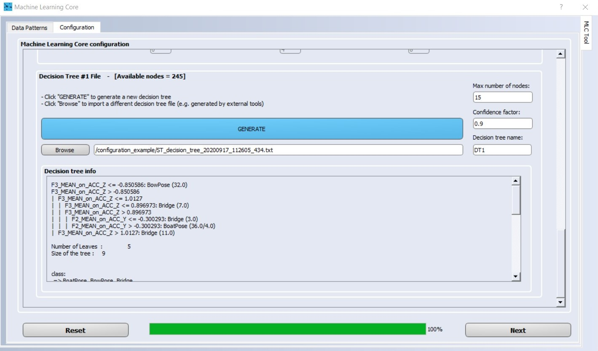

The decision tree used in this example is available [here](./3_decisiontree/ST_decision_tree.txt).

After loading or generating the decision tree, the button **Next** has to be clicked. 

# 4. Generate the MLC configuration file

The user will be first prompted to specify the meta-classifiers (which is not necessary for the purpose of this tutorial). The meta-classifiers can be left at 0.

Finally, the user will be prompted to select the target [UCF file](./4_ucf/lsm6dsox_yoga_pose_recognition.ucf) and, by clicking next, it will be automatically generated by Unico.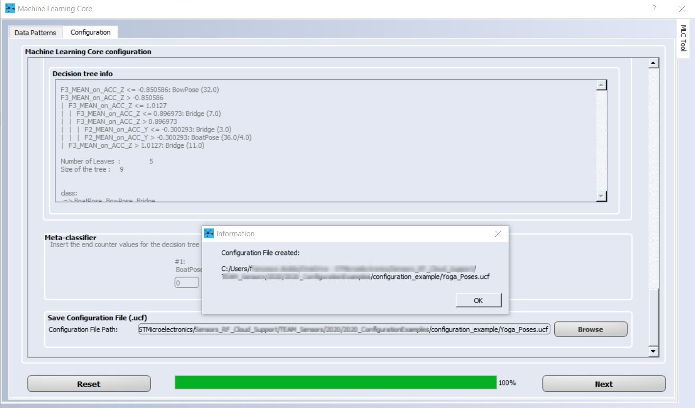

**UCF** stands for Unico Configuration File. It is a text file with a sequence of register addresses and corresponding values. It contains the full sensor configuration, including of course the MLC configuration.

The UCF file can be used as-is by several software tools provided by ST: Unico GUI, Unicleo GUI, AlgoBuilder GUI.

**UCF files can also be converted to C source code** and saved as header *.h* files to be conveniently included in C projects: in the Unico GUI main window click on the Options tab, select Browse and load the UCF file, then click on Generate C code (see picture below).

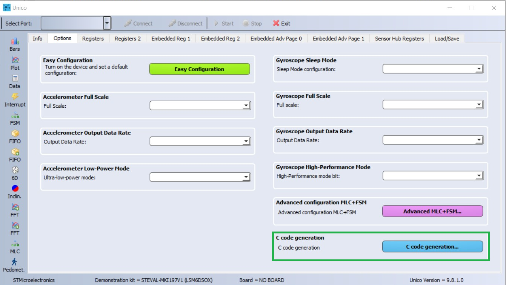

An example of how to use the generated *.h* file in a standard C driver is available in the [STMems_Standard_C_drivers repository](https://github.com/STMicroelectronics/STMems_Standard_C_drivers/blob/master/lsm6dsox_STdC/example/lsm6dsox_mlc.c).

# 5. Use the MLC configuration file

We are showing here three different ways to test the Yoga MLC configuration example.

**The first way** to test the decision tree is to program the [SensorTile.box](https://www.st.com/en/evaluation-tools/steval-mksbox1v1.html) with the **DataLogExtended** firmware available in [FP-SNS-STBOX1](https://www.st.com/content/st_com/en/products/embedded-software/mcu-mpu-embedded-software/stm32-embedded-software/stm32-ode-function-pack-sw/fp-sns-stbox1.html) package. The SensorTile.box can be programmed by [STM32CubeProg](https://www.st.com/content/st_com/en/products/development-tools/software-development-tools/stm32-software-development-tools/stm32-programmers/stm32cubeprog.html#overview):

1. Put the SensorTile.Box in **DFU mode** (Direct Firmware Upgrade): disconnect the battery and unplug the USB cable, press and hold the "DFU boot" button, connect the USB cable then release the button.
2. Run STM32CubeProgrammer, select "USB" from the pull-down menu on the right, then press "Connect". Click on the Menu button in the top-left corner. Optionally perform a full chip erase. Select "Erase & Programming", browse to select the **DataLogExtended** binary, set the address to 0x800 0000, check "Run after Programming", then click "Start Programming".
3. Run [Unicleo GUI](https://www.st.com/content/st_com/en/products/embedded-software/evaluation-tool-software/unicleo-gui.html), connect to the device, click the checkbox to enable the MLC, then click on the MLC button in the left panel, browse and load the *.uc*f file, finally click the Start button. 

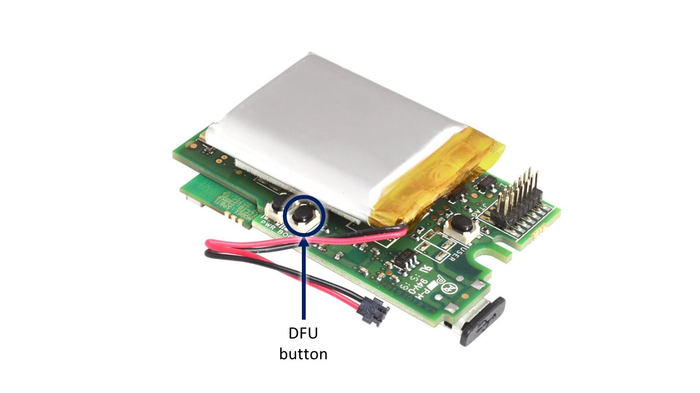

**The second way** to test the decision tree is to create a firmware project using [AlgoBuilder GUI](https://www.st.com/content/st_com/en/products/embedded-software/mems-and-sensors-software/inemo-engine-software-libraries/algobuilder.html). AlgoBuilder can be configured to use [STM32CubeIDE](https://www.st.com/content/st_com/en/products/development-tools/software-development-tools/stm32-software-development-tools/stm32-ides/stm32cubeide.html) to generate the binary, [STM32CubeProg](https://www.st.com/content/st_com/en/products/development-tools/software-development-tools/stm32-software-development-tools/stm32-programmers/stm32cubeprog.html#overview) to program the SensorTile.box device, and [Unicleo GUI](https://www.st.com/content/st_com/en/products/embedded-software/evaluation-tool-software/unicleo-gui.html) to display the output in real-time.

1. Configure AlgoBuilder: "File" menu, "Application Settings", browse to select the path for Unicleo GUI, STM32CubeIDE, and STM32CubeProgrammer. 
2. Create a new design: "File" menu, "New Design", browse and select the directory for the project, select the available IDE toolchain, select "SensorTile.box" or "SensorTile.box BLE" as the target platform (the latter will support the use of a Bluetooth connection instead of the USB cable). 
3. Click and configure the default Sensor Hub block in the design to <u>use the Timer as data rate control</u>, set the data rate to 104 Hz, set the full-scale of the accelerometer to 2 g. These settings match the MLC settings as illustrated in section 1.
4. Expand the "Sensor Hub" library, drag and drop the "FSM / MLC" block in the design, connect it to the Sensor Hub block, click and configure it for 0 Finite State Machine, 1 Decision Tree in the Machine Learning core, browse and select the corresponding *.ucf* file.
5. Optionally, from the "Sensor Hub" library, drag and drop the "Acceleration" block, connect it to the Sensor Hub block. Then, from the "Display" library, drag and drop the "Graph" block, click and configure it for the accelerometer data type, then connect it to the Acceleration block.
6. Generate the project: "Firmware" menu, "Generate C code". Then build the binary: "Firmware" menu, "Build Firmware". 
7. Program the target: put the SensorTile.box in **DFU mode**, "Tools" menu, "Program Target". Then "Tools" menu, "Run Unicleo-GUI application", connect to the device, press Start to display the output in real-time.

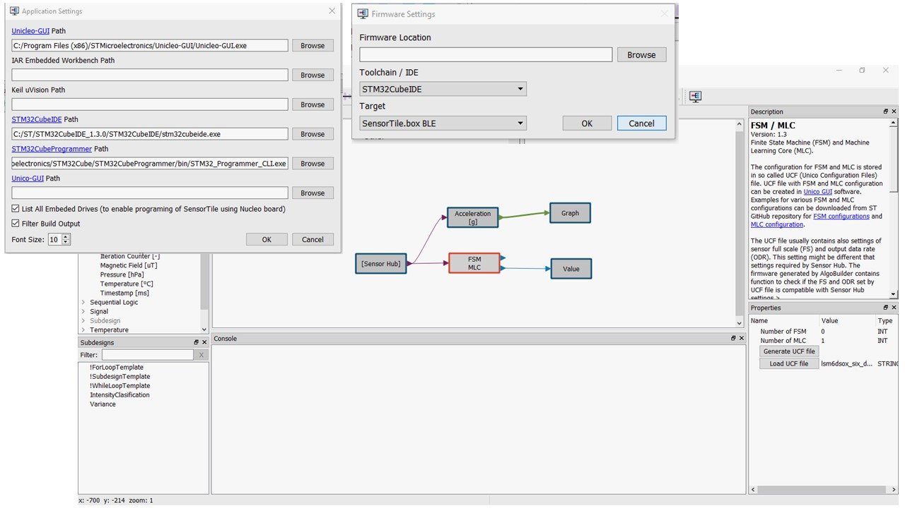

The Decision Tree classifier has been created using the **MLC Tool** available in [Unico GUI](https://www.st.com/content/st_com/en/products/embedded-software/evaluation-tool-software/unico-gui.html). To re-create it, run Unico, click on the MLC button in the left panel, load and label the data logs, then switch to the configuration tab and configure the MLC as illustrated in section 1.

In this example there are 2 data logs for each class. Each data log is a *.csv* files recorded by the [Unicleo GUI](https://www.st.com/content/st_com/en/products/embedded-software/evaluation-tool-software/unicleo-gui.html) connected via USB to the [SensorTile.box](https://www.st.com/en/evaluation-tools/steval-mksbox1v1.html). The SensorTile.box has been programmed with the **DataLogExtended** firmware available in [FP-SNS-STBOX1](https://www.st.com/content/st_com/en/products/embedded-software/mcu-mpu-embedded-software/stm32-embedded-software/stm32-ode-function-pack-sw/fp-sns-stbox1.html) package.

The MLC tool will create the file with all computed features (*Yoga_Poses.arff*), the file with the description of the decision tree (*ST_decision_tree.txt*), the file with performance statistics (*ST_decision_tree_stats.txt*), and the Unico Configuration File for the Machine Learning Core (*Yoga_Poses.ucf*).  

**The third way** to test the decision tree is to load it in the STBLESensor app.

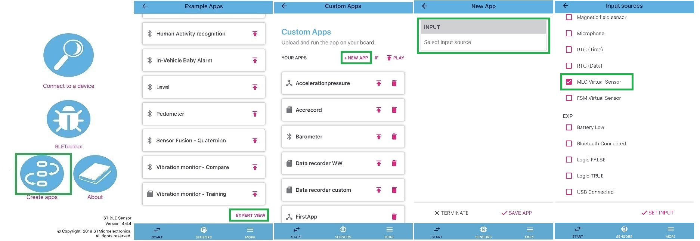

[^Fig.5]: press "Create apps"; scroll down the menu and press on expert view; click on "INPUT" and select "MLC Virtual Sensor"

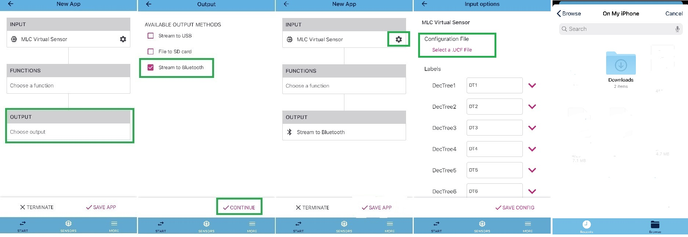

[^Fig.6]: press on "choose output" and select "Stream to Bluetooth" and then "CONTINUE"; click on the MLC Virtual Sensor setting icon, then on "Select a UCF file" and select it from your favorite cloud repository. 

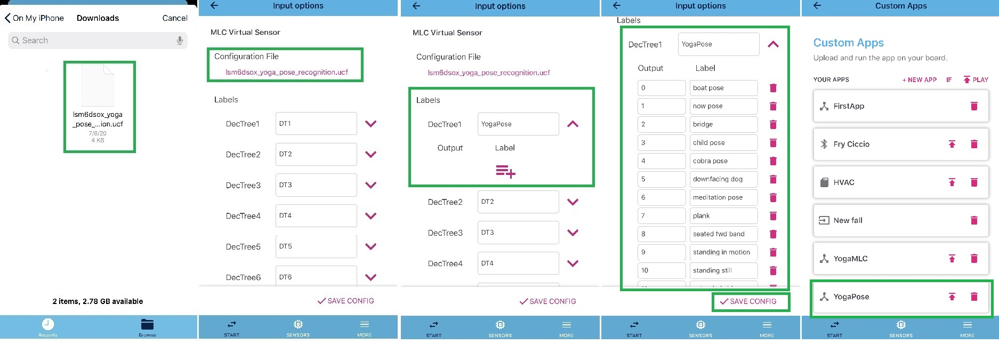

[^Fig.7]: select the .ucf file then name your decision tree and assign numbers and labels to the output of the decision tree. Click on "SAVE CONFIG" and you should now see the app available.

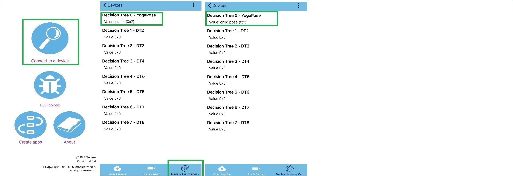

[^Fig.8]: go back to the main menu and click on "Connect to a device"; after connecting to your SensorTile.box go to the "Machine Learning Core" tab and you'll see the Yoga decision tree. Use the SensorTile.box as described in Fig.A and you'll be able to see the output of the decision tree in the app.

# Appendix A

This appendix describes how to modify the default parameters of the sensors from the STBLESensor app to fit the data acquisition requirements.

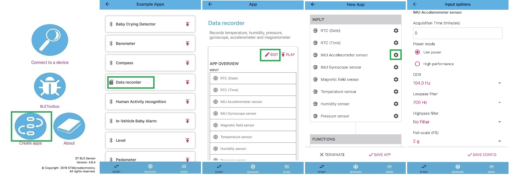

[^Fig.5]: click on "Create apps"; click on the example you want to edit; click on "EDIT"; click on the "Setting" button for the sensor you want to edit; change the available parameters.

------

**More information: [http://www.st.com](http://st.com/MEMS)**

**Copyright © 2020 STMicroelectronics**

