This ReadMe file describes how to use the **Machine Learning Core (MLC)** configuration in ST MEMS sensors that can be found on the [**SensorTile.box**](https://www.st.com/content/st_com/en/products/evaluation-tools/product-evaluation-tools/mems-motion-sensor-eval-boards/steval-mksbox1v1.html) evaluation board. This example shows how MLC functionality can be used for a Motion Intensity detection use case.

**MLC** is a highly configurable and power-efficient hardware logic offered in ST sensors, supporting multiple Decision Tree classifiers. [**LSM6DSOX**](https://www.st.com/en/mems-and-sensors/lsm6dsox.html) is a 6-axis iNemo inertial module that features MLC and can be found in the SensorTile.box.

This example explains the following steps:

1. How to capture the data log for each class to be classified
2. How to label each data log
3. How to design the decision tree classifier
4. How to configure the MLC to run the generated decision tree
5. How to check the decision tree output in real-time when it is running in the MLC

**Software** Tools:

The picture below shows the workflow to implement the five steps above and the different software tools that can be used.

For the example discussed here, **AlgoBuilder GUI**, **Unicleo GUI** and **Unico GUI** software tools will be used.

For more details on the software tools:

- [Unico GUI](https://www.st.com/content/st_com/en/products/embedded-software/evaluation-tool-software/unico-gui.html) software tool useful to generate the LSM6DSOX MLC configuration
- [Unicleo GUI](https://www.st.com/content/st_com/en/products/embedded-software/evaluation-tool-software/unicleo-gui.html) software tool to work with [Nucleo](https://www.st.com/content/st_com/en/products/evaluation-tools/product-evaluation-tools/mcu-mpu-eval-tools/stm32-mcu-mpu-eval-tools/stm32-nucleo-boards.html) motherboards coupled with X-Nucleo expansion boards and SensorTile.box. It will be used to acquire the data for the MLC training and to see the results of the MLC implementation
- [AlgoBuilder GUI](https://www.st.com/content/st_com/en/products/embedded-software/mems-and-sensors-software/inemo-engine-software-libraries/algobuilder.html) software tool to design a custom processing flow and build the firmware for Nucleo boards coupled with the MEMS expansions or form-factor evaluation boards such as SensorTile.Box
  - For complete functionality of AlgoBuilder, the following software packages need to be installed as well:
    - [STM32CubeIDE](https://www.st.com/en/development-tools/stm32cubeide.html)
    - [STM32CubeProg](https://www.st.com/en/development-tools/stm32cubeprog.html)

**Hardware**: 

In this example we will be using the **LSM6DSOX inertial measurement unit (IMU)** with an accelerometer and a gyroscope sensor. This sensor is one of several sensors that are included with SensorTile.box. The same procedure shown in this tutorial also applies to other ST sensors with MLC support.

For more details on the hardware:

- ST resource page on [MEMS sensor](  https://www.st.com/mems  )
- ST resource page on [Explore Machine Learning Core in MEMS sensors]( https://www.st.com/content/st_com/en/campaigns/machine-learning-core.html )
- Application note [AN5259](  https://www.st.com/resource/en/application_note/dm00563460-lsm6dsox-machine-learning-core-stmicroelectronics.pdf  ) on MLC embedded in [LSM6DSOX](https://www.st.com/content/st_com/en/products/mems-and-sensors/inemo-inertial-modules/lsm6dsox.html) 

# 1. Capture Data Logs

In this example the MLC will be configured to recognize three different classes or scenarios of Motion Intensity: 

- *no_movement* ([static.csv](./1_datalogs/static.csv))
- *medium_intensity_movement* ([medium_intensity.csv](./1_datalogs/medium_intensity.csv))
- *high_intensity_movement* ([high_intensity.csv](./1_datalogs/high_intensity.csv))

Each class to be classified by the decision tree must be characterized by one or more data logs.

**Hardware** needed:

- [STEVAL-MKSBOX1V1](https://www.st.com/content/st_com/en/products/evaluation-tools/product-evaluation-tools/mems-motion-sensor-eval-boards/steval-mksbox1v1.html), referenced as SensorTile.box, is a ready-to-use box kit with wireless IoT and wearable sensor platform to help you use and develop apps based on remote motion and environmental sensor data, regardless of your level of expertise
- Micro USB cable to connect the SensorTile.box to the PC 

**Software** needed:

- [AlgoBuilder](https://www.st.com/en/embedded-software/algobuilder.html) to graphically design the custom program that we want to run on our SensorTile.box and automatically compile firmware that can be directly uploaded on the board
- [Unicleo](https://www.st.com/en/embedded-software/unicleo-gui.html) to prove the functionality of the FW created with AlgoBuilder (acquire the sensor data, check the MLC functionality, etc.)

The first step of this tutorial will show how to design dedicated acquisition firmware for the SensorTile.box in order to collect the data that will be used to train the MLC. The user should start by launching AlgoBuilder. If this is the first time that the user launches AlgoBuilder, it is necessary to follow the instructions below before starting a new project:

1. On the top left corner of the main window click on **File--->Application Settings** and a new window will pop up
2. Provide the installation path for the following software:
   - **Unicleo-GUI** (typical path *C:/Program Files (x86)/STMicroelectronics/Unicleo-GUI/Unicleo-GUI.exe*)
   - **STM32CubeIDE** (typical path *C:\ST\STM32CubeIDE_1.3.0\STM32CubeIDE\stm32cubeide.exe*)
   - **STM32CubeProgrammer** (typical path *C:/Program Files (x86)/STMicroelectronics/STM32Cube/STM32CubeProgrammer/bin/STM32_Programmer_CLI.exe*)
   - **Unico-GUI** (typical path *C:/Program Files (x86)/STMicroelectronics/Unico/bin/unico.exe*)

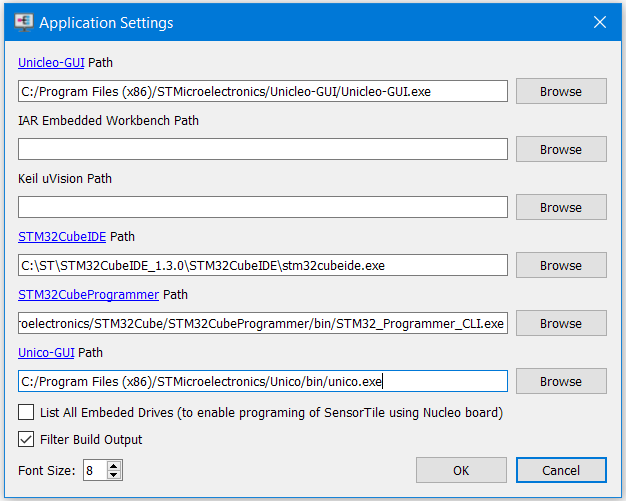

Once these initial settings are confirmed, the user can create a new project for the SensorTile.box:

1. Click on **File--->New design** in the top left corner

2. Select a target folder for the new project, select **STM32CubeIDE** as Toolchain/IDE and **Sensortile.box** as Target. Click Ok to proceed.

   

3. The new project will open up and you will see a block diagram where the "Sensor Hub" node is already placed. If not, you can drag and drop it from the Library menu on the left.

4. Double click on the Sensor Hub node and its properties will show up in the bottom right side menu. Here you can modify the settings of the inertial sensor (such as XL and Gyro full scale). For this example we can leave the full scales in the default configuration (Acc_FS=4g and Gyro_FS=500dps) but, instead, we should modify the *"Data Rate"* to *"26"*. This means that the sensor will output data at a rate of 26Hz.

5. Once the Sensor Hub is set up, you can select the *"Acceleration [g]"* block and connect it to the Sensor Hub. This means that you will extract only accelerometer data from the sensor hub.

6. It is also possible to add a graph block to visualize the XL data in real time using Unicleo. You can add it to the diagram by dragging and dropping the library element *"Display--->Graph"*. Before connecting it to the *"Acceleration [g]"* it is required to enter the Graph block settings and change the "Number of Curves" to 3. It is also possible to rename the curves and, in our case, we will plot the X, Y and Z axes of the accelerometer.

If these steps have been followed correctly, the block diagram should look like the one in the picture below:

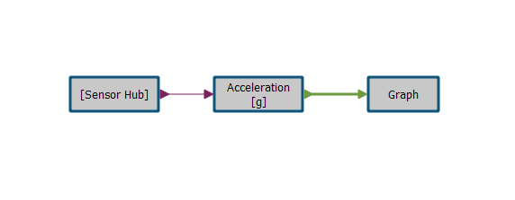

It is now possible to save the customized block diagram and to finally build the first firmware that will be uploaded to the SensorTile.box. By clicking the **Build firmware** button in the top bar () the sequence will start; it will take a while to compile. A "Build Process Finished" message will show up in the console when the task is completed.

With the compiled firmware the user can now connect the SensorTile.box to the PC and flash it. To upload the new firmware the user must connect the SensorTile.box in **DFU mode**. To do so, it is important to first disconnect the battery and remove the SensorTile.box from its chassis. Once this action has been performed, the user has to press and hold down the **Boot** button while connecting the board via USB to the PC. Once the board has been connected, the Boot button can be released.

If the connection procedure has been performed correctly, by clicking the **Program target** button (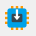) the flash procedure will automatically start.

Once the flash procedure is completed, the user can reset the board by disconnecting and reconnecting it to the PC (this time, without using the **Boot** button) and can start to use **Unicleo** to acquire data.

Unicleo can be launched from the AlgoBuilder UI by clicking its button (): the Unicleo GUI will pop up.

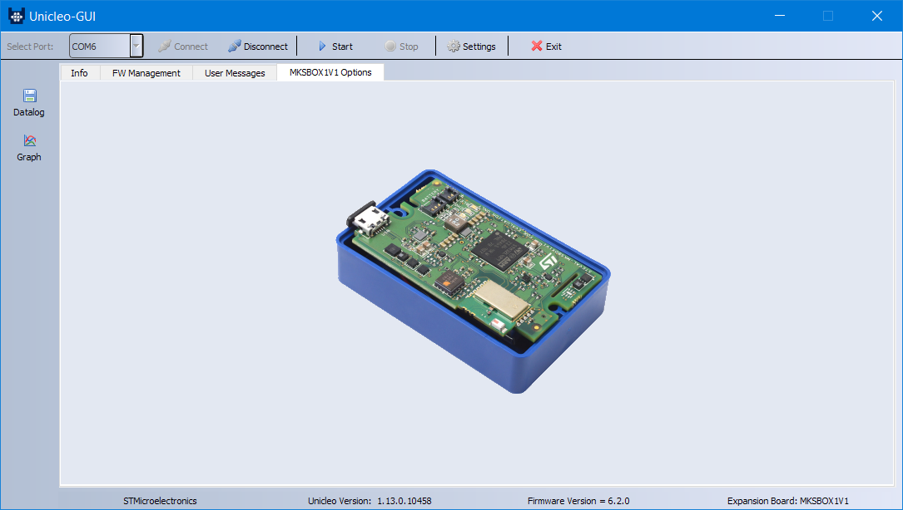

If the board has been detected correctly, no error message should appear and the Unicleo-GUI will look like the one in the picture above. By clicking the **Start** button in the top bar () the Sensortile.box will start to transmit the sensor data to the PC (XL only, as previously programmed with AlgoBuilder). It is possible to plot the data in real-time by clicking the **Graph** button ().

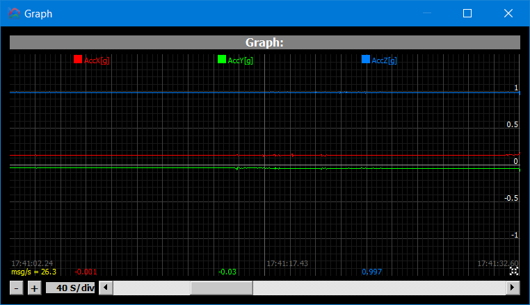

Since the board meets the *"Start"* condition (that means the data is flowing from the board to the PC), click on the **Datalog** button (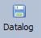) and a pop-up window will appear.

By checking the **Graph** tick box and selecting the name of the log, it is possible to finally click on the **Start** button in the new window to start logging, in the target .csv file, the sensor data. Data logging can be stopped by clicking the adjacent **Stop** button.

To complete this tutorial, it is necessary to acquire 3 different datasets, one for every scenario the MLC will be "trained" to recognize. The 3 acquisitions described below are provided as examples in the ReadMe folder:

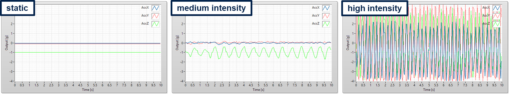

The more data present in the dataset, the better the MLC will be trained to detect the different scenarios (e.g. 10 seconds acquisition with a sampling rate of 26Hz is a good dataset for this specific case).

Once the three datasets are acquired and saved in 3 different .csv files, it is possible to proceed with the second step of the tutorial.

# 2. Load and Label Data Logs

The datalogs need to be loaded and labelled in Unico in order to proceed with the MLC training and the generation of the configuration file for the LSM6DSOX.

Going back to AlgoBuilder, the user can place the FSM/MLC block in the diagram and connect it to the Sensor Hub block. Since only the MLC feature will be used in this tutorial, it is necessary to enter in the FSM/MLC settings and set the FSM value to 0 while the MLC value should not be changed.

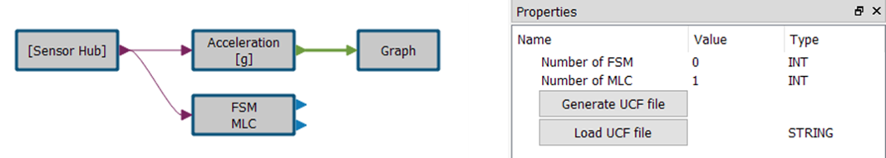

By clicking the **Generate UCF file** button, Unico GUI will pop up. In this phase it is not necessary to have the SensorTile.box board connected to the PC, the MLC generation can be performed offline.

Once Unico GUI is visible, the user can click on the MLC button on the left (). A new window will appear: here it is possible to load the files previously acquired with Unicleo.

The user has to select the target datalog file by clicking the **Browse** button and then, once it is loaded, type a description string in the *"Set Class (label)"* field and, finally, click **Load**. The sequence has to be repeated for all the logs. If the procedure has been performed correctly, the data patterns should look like the following:

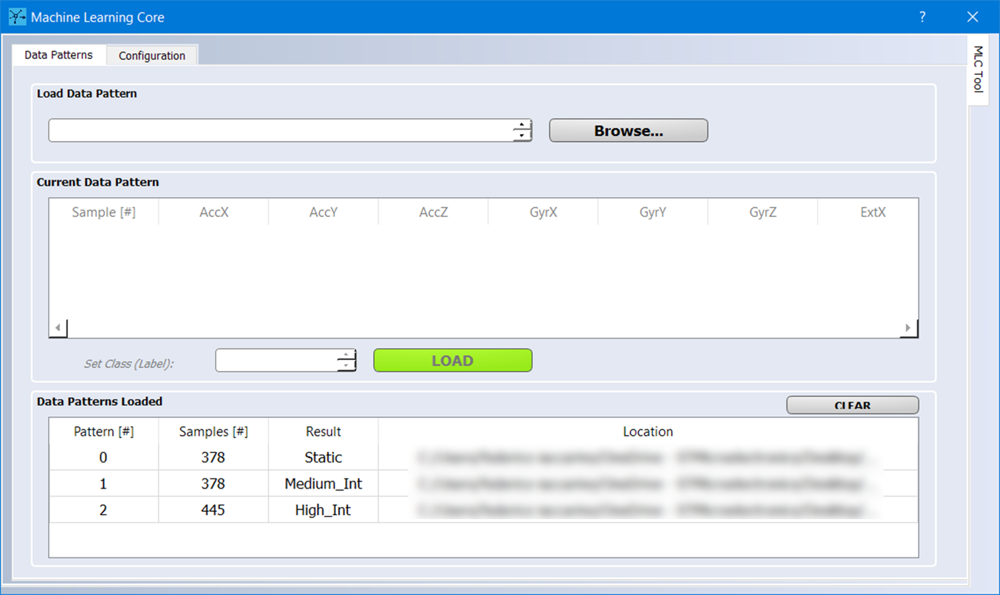

The user can now move to the **Configuration** tab of the current window. Here the user will be prompted with several requests regarding the settings used with the sensor and other parameters related to the MLC. Here below are summarized the choices that the user should select for this example:

- Device: LSM6DSOX
- MLC ODR: 26Hz
- Inputs: Accelerometer only. Full Scale=4g, ODR=26Hz
- Decision trees: 1
- Window length: 26
- Filter configuration: End filters configuration

Now the user has to select the feature(s) used by the MLC to discriminate between the different scenarios. In this case, the **variance of ACC_V** (acceleration vector) is sufficient and should be the only feature selected before continuing with the tutorial.

The user will be then prompted to select the path to save the ARFF file; this will be used to generate the Decision tree for the MLC.

**ARFF** files are text files: the first few lines describe the attributes (extracted features), the rest of the file has one line for every window (data segment) of every log file processed by Unico. Each line is composed of the listed attributes (a number, or numeric class) and the corresponding label (a string, or nominal class). This file is the input for the algorithm which designs the decision tree classifier (see next paragraph).

Once completed, it is possible to insert the numeric code associated with each data label. This is the numeric output that the decision tree will send out when the MLC will be fully configured. One possible decision is given below.

- Static = 0
- Medium_intensity = 4
- High_intensity = 8

# 3. Design the Decision Tree Classifier

Unico offers the possibility to design the decision tree using a built-in algorithm without using third-party tools (such as Weka, Python SciKit, Matlab, and RapidMiner) that can also be used as an alternative.

The procedure to design the decision tree classifier in Unico requires two simple steps:

1. Set the number of **nodes** and the **confidence interval**. In this case, **1** node and **0.9** confidence interval are compatible with the application.

2. Click **Generate** to create a .txt file that will contain the Decision Tree.

More details on decision tree generation using third party tools can be found in the application note [AN5259](  https://www.st.com/resource/en/application_note/dm00563460-lsm6dsox-machine-learning-core-stmicroelectronics.pdf  ):

- Appendix A for Weka
- Appendix B for RapidMiner
- Appendix C for Matlab
- Appendix D for Python SciKit

# 4. Generate the MLC configuration file

The user can now generate the MLC configuration file for LSM6DSOX by clicking on **Next** after generating the decision tree. 

The user will be first prompted to specify the meta-classifier (which is not necessary for the purpose of this tutorial). The meta-classifiers can be left at 0.

Finally, the user will be prompted to select the target UCF file and, by clicking on **Next**, it will be automatically generated by Unico.

**UCF** stands for Unico Configuration File. It is a text file with a sequence of register addresses and corresponding values. It contains the full sensor configuration, including of course the MLC configuration. 

The UCF file can be used as-is by several software tools provided by ST: Unico GUI, Unicleo GUI, AlgoBuilder GUI.

**UCF files can also be converted to C source code** and saved as a header *.h* files to be conveniently included in C projects: click on the Options tab, select Browse and load the UCF file, then click on Generate C code.

An example on how to use the generated *.h* file in a standard C driver is available in the [STMems_Standard_C_drivers repository]( https://github.com/STMicroelectronics/STMems_Standard_C_drivers/blob/master/lsm6dsox_STdC/example/lsm6dsox_mlc.c ).

# 5. Use the MLC configuration file

The generated UCF file can now be imported in AlgoBuilder to generate the final firmware that will be uploaded to the SensorTile.box.

The user can close Unico, go back to AlgoBuilder and enter the FSM/MLC block settings. By clicking on **Load UCF file** and selecting the previously generated file, the MLC will be configured.

As a last element to add to the block diagram, the user can drag and drop a *"Value"* block to visualize the result of the MCL when running in Unicleo. Before connecting the Value block to the FSM/MLC block, it is necessary to enter its property window and change the *"Number of Values"* field to **1**.

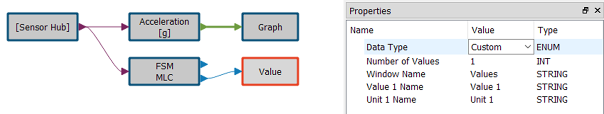

The new firmware is now ready to be compiled. Following the instructions already presented in paragraph 1 of this tutorial, the user can build the firmware by saving the new design and clicking on the **Build the firmware** button. Once this operation is completed, the user has to connect the SensorTile.box to the PC in DFU mode and then proceed with the upload of the newly built firmware.

Once the board has been reconnected to the PC in normal mode, the user can start Unicleo and see the results. By clicking on **Start** and opening the "plot" and "value" windows, it is possible to visualize and appreciate how the MLC is reporting the output value in 3 different scenarios:

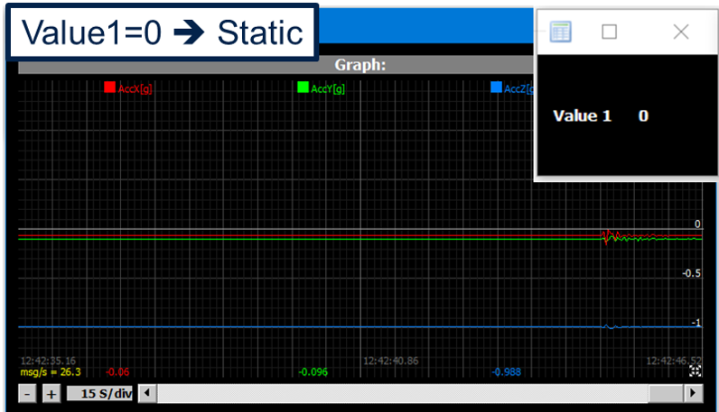

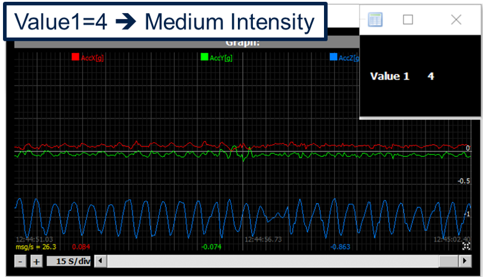

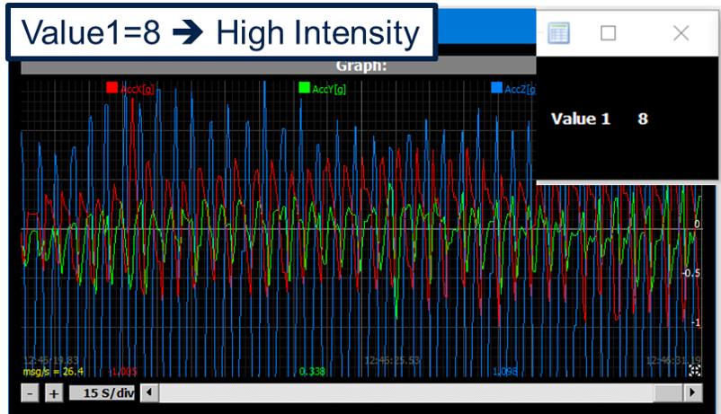

The user can verify that the numeric output of the decision tree does correspond to what is happening to the device. 

The decision tree result is updated at every window. In this example the window is 26 samples long, the data rate is 26Hz, hence the output is updated every second.

------

**More Information: [http://www.st.com](http://st.com/MEMS)**

**Copyright © 2020 STMicroelectronics**

