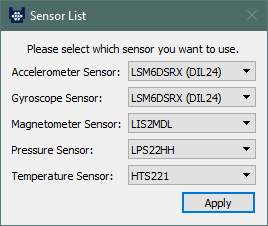
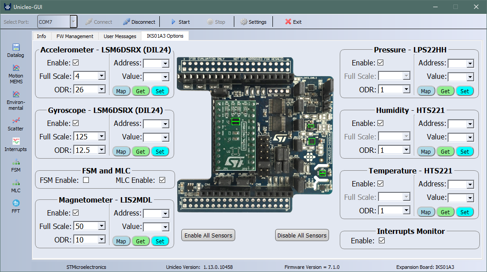
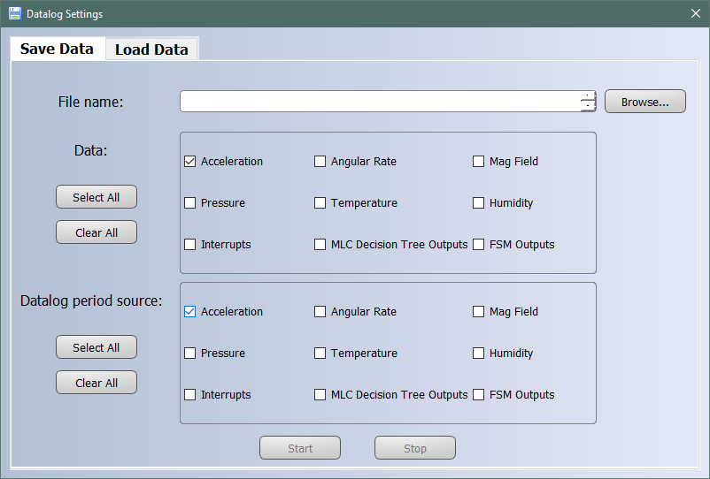
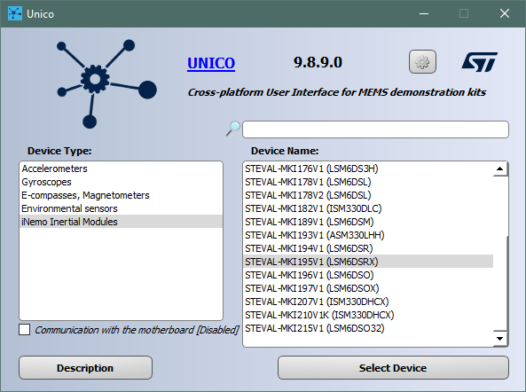
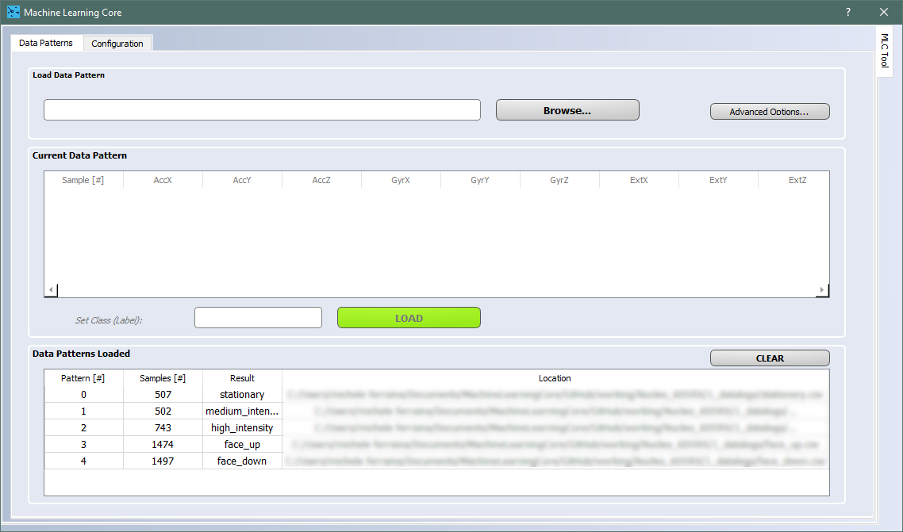
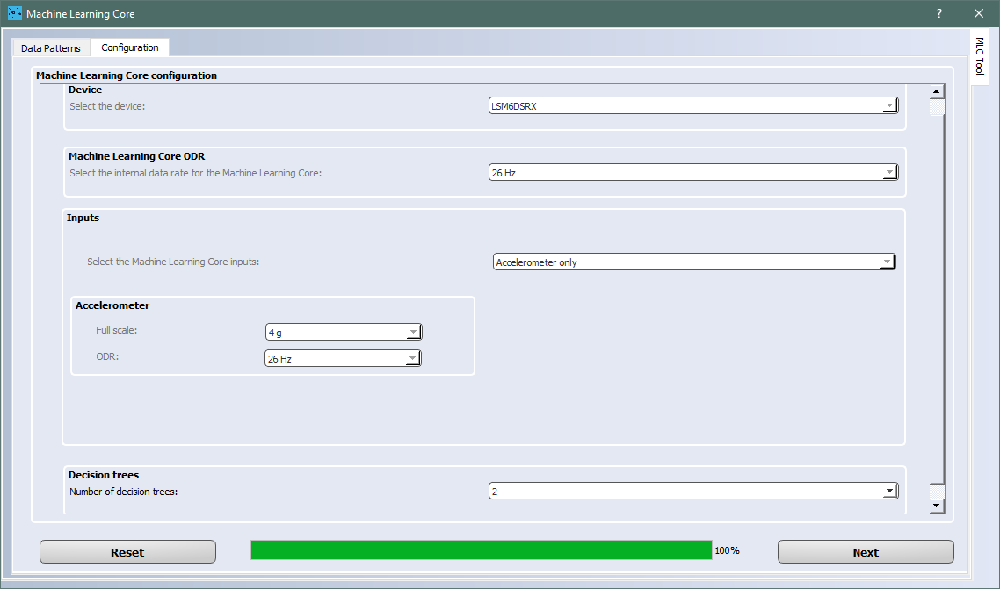
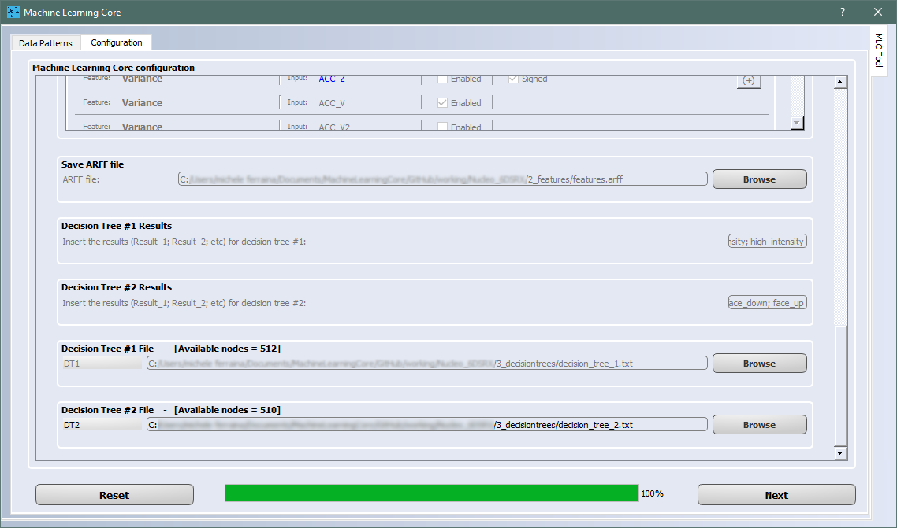
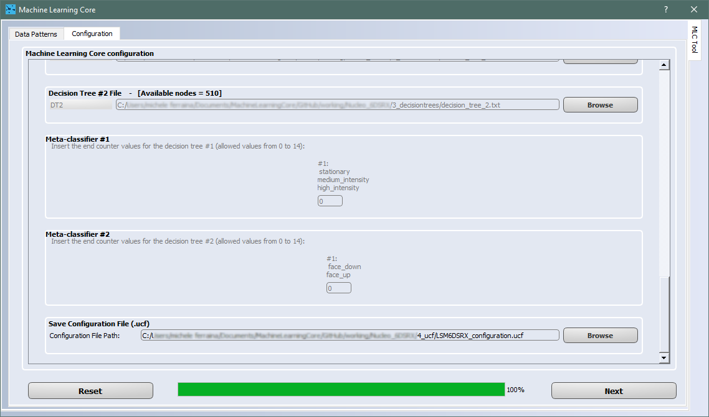
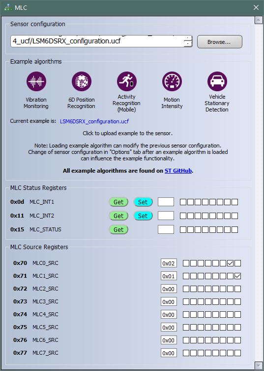

This ReadMe file describes how to use the **Machine Learning Core (MLC)** configuration in ST MEMS sensors with [STM32 Nucleo ](https://www.st.com/content/st_com/en/products/evaluation-tools/product-evaluation-tools/mcu-mpu-eval-tools/stm32-mcu-mpu-eval-tools/stm32-nucleo-boards.html)motherboards coupled with X-Nucleo expansion boards, and in particular the MEMS expansions (e.g. [X-Nucleo-IKS01A3](https://www.st.com/content/st_com/en/products/ecosystems/stm32-open-development-environment/stm32-nucleo-expansion-boards/stm32-ode-sense-hw/x-nucleo-iks01a3.html)). This example shows how MLC functionality can be used for Motion Intensity and face-up/down detection use cases.

**MLC** is a highly configurable and power-efficient hardware logic offered in ST sensors, supporting multiple Decision Tree classifiers. [**LSM6DSRX**](https://www.st.com/en/mems-and-sensors/lsm6dsrx.html) is a 6-axis iNemo inertial module that features MLC and can be mounted on the X-Nucleo expansion board.

This example explains the following steps:

1. How to capture the data log for each class to be classified
2. How to label each data log
3. How to design the decision tree classifier
4. How to configure the MLC to run the generated decision tree
5. How to check the decision tree output in real-time when it is running in the MLC

**Software** Tools:

The picture below shows the workflow to implement the five steps above and the different software tools that can be used.

For the example discussed here, **Unicleo GUI** and **Unico GUI** software tools will be used, and MATLAB as an external tool for decision tree generation.

For more details on the software tools:

- [Unicleo GUI](https://www.st.com/content/st_com/en/products/embedded-software/evaluation-tool-software/unicleo-gui.html) software tool working with [Nucleo](https://www.st.com/content/st_com/en/products/evaluation-tools/product-evaluation-tools/mcu-mpu-eval-tools/stm32-mcu-mpu-eval-tools/stm32-nucleo-boards.html) motherboards coupled with X-Nucleo expansion boards and an optional sensor in the form of the DIL24 adapter. It will be used to acquire the data for the MLC training and to see the results of the MLC implementation.
- [Unico GUI](https://www.st.com/content/st_com/en/products/embedded-software/evaluation-tool-software/unico-gui.html) software tool useful to generate the LSM6DSRX MLC configuration.
- [MATLAB](www.mathworks.com) and dedicated scripts to generate the decision trees.

**Hardware**: 

In this example we will be using the **LSM6DSRX inertial measurement unit (IMU)** with an accelerometer and a gyroscope sensor. This sensor is one of several sensors that can be mounted in the X-Nucleo expansion board. The same procedure shown in this tutorial also applies to other ST sensors with MLC support.

For more details on the hardware:

- ST resource page on [MEMS sensor](  https://www.st.com/mems  )
- ST resource page on [Explore Machine Learning Core in MEMS sensors]( https://www.st.com/content/st_com/en/campaigns/machine-learning-core.html )
- Application note [AN5393](   https://www.st.com/resource/en/application_note/dm00651840-lsm6dsrx-machine-learning-core-stmicroelectronics.pdf  ) on MLC embedded in [LSM6DSRX](https://www.st.com/content/st_com/en/products/mems-and-sensors/inemo-inertial-modules/lsm6dsrx.html) 

# 1. Capture Data Logs

In this example the MLC will be configured to run two different decision trees, recognizing five different classes overall.

- Decision tree 1: Motion Intensity detection (three classes) 
  - *no_movement*
  - *medium_intensity_movement* 
  - *high_intensity_movement* 
- Decision tree 2: Face-up / Face-down detection (two classes) 
  - *face_up*
  - *face_down*

Each class to be classified by the decision tree must be characterized by one or more data logs.

**Hardware** needed:

- [STM32 Nucleo board](https://www.st.com/content/st_com/en/products/evaluation-tools/product-evaluation-tools/mcu-mpu-eval-tools/stm32-mcu-mpu-eval-tools/stm32-nucleo-boards.html), for this example the [Nucleo-F411RE]( https://www.st.com/content/st_com/en/products/evaluation-tools/product-evaluation-tools/mcu-mpu-eval-tools/stm32-mcu-mpu-eval-tools/stm32-nucleo-boards/nucleo-f411re.html ) has been used.
- [X-Nucleo-IKS01A3](https://www.st.com/content/st_com/en/products/ecosystems/stm32-open-development-environment/stm32-nucleo-expansion-boards/stm32-ode-sense-hw/x-nucleo-iks01a3.html), expansion board for STM32 Nucleo boards.
- [STEVAL-MKI195V1](  https://www.st.com/content/st_com/en/products/evaluation-tools/product-evaluation-tools/mems-motion-sensor-eval-boards/steval-mki195v1.html  ), daughterboard with **LSM6DSRX** IMU sensor (referenced as **DIL24 adapter** in ST's documentation). It must be plugged into the X-Nucleo expansion board.
- Mini USB cable to connect the Nucleo board to the PC.

**Software** needed:

- [Unicleo](https://www.st.com/en/embedded-software/unicleo-gui.html) to acquire the sensor data and check MLC functionality. For this example, version 1.13.0 has been used. 

Follow these required steps to start data acquisition with *Unicleo GUI*: 

1. Download the latest version of [Unicleo GUI](https://www.st.com/en/embedded-software/unicleo-gui.html) (if not already installed on your PC)

2. Download the latest version of [X-CUBE-MEMS1](https://www.st.com/content/st_com/en/products/embedded-software/mcu-mpu-embedded-software/stm32-embedded-software/stm32cube-expansion-packages/x-cube-mems1.html) 

3. Plug the X-NUCLEO expansion board (e.g. MEMS expansion board [X-Nucleo-IKS01A3](https://www.st.com/content/st_com/en/products/ecosystems/stm32-open-development-environment/stm32-nucleo-expansion-boards/stm32-ode-sense-hw/x-nucleo-iks01a3.html) into the [STM32 Nucleo](https://www.st.com/content/st_com/en/products/evaluation-tools/product-evaluation-tools/mcu-mpu-eval-tools/stm32-mcu-mpu-eval-tools/stm32-nucleo-boards.html) board

4. Plug the DIL24 adapter of LSM6DSRX ([STEVAL-MKI195V1](https://www.st.com/content/st_com/en/products/evaluation-tools/product-evaluation-tools/mems-motion-sensor-eval-boards/steval-mki195v1.html)) into the DIL24 socket on the X-NUCLEO expansion board

5. Plug the [STM32 Nucleo](https://www.st.com/content/st_com/en/products/evaluation-tools/product-evaluation-tools/mcu-mpu-eval-tools/stm32-mcu-mpu-eval-tools/stm32-nucleo-boards.html) board into your PC using the USB cable

6. [STM32 Nucleo](https://www.st.com/content/st_com/en/products/evaluation-tools/product-evaluation-tools/mcu-mpu-eval-tools/stm32-mcu-mpu-eval-tools/stm32-nucleo-boards.html) has to be programmed with **DataLogExtended** firmware from the X-CUBE-MEMS1 package (if already programmed you can skip the following two steps) 

   1. Locate the *DatalogExtended.bin* file in the X-CUBE-MEMS1 package (*STM32CubeExpansion_MEMS1_Vx.x.x\Projects\STM32xxxxxx-Nucleo\Examples\IKS0xxxx\DataLogExtended*\)
   2. Copy the *DatalogExtended.bin* file to the disk drive associated with the STM32 Nucleo board
   
7. Run *Unicleo GUI*, select LSM6DSRX (DIL24) as Accelerometer Sensor

   

8. Enable *Accelerometer* with *Full Scale=4g, ODR=26Hz,* and press *Start*

   

9. Open the Datalog tool from the sidebar on the left, and select *Acceleration* both in *Data* and in *Datalog period source*, insert the file name and click *Start/Stop* to start and stop logging

   

10. Save the data logs for the five classes mentioned at the beginning of this section (the first three for motion intensity detection, and the last two for face-up/down detection):

- [stationary.csv](./1_datalogs/stationary.csv) 

- [medium_intensity.csv](./1_datalogs/medium_intensity.csv) 

- [high_intensity.csv](./1_datalogs/high_intensity.csv) 

- [face_up.csv](./1_datalogs/face_up.csv) 

- [face_down.csv](./1_datalogs/face_down.csv) 

  

# 2. Load and Label Data Logs

**Software** needed:

-  [Unico GUI](https://www.st.com/content/st_com/en/products/embedded-software/evaluation-tool-software/unico-gui.html), to generate the MLC configuration for LSM6DSRX. For this example, version 9.8.9.0 has been used. 

The data logs need to be loaded and labelled in Unico in order to proceed with the MLC training and the generation of the configuration file for the LSM6DSRX. 

Unico can run in "offline mode" (without any board) to generate the MLC configuration. To enable the "offline mode" in Unico, the checkbox "*Communication with the motherboard*" must be unchecked.

After selecting the LSM6DSRX device in Unico, the MLC tool can be opened by clicking the MLC button on the left of the main window. A new window will appear in which it is possible to load the files previously acquired with Unicleo.

The data log file can be selected by clicking the *Browse* button and then, once it is loaded, the label (name of the class associated to that data log) can be typed in the *"Set Class (label)"* field. Finally, by clicking **Load**, the data pattern has been loaded. The sequence has to be repeated for all the logs. If the procedure has been performed correctly, the data patterns should look like this:

The user can now move to the "Configuration" tab of the current window. Here the user will be prompted with several requests regarding the settings used with the sensor and other parameters related to the MLC. Here below are summarized the choices that the user should select for this example:

- Device: LSM6DSRX
- MLC ODR: 26Hz
- Inputs: Accelerometer only. Full Scale=4g, ODR=26Hz
- Decision trees: 2
- Window length: 26
- Filter configuration: End filters configuration

Now the user has to select the features used by the MLC to discriminate between the different scenarios. In this case, the following features have been chosen:

- **Variance on the accelerometer norm**, to easily distinguish the different *motion intensity* classes;
- **Mean on the accelerometer Z axis**, to easily distinguish *face_up* from *face_down*.

The user will be then prompted to select the path to save the ARFF file ([features.arff](./2_features/features.arff)); this will be used to generate the Decision tree for the MLC.  

**ARFF** files are text files: the first few lines describe the attributes (extracted features), the rest of the file has one line for every window (data segment) of every log file processed by Unico. Each line is made of the listed attributes (a number, or numeric class) and the corresponding label (a string, or nominal class). This file is the input for the algorithm which designs the decision tree classifier (see next paragraph).

Unico also requires the expected results for each decision tree (numeric code associated with each data label). In this case two decision trees are going to be generated, so two sets of results have to be loaded in Unico:

For Decision Tree #1 (motion intensity) the configured results are: 

- stationary; medium_intensity; high_intensity

  which corresponds to the following codes:

  - stationary = 0
  - medium_intensity = 1
  - high_intensity = 2

For Decision Tree #2 (face-up / face-down) the configured results are: 

- face_down; face_up

  which corresponds to the following codes:

  - face_down= 0
  - face_up= 1

Note: 

- The version of Unico used in this example (v9.8.9.0) generates one single ARFF file including all the features and classes configured ([features.arff](./2_features/features.arff)). However, two decision trees have to be configured in the example, so starting from the .arff file generated by Unico, two subsets of .arff have been manually created, removing the unnecessary classes: 
  - [features_DT1.arff](./2_features/features_DT1.arff), containing all the classes related to motion intensity detection;
  - [features_DT2.arff](./2_features/features_DT2.arff), containing all the classes related to face-up / face-down detection.

# 3. Design the Decision Tree Classifier

**Software** needed:

-  [MATLAB](www.mathworks.com), version R2016b has been used for this example

Unico offers the possibility to design the decision tree using a built-in algorithm. However, in this example Matlab is used to show the possibility to use an external tool, compatible with Unico through dedicated scripts provided by ST.

It is required to import all the scripts provided in the folder [tools/matlab]( https://github.com/STMicroelectronics/STMems_Machine_Learning_Core/tree/master/tools/matlab ) (of the MLC GitHub repository) in the Matlab project workspace. After that, the following commands have been used to generate the two decision tree files, starting from the .arff files generated in the previous section:

    filename_ARFF_1 = 'features_DT1.arff';
    filename_dectree_1 = 'decision_tree_1.txt';
    Generate_DecisionTree(filename_ARFF_1, filename_dectree_1);
    
    filename_ARFF_2 = 'features_DT2.arff';
    filename_dectree_2 = 'decision_tree_2.txt';
    Generate_DecisionTree(filename_ARFF_2, filename_dectree_2);
Through these commands, the two decision trees will be generated: 

- [decision_tree_1.txt](./3_decisiontrees/decision_tree_1.txt), decision tree for motion intensity detection;
- [decision_tree_2.txt](./3_decisiontrees/decision_tree_2.txt), decision tree for face-up / face-down detection.

# 4. Generate the MLC configuration file

**Software** needed:

-  [Unico GUI](https://www.st.com/content/st_com/en/products/embedded-software/evaluation-tool-software/unico-gui.html), to generate the MLC configuration for LSM6DSRX. Unico version 9.8.9.0 has been used for this example. 

The user can now generate the MLC configuration file for LSM6DSRX by clicking **Next** after loading the decision tree files through the **Browse** button. 

The user will be first prompted to specify the meta-classifiers (which is not necessary for the purpose of this tutorial). The meta-classifiers can be left to 0.

Finally, the user will be prompted to select the target UCF file and, by clicking next, it will be automatically generated by Unico.

**UCF** stands for Unico Configuration File. It is a text file with a sequence of register addresses and corresponding values. It contains the full sensor configuration, including of course the MLC configuration. 

The UCF file can be used as-is by several software tools provided by ST: Unico GUI, Unicleo GUI, AlgoBuilder GUI.

**UCF files can also be converted to C source code** and saved as a header *.h* files to be conveniently included in C projects: click on the Options tab, select Browse and load the UCF file, then click on Generate C code.

An example on how to use the generated *.h* file in a standard C driver is available in the [STMems_Standard_C_drivers repository]( https://github.com/STMicroelectronics/STMems_Standard_C_drivers/blob/master/lsm6dsox_STdC/example/lsm6dsox_mlc.c ).

# 5. Use the MLC configuration file

**Hardware** needed:

- [STM32 Nucleo board](https://www.st.com/content/st_com/en/products/evaluation-tools/product-evaluation-tools/mcu-mpu-eval-tools/stm32-mcu-mpu-eval-tools/stm32-nucleo-boards.html), for this example the [Nucleo-F411RE]( https://www.st.com/content/st_com/en/products/evaluation-tools/product-evaluation-tools/mcu-mpu-eval-tools/stm32-mcu-mpu-eval-tools/stm32-nucleo-boards/nucleo-f411re.html ) has been used.
- [X-Nucleo-IKS01A3](https://www.st.com/content/st_com/en/products/ecosystems/stm32-open-development-environment/stm32-nucleo-expansion-boards/stm32-ode-sense-hw/x-nucleo-iks01a3.html), expansion board for STM32 Nucleo boards.
- [STEVAL-MKI195V1](  https://www.st.com/content/st_com/en/products/evaluation-tools/product-evaluation-tools/mems-motion-sensor-eval-boards/steval-mki195v1.html  ), daughterboard with **LSM6DSRX** IMU sensor (referenced as **DIL24 adapter** in STs documentation). It must be plugged into the X-Nucleo expansion board.
- Mini USB cable to connect the Nucleo board to the PC.

**Software** needed:

- [Unicleo](https://www.st.com/en/embedded-software/unicleo-gui.html), the same software used to acquire sensor data will be used to check the MLC functionality. For this example Unicleo version 1.13.0 has been used. 

To run the MLC application example in [Unicleo GUI]( https://www.st.com/en/embedded-software/unicleo-gui.html ) , the `.ucf` file has to be loaded. Follow these required steps (of course the first steps can be skipped if already done during the data log acquisition): 

1. Taking the [STM32 Nucleo](https://www.st.com/content/st_com/en/products/evaluation-tools/product-evaluation-tools/mcu-mpu-eval-tools/stm32-mcu-mpu-eval-tools/stm32-nucleo-boards.html) board configured as in step 1, with the MEMS expansion board [X-Nucleo-IKS01A3](https://www.st.com/content/st_com/en/products/ecosystems/stm32-open-development-environment/stm32-nucleo-expansion-boards/stm32-ode-sense-hw/x-nucleo-iks01a3.html) and the DIL24 adapter of LSM6DSRX ([STEVAL-MKI195V1](https://www.st.com/content/st_com/en/products/evaluation-tools/product-evaluation-tools/mems-motion-sensor-eval-boards/steval-mki195v1.html)), plug the board into your PC using the USB cable

2. Run *Unicleo GUI* and select LSM6DSRX (DIL24) as Accelerometer Sensor

   

3. Click the checkbox to enable the MLC, and then click on the MLC button on the left panel

   

4. Browse and load the *Unico GUI* Configuration File (`.ucf`) using the *Browse* button, finally click the Start button in the main window 

   

5. The MLC results are displayed in the MLC window and User Messages Tab

   - MLC0_SRC (0x70) shows the values of the decision tree 1 (motion intensity)
     - 0x00= stationary
     - 0x01 = medium_intensity 
     - 0x02 = high_intensity

   - MLC1_SRC (0x71) shows the values of the decision tree 2 (face down/up)
     - 0x00= face_down
     - 0x01 =face_up 

   The decision tree results are updated at every window. In this example the window is 26 samples long, the data rate is 26Hz, hence the output is updated every second.

------

**More Information: [http://www.st.com](http://st.com/MEMS)**

**Copyright © 2020 STMicroelectronics**

