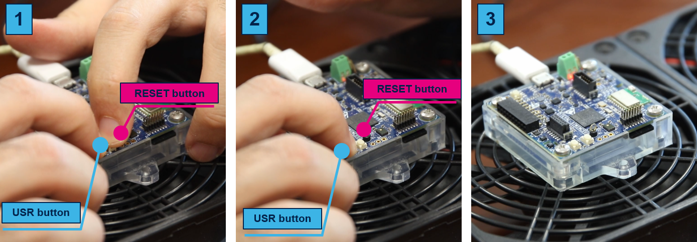
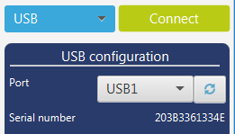
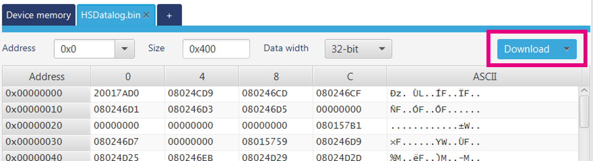
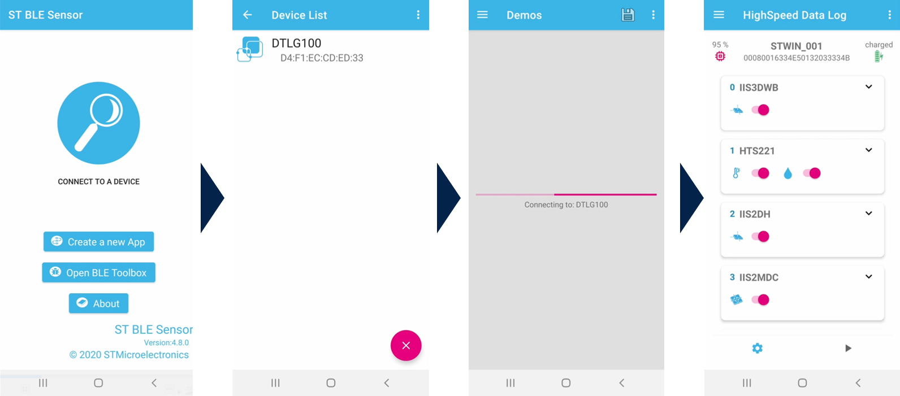
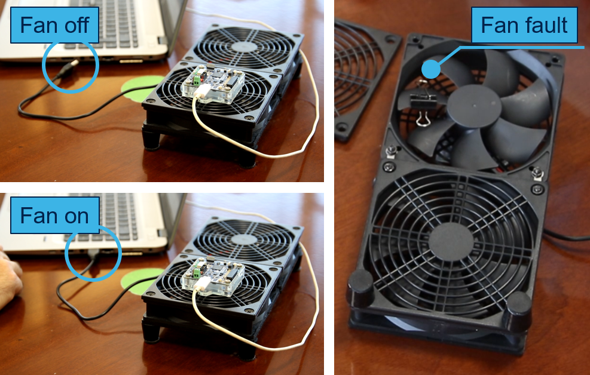
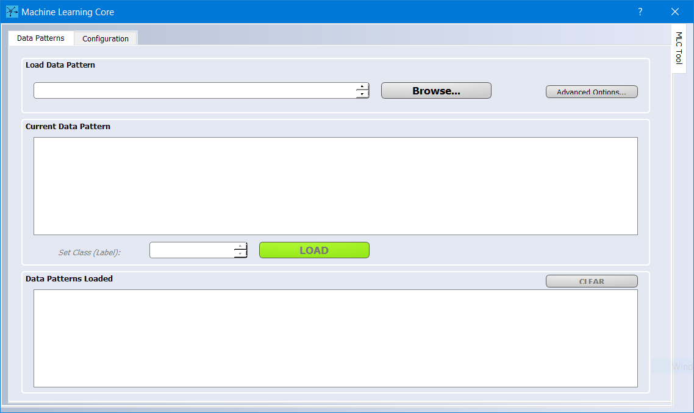
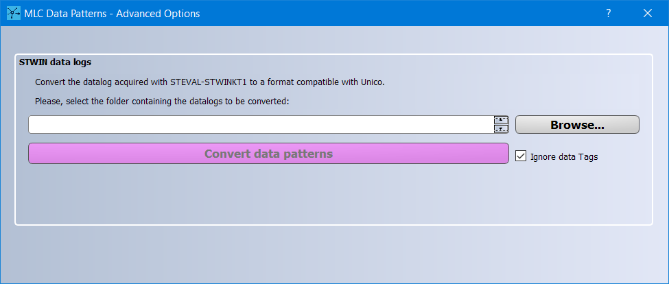
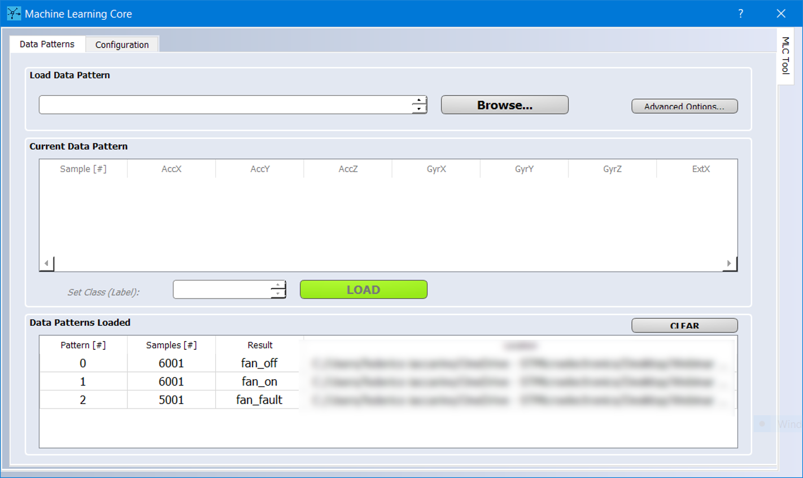
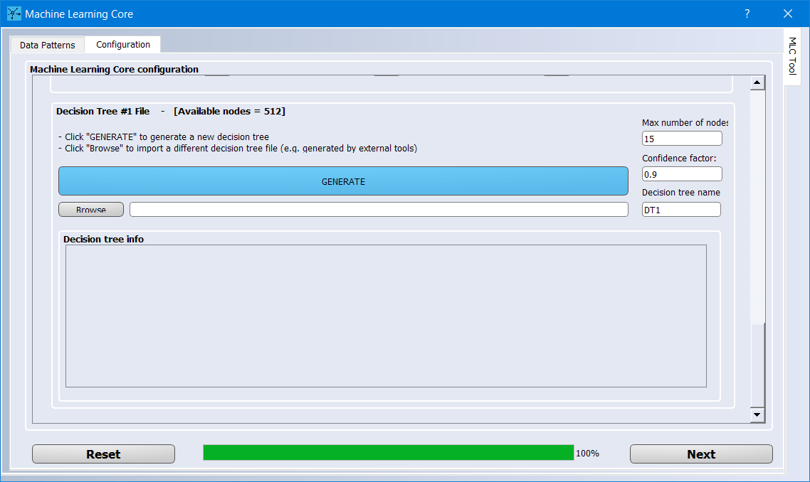
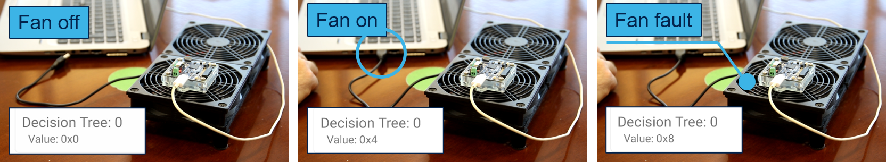

This ReadMe file describes how to use the **Machine Learning Core (MLC)** configuration in the ST MEMS sensors that can be found on the [**STWIN**](https://www.st.com/en/evaluation-tools/steval-stwinkt1b.html) evaluation board. This example shows how MLC functionality embedded in ISM330DHCX can be used for fan rack condition monitoring use case.

**MLC** is a highly configurable and power-efficient hardware logic offered on ST sensors, supporting multiple Decision Tree classifiers. [**ISM330DHCX**](https://st.com/content/st_com/en/products/mems-and-sensors/inemo-inertial-modules/ism330dhcx.html) is a 6-axis iNemo inertial module that features MLC and can be found in the STWIN.

This example explains the following steps:

1. How to capture the data log for each class to be classified
2. How to label each data log
3. How to design the decision tree classifier
4. How to configure the MLC to run the generated decision tree
5. How to check the decision tree output in real-time when it is running in the MLC

**Software** Tools:

The picture below shows the workflow to implement the five steps above and the different software tools that can be used.

For the example discussed here, **STM32CubeProg**, **STBLE Sensor** and **Unico-GUI** software tools will be used.

For more details on the software tools:

- **[STBLESensor](https://www.st.com/en/embedded-software/stblesensor.html) v4.8.0 (or higher)** app for iOS/Android, used to acquire the sensor data, to program the MLC embedded in ISM330DHCX and to check its functionality in real time. 
- **[Unico-GUI](https://www.st.com/content/st_com/en/products/embedded-software/evaluation-tool-software/unico-gui.html) v9.9.0 (or higher)**, used to generate the ISM330DHCX MLC configuration
- **[STM32CubeProg](https://www.st.com/en/development-tools/stm32cubeprog.html) v2.4.0 (or higher)** an all-in-one multi-OS software tool for programming STM32 products.

**Hardware**: 

In this example we will be using the **ISM330DHCX inertial measurement unit (IMU)**, with an accelerometer and a gyroscope sensor. This sensor is one of the several sensors that are included with STWIN. The same procedure shown in this tutorial also applies to other ST sensors with MLC support.

For more details on the hardware:

- ST resource page on [MEMS sensor](  https://www.st.com/mems  )
- ST resource page on [Explore Machine Learning Core in MEMS sensors]( https://www.st.com/content/st_com/en/campaigns/machine-learning-core.html )
- Application note [AN5392](https://www.st.com/resource/en/application_note/dm00651838-ism330dhcx-machine-learning-core-stmicroelectronics.pdf) on MLC embedded in [ISM330DHCX](https://www.st.com/content/st_com/en/products/mems-and-sensors/inemo-inertial-modules/ism330dhcx.html) 

# 1. Capture Data Logs

In this example the MLC will be configured to recognize three different classes or scenarios of the fan rack working mode: 

- *fan_off* ([fan_off.txt](./1_datalogs/fan_off.txt))
- *fan_on* ([fan_on.txt](./1_datalogs/fan_on.txt))
- *fan_fault* ([fan_fault.txt](./1_datalogs/fan_fault.txt))

Each class to be classified by the decision tree must be characterized by one or more data logs.

**Hardware** needed:

- [STEVAL-STWINKT1B](https://www.st.com/en/evaluation-tools/steval-stwinkt1b.html), referenced as STWIN, is a development kit and reference design that simplifies prototyping and testing of advanced industrial IoT applications such as condition monitoring and predictive maintenance.
- An Android/iOS smartphone that can run STBLESensor App. We will use it to interact with the STWIN during the acquisition phase and the real time test.
- A fan rack, which is the platform that we want to monitor with MLC in this example. Any fan rack can be used for this demo as long as it is possible to turn it on/off and to apply a small weight on one of the fan blades (e.g. a metal spring paper clip) to emulate a failure.
- A PC with peripherals for reading the microSD card where STWIN store the data logs.
- Micro USB cable to connect the STWIN to the PC 

**Software** needed:

- [STM32CubeProg](https://www.st.com/en/development-tools/stm32cubeprog.html) to flash the STWIN board with the latest logging firmware.
- [STBLESensor](https://www.st.com/en/embedded-software/stblesensor.html) to acquire the sensor data in the three above mentioned conditions of the rack.

The first step of this tutorial will show how to interact with STBLESensor app to log the training data for the decision tree that we will implement in the ISM330DHCX MLC.

Before proceeding with the app, it is necessary to upload the logging firmware on STWIN. To do so, one has to navigate to the [FP-SNS-DATALOG1](https://www.st.com/content/st_com/en/products/embedded-software/mcu-mpu-embedded-software/stm32-embedded-software/stm32-ode-function-pack-sw/fp-sns-datalog1.html) webpage and download the full package, which also contains the latest firmware version for logging data with STWIN .

To flash the board, one has to launch the STM32CubeProgrammer software, connect the board to the PC and enable the DFU mode.

To enable the DFU mode, the user has to push both USR and RESET button found on STWIN board, then has to release only the RESET button while keeping the USR button pushed. After 5 seconds, the user can also release the USR button and the board will be initialized in DFU mode.

The user can now open STM32CubeProgrammer, select USB in the top right dropdown list and can click on the "refresh" icon. If a device appears in the "Port" dropdown list then the DFU mode entry has been performed correctly.

Proceed by clicking "Connect". The software will read the device memory.

Now the user can click on the "Open file" tab, next to device memory, and will select the firmware downloaded in the previous step (default path *.../FP-SNS-DATALOG1_V1.0.0/Projects/HSDatalog/Binary/HSDatalog.bin*).

When the correct file is selected, one has to click on "Download" to upgrade the board firmware.

The user can now click the RESET button. The board will boot with the newly installed firmware running.

The user can now connect to STWIN using STBLESensor App (which can be downloaded from Google Play or Apple store). The app uses Bluetooth protocol to interact with the board, so make sure to enable Bluetooth on the phone before starting the app.

Once the app is loaded, the user can click on "Connect to a device" and a device named **DTLG100** (default name of the board, it may differ) will show up. The user can select the active board by clicking and the app loads the board configuration.

In this tab the user can check all the sensors available on STWIN. For the application shown in this readme, any sensor needs to be selected but ISM330DHCX.

Once the user open the ISM330DHCX settings, it is able to **select the full scale and the Output Data Rate** of both Accelerometer and Gyroscope (referred as XL and Gyro from now-on). Since the goal is to use this data to train the MLC embedded in ISM330DHCX, and the MLC can't run to a frequency higher than 104Hz, the user needs to set both the ODRs to 104Hz. Regarding the full scale, the intensity of the movement that the sensor will acquire is limited so, selecting the lower full scale for both XL and Gyro (thus, 2g and 125dps) the user achieve the best performance.

By clicking on the play button in bottom right corner, the user will move to a different tab of the app. Here it is possible to specify the name of the acquisition and add a brief description of the test. The user can skip the SW_TAG settings. The user is now ready to start three different acquisitions of the sensor, one for every scenario of the fan rack.

Before clicking Start it is necessary to place the STWIN on top of the fan rack and let the fan rack work in three different scenarios. To achieve the best performance, STWIN needs to be double side taped to the fan rack and placed at the center of one of the fans. Once it is placed, we can differentiate the three scenarios as below:

- Fan_off: obtained by not supplying the fan rack
- Fan_on: obtained by supplying the fan rack
- Fan_fault: can be obtained in a disruptive way by breaking one of the fan fins or, in a non disruptive way, by applying a small weight (e.g. a metal spring paper clip) on one of the fins. Once turned on, the fan rack will vibrate in a different way and will tend to move around. A good idea is to use double-sided tape also to attach the fan rack to the table.

It is now time to log the sensor data. **The user needs to create a different log file for every scenario** (total of 3). The length of the acquisition should be of ~1 minute per log in order to achieve a good training result. The user has to avoid inducing any other form of vibration to the fan rack while logging; any vibration or movement induced in the sensor by an external source can potentially cause the non validity of the data set.

# 2. Convert, Load and Label Data Logs

In this paragraph the user will understand how the data logs will be loaded and labelled in Unico-GUI, in order to proceed with the MLC training and with the generation of the configuration file for the ISM330DHCX.

The three different logs should be now stored in the microSD card of the STWIN. The user should remove it from STWIN and read it with a PC with the correct peripheral. Once opened, the user will see three different folders, one for every acquisition. The user can rename the folders according to the data acquired, copy the folders and paste them in a local drive.

The microSD card can then be removed from PC and placed again in STWIN.

The user has to open Unico-GUI, It is necessary to start it in offline mode by **de-selecting the checkbox "Communication with motherboard"** on the launch window. Then the user can select ISM330DHCX in the "iNemo Inertial Modules" tab and click "Select Device".

When the Unico-GUI main page is loaded, the user has to **click the "MLC" button** in the bottom left corner and a new window will pop-up.

In this window the user can import the data logs, label them and use them as training data for the MLC. Before doing so, it is **necessary to convert the log file from STWIN type to Unico-GUI type**.

To do so, the user has to click the "Advanced options" button at the top-right corner. A new window will pop-up.

By clicking the "Browse" button the user is prompted to target the root folder of every data log that has been acquired with STWIN (e.g. the folder "Fan_on" which contains all the log files generated by STWIN for that acquisition). Once the conversion is completed, if the operation is completed successfully, a nested folder is generated in the root folder and it will contain a ".txt" file which it is the converted data log for Unico-GUI. **The user has to select the option "Ignore Data tags"** before starting the conversion.

The user is now asked to target those converted data logs and import them in Unico-GUI by assigning a label. A possible assignment for the labels is "Fan_off", "Fan_on" and "Fan_fault"

Once performed this task for all of the 3 logs, the user will see a populated window like the one below and can proceed with the decision tree generation.

The user can now move to the **Configuration** tab of the current window. Here the user will be prompted with several requests regarding the settings used with the sensor and other parameters related to the MLC. Here below are summarized the choices that the user should select for this example:

- Device: ISM330DHCX
- MLC ODR: 104Hz
- Inputs: Accelerometer only. Full Scale=2g, ODR=104Hz
- Decision trees: 1
- Window length: 104
- Filter configuration: End filters configuration

Now the user has to select the feature(s) used by the MLC to discriminate between the different scenarios. In this case, the **Peak to Peak of ACC_X** (acceleration X axis) is sufficient and should be the only selected feature before continuing with the tutorial. To help the user in this making this decision, it is useful to plot the sensor data in a graphical way with an external software (e.g. Excel, Matlab, LabVIEW, etc...):

It is clear how the peak-to-peak value of the signal changes according to the fan rack mode. In this case, the most relevant axis is the X axis but it may vary (depends from board orientation, fan rack shape, type of failure, double-sided tape used, etc...). For any further info regarding the creation of the decision tree and the choice of features, the user can check [DT0139](https://www.st.com/resource/en/design_tip/dm00747046-decision-tree-generation-stmicroelectronics.pdf), a design tip document for Decision Tree generation.

Once the correct feature has been selected, the user will be prompted to select the path where to save the ARFF file; this will be used to generate the Decision tree for the MLC.

**ARFF** files are text files: the first few lines describe the attributes (extracted features), the rest of the file has one line for every window (data segment) of every log file processed by Unico-GUI. Each line is made of the listed attributes (a number, or numeric class) and the corresponding label (a string, or nominal class). This file is the input for the algorithm which designs the decision tree classifier (see next paragraph).

Once completed, it is possible to insert the numeric code associated with each data label. This is the numeric output that the decision tree will send out when the MLC will be fully configured. One possible decision is the one below.

- fan_off = 0
- fan_on = 4
- fan_fault = 8

# 3. Design the Decision Tree Classifier

Unico-GUI offers the possibility to design the decision tree using a built-in algorithm without using third-party tools (such as Weka, Python SciKit, Matlab, and RapidMiner) that can also be used as alternative.

The procedure to design the decision tree classifier in Unico-GUI requires two simple steps:

1. Set the number of **nodes** and the **confidence interval**. In this case, **1** node and **0.9** confidence interval are compatible with the application.

2. Click **Generate** to create a .txt file that will contain the Decision Tree.

More details on the decision tree generation using third party tools can be found in the application note [AN5392](https://www.st.com/content/st_com/en/products/mems-and-sensors/inemo-inertial-modules/ism330dhcx.html):

- Appendix A for Weka
- Appendix B for RapidMiner
- Appendix C for Matlab
- Appendix D for Python SciKit

# 4. Generate the MLC configuration file

The user can now generate the MLC configuration file for ISM330DHCX by clicking **Next** after generating the decision tree. 

The user will be first prompted to specify the meta-classifier (which is not necessary for the purpose of this tutorial). The meta-classifiers can be left to 0.

Finally, the user will be prompted to select the target UCF file and, by clicking next, it will be automatically generated by Unico-GUI.

**UCF** stands for Unico Configuration File. It is a text file with a sequence of register addresses and corresponding values. It contains the full sensor configuration, including of course the MLC configuration. 

The UCF file can be used as-is by several software tools provided by ST: Unico-GUI, Unicleo GUI, AlgoBuilder GUI.

**UCF files can also be converted to C source code** and saved as a header *.h* files to be conveniently included in C projects: click on the Options tab, select Browse and load the UCF file, then click on Generate C code.

An example on how to use the generated *.h* file in a standard C driver is available in the [STMems_Standard_C_drivers repository]( https://github.com/STMicroelectronics/STMems_Standard_C_drivers/blob/master/lsm6dsox_STdC/example/lsm6dsox_mlc.c ).

# 5. Use the MLC configuration file

The generated UCF file can now be downloaded in the ISM330DHCX  that can be found on top of STWIN,

The user can close Unico-GUI and proceed with the transfer of the UCF file on the smartphone where STBLESensor app is installed. there are many ways to transfer the file (Bluetooth, USB, etc...) . Once the UCF file is saved in the smartphone memory, the user can open the STBLESensor app again and expand the ISM330DHCX settings in the sensor list. 

It is possible to see how, by **enabling the MLC switch, the "Load Configuration" is enabled, too**. The user has to click on it and proceed to select the UCF file previously transferred. It is also necessary to set FS and ODR of the Accelerometer in the same way as we did during the previous acquisition (Full Scale=2g, ODR=104Hz).

To check the outcome of the MLC in real-time, the user has to start an acquisition. Once the acquisition is started, by clicking the menu button in the top left corner it will find the "Machine Learning Core" menu.

Here, the user will find the real-time outcome of MLC, expressed as a value.

The user can verify that the numeric output of the decision tree corresponds to the working mode of the fan rack. 

------

**More Information: [ST MEMS Sensors](http://st.com/MEMS)**, **[ST MLC Ecosystem](www.st.com/mems-sensors-ml)**

**Copyright © 2021 STMicroelectronics**