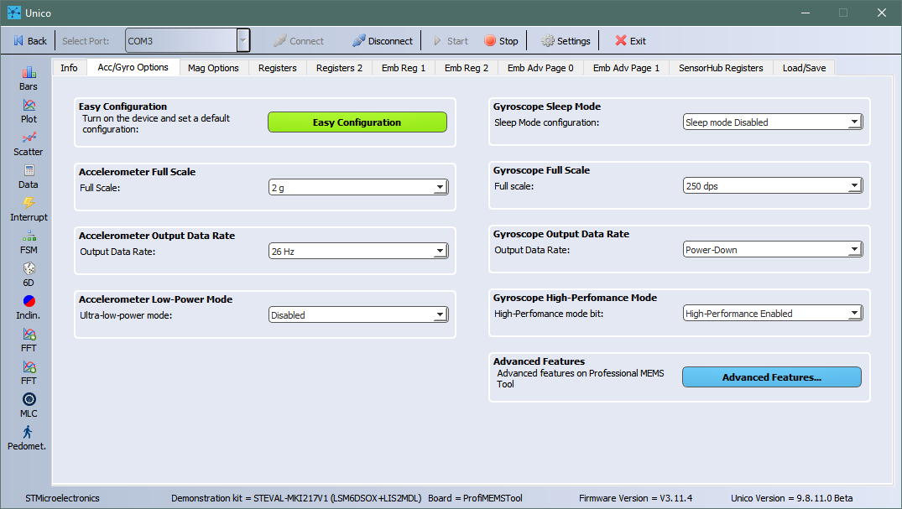
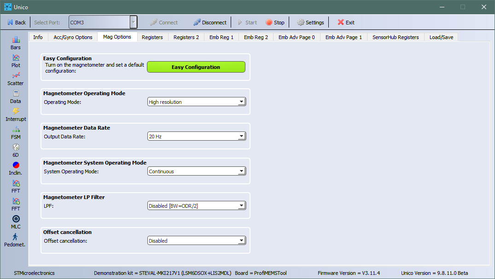
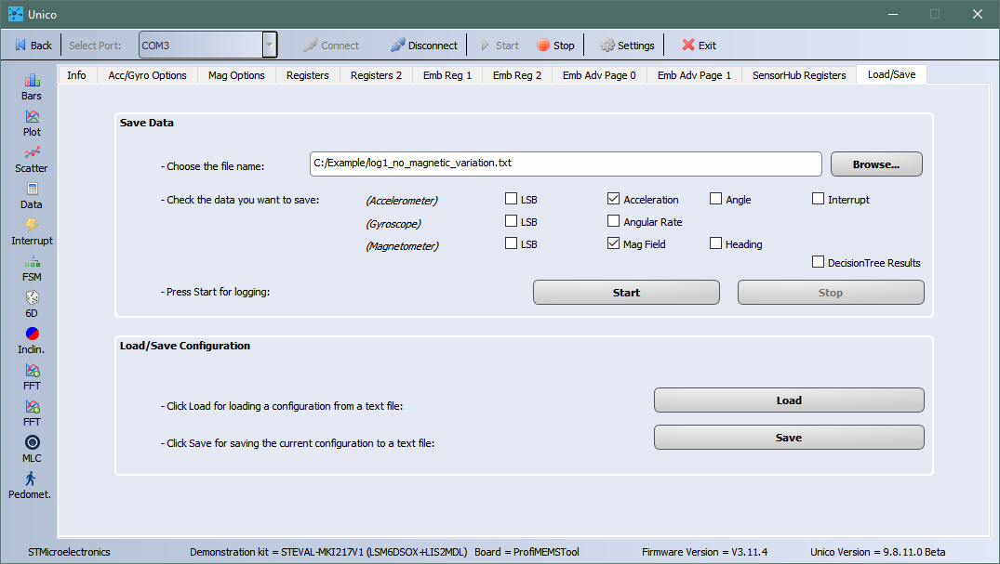
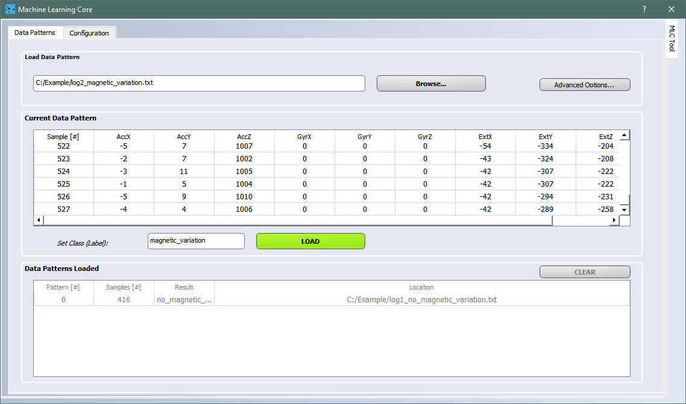
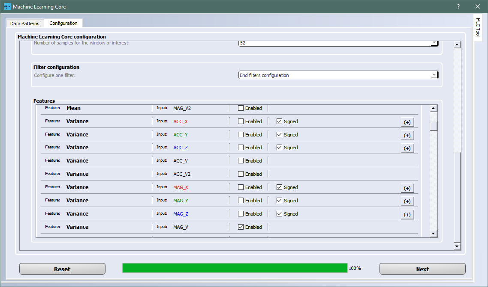
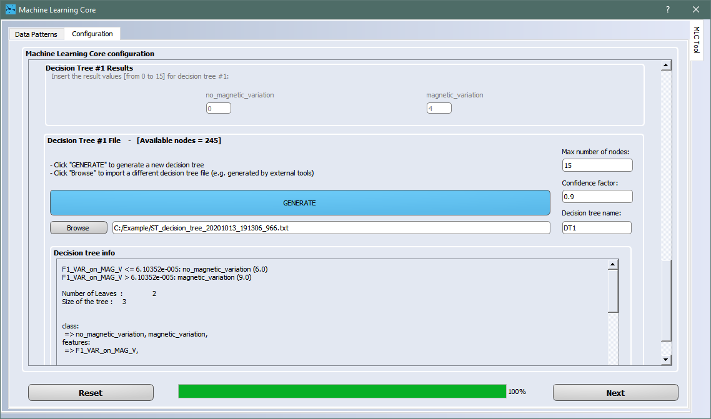
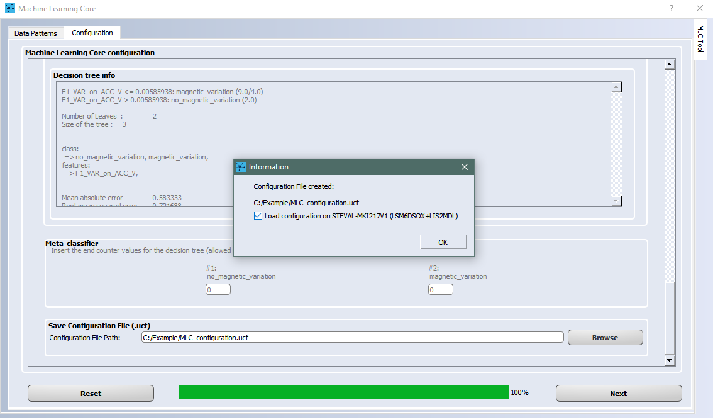
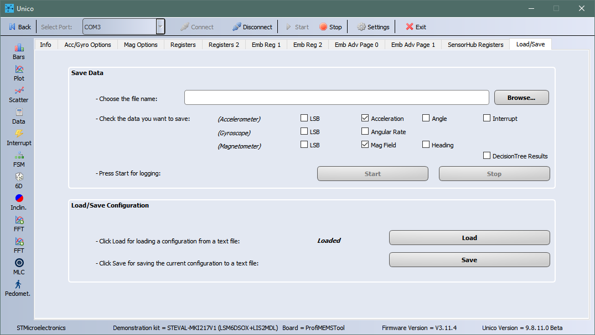
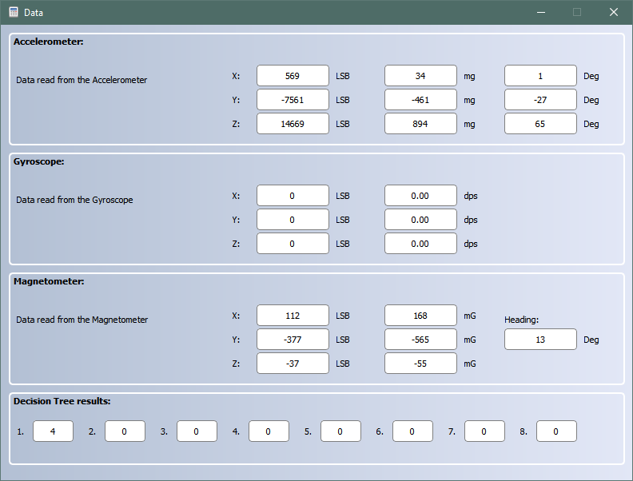

This README file describes how to use the **Machine Learning Core (MLC)** configuration in MEMS sensors from ST. This example shows how the MLC embedded in the ST MEMS sensor can process external sensor data (e.g. data coming from a magnetometer).

The **MLC** is a highly configurable and power-efficient hardware logic offered on ST sensors with part numbers ending in "X" (e.g. LSM6DSOX) supporting multiple Decision Tree classifiers.

This example explains the following steps:

1. How to capture the data log for each class to be classified
2. How to label each data log
3. How to design the decision tree classifier
4. How to configure the MLC to run the generated decision tree
5. How to check the decision tree output in real-time when it is running in the MLC

**Software** Tools:

The picture below shows the workflow to implement the five steps above and the different software tools that can be used.

For the example discussed here, the **Unico GUI** software tool will be used.

For more details on the software tools:

-  [STBLESensor](https://www.st.com/content/st_com/en/products/embedded-software/wireless-connectivity-software/stblesensor.html) app available for Android and iOS, enables real-time wireless Bluetooth LE connectivity with the target platform (e.g. SensorTile.box); can be used for data capture (step 1 above) and MLC configuration and test (step 5 above)
- [Unico GUI](https://www.st.com/content/st_com/en/products/embedded-software/evaluation-tool-software/unico-gui.html) software tool to work with the ProfiMEMS evaluation board (see the next paragraph for more details)
- [Unicleo GUI](https://www.st.com/content/st_com/en/products/embedded-software/evaluation-tool-software/unicleo-gui.html) software tool to work with the [Nucleo](https://www.st.com/content/st_com/en/products/evaluation-tools/product-evaluation-tools/mcu-mpu-eval-tools/stm32-mcu-mpu-eval-tools/stm32-nucleo-boards.html) motherboards coupled with the X-Nucleo expansion boards, and in particular the MEMS expansions (the latest is [X-Nucleo-IKS01A3](https://www.st.com/content/st_com/en/products/ecosystems/stm32-open-development-environment/stm32-nucleo-expansion-boards/stm32-ode-sense-hw/x-nucleo-iks01a3.html))
- [AlgoBuilder GUI](https://www.st.com/content/st_com/en/products/embedded-software/mems-and-sensors-software/inemo-engine-software-libraries/algobuilder.html) software tool to design a custom processing flow and build the firmware for Nucleo boards coupled with the MEMS expansions, or form-factor evaluation boards such as [SensorTile.Box](https://www.st.com/content/st_com/en/products/evaluation-tools/product-evaluation-tools/mems-motion-sensor-eval-boards/steval-mksbox1v1.html)

**Hardware**: 

In this example we will be using the **LSM6DSOX inertial measurement unit (IMU)**, with an accelerometer and a gyroscope sensor, and the **LIS2MDL magnetometer** (see the next paragraph for more details). However, the same procedure also applies to other sensors with MLC support. 

LSM6DSOX allows connecting an external sensor (e.g. magnetometer, like LIS2MDL in this case) through the Sensor Hub feature (Mode 2): through its I2C-master interface the LSM6DSOX can configure the LIS2MDL external magnetometer sensor and read the magnetometer output registers, saving their values in the SENSOR_HUB_1 (02h) to SENSOR_HUB_6 (07h) registers. These data coming from an external sensor can also be used as input for machine learning processing; in this case, the first six sensor hub bytes (two bytes per axis) are considered as input for the MLC. In other words, the MLC will directly take as input the content of the LSM6DSOX registers from SENSOR_HUB_1 (02h) to SENSOR_HUB_6 (07h).

**Note:** The LSM6DSOX Sensor Hub feature requires having at least one sensor enabled between the accelerometer and the gyroscope (both cannot be set in Power-Down mode). For this reason, in this example we enabled also the accelerometer sensor along with the external magnetometer sensor.

For more details on the hardware:

- ST resource page at [MEMS sensor](  https://www.st.com/mems  )
- ST resource page at [Explore Machine Learning Core in MEMS sensors]( https://www.st.com/content/st_com/en/campaigns/machine-learning-core.html )
- Application note [AN5259](  https://www.st.com/resource/en/application_note/dm00563460-lsm6dsox-machine-learning-core-stmicroelectronics.pdf  ) on the MLC embedded in [LSM6DSOX](https://www.st.com/content/st_com/en/products/mems-and-sensors/inemo-inertial-modules/lsm6dsox.html) 

# 1. Capture Data Logs

In this simple example we keep the board and the magnetic sensor mounted on it in a static position and move a magnet close to it; we then evaluate the change of the magnetic vector norm (comparing it with its value in static conditions) to verify when the magnet is closer or further away from the magnetic sensor. The MLC will be configured to recognize two different classes: 

- *no_magnetic_variation* (the magnet is far from the magnetic sensor or it is not moving)
- *magnetic_variation* (the magnet is close to the magnetic sensor and it is moving)

Each class has to be characterized by one or more data logs, in order to be classified by the decision tree. 

**Note**: During data collection it is important to acquire "clean" data. For instance, when recording the class "*no_magnetic_variation*", the magnet has to be placed before the start of recording and must not be moved during the acquisition.

**Hardware** needed:

- [STEVAL-MKI109V3]( https://www.st.com/content/st_com/en/products/evaluation-tools/product-evaluation-tools/mems-motion-sensor-eval-boards/steval-mki109v3.html ), professional evaluation board for MEMS sensors, referenced as **ProfiMEMS** in ST docs. It is based on the STM32F401 microcontroller and features a DIL24 connector to plug the daughterboard with the sensor under test. Check that the firmware is up to date (version 3.11.4 or later).

- [STEVAL-MKI217V1](  https://www.st.com/content/st_com/en/products/evaluation-tools/product-evaluation-tools/mems-motion-sensor-eval-boards/steval-mki217v1.html  ), daughterboard with the **LSM6DSOX** IMU sensor and **LIS2MDL** magnetometer (referenced as **DIL24 adapter** in the ST docs); the magnetometer is connected to the IMU in Sensor Hub mode (Mode 2 connection mode). It must be plugged into the ProfiMEMS motherboard.

- Micro USB cable to connect the ProfiMEMS motherboard to the PC.

  **Note**: Even if ProfiMEMS has been used in this example, other platforms are supported (see [Getting started with ST development kit and GUI](https://www.st.com/content/ccc/resource/sales_and_marketing/presentation/product_presentation/group0/f6/ab/59/ed/d8/d0/4a/47/MLC_tools_and_GUI/files/MLC_tools_and_GUI.pdf/_jcr_content/translations/en.MLC_tools_and_GUI.pdf)).

**Software** needed:

- [STSW-MKI109W](  https://www.st.com/content/st_com/en/products/embedded-software/evaluation-tool-software/stsw-mki109w.html  ), referenced as **Unico GUI**, companion software to work with the ProfiMEMS motherboard. This software tool includes the J48 algorithm to design decision trees. Check that your Unico GUI version is up to date (version 9.8.11.0 has been used for this example).

Procedure to capture data:

1. Plug in the DIL24 LSM6DSOX+LIS2MDL adapter to the ProfiMEMS motherboard, and connect the motherboard to the PC. 

2. Run the Unico GUI. **Type** **"OX" in the search field, select LSM6DSOX+LIS2MDL** and confirm by pressing the corresponding button.

3. Click on the **Acc/Gyro Options tab** and configure the **accelerometer:** **2 *g* full scale, 26 Hz output data rate**, low-power mode disabled.

   

4. Click on the **Mag Options tab** and configure the **magnetometer:** **20 Hz output data rate, Continuous operating mode**.

   

5. Click on the **Start** button on the top bar and click **Plot** to check the data in real time. Close the Plot window but **do not click the Stop button** otherwise the log will be empty.

6. Click on the **Load/Save tab**, select the **Acceleration** and **Mag field** checkboxes, type the filename for the log; it is very convenient to include the label as part of the filename (example: "log1_no_magnetic_variation.txt").

   

7. When ready, click **Start** in the Load/Save window to start writing to the log file. When the log is complete, click **Stop** to stop writing and close the log file. The log is a tab-separated-value file which can be opened with any text editor.

In this example two logs have been collected:

- [log1_no_magnetic_variation.txt](./1_datalogs/log1_no_magnetic_variation.txt), without significant magnetic variations (no magnet present).
- [log2_magnetic_variation.txt](./1_datalogs/log2_magnetic_variation.txt), with significant magnetic variations (moving a magnet around the board).

**Note**: For this simple example, just one data log per class has been acquired. In general, it is recommended to acquire multiple data logs for each class to diversify the dataset.

# 2. Load and Label Data Logs

Procedure to label the data logs:

1. The ProfiMEMS board does not need to be plugged into the PC. Unico GUI can work standalone in "offline" mode: run the Unico GUI, and uncheck "communication with the motherboard".

2. **Type "OX" in the search field, select LSM6DSOX+LIS2MDL** and confirm by pressing the corresponding button.

3. Click on the **MLC button** in the side bar. Select the **Data Patterns tab** (it should already be selected).

4. For each class, click on **Browse** to select the corresponding data log files (multiple files can be selected simultaneously in the dialog), type the label for the class, and click **Load**. Repeat for each class.

   

5. When all data logs are loaded, select the **Configuration tab**. For each step, select the desired configuration, then click **Next**.

In this example the accelerometer settings are the same as used for data capture (2 *g*, 26 Hz). The MLC is configured to run at the same speed as the accelerometer sensor (26 Hz), and compute a new set of features every two seconds (window length of 52 samples has been chosen to get a good tradeoff between latency and time necessary to recognize the classes).

Settings selected in the Configuration tab:

1. LSM6DSOX sensor

2. MLC running at 26 Hz

3. Accelerometer + external sensor

4. Accelerometer configured for 2 *g* full scale and 26 Hz data rate

5. External sensor sensitivity: 1625h 

   Note: LIS2MDL sensitivity is 0.0015 gauss/LSB, and the external sensitivity value is expressed as half-precision floating-point format: SEEEEEFFFFFFFFFF (S: 1 sign bit; E: 5 exponent bits; F: 10 fraction bits)

6. One decision tree only

7. Window length of 52 samples

8. No filters selected

9. Select the following features and click Next when done:

   - **Variance** for magnetometer norm, **MAG_V**, to detect the magnetic field variation

     

10. Click on **Browse** to select or type the name of the ARFF file where computed features will be saved. Click Next to save the file. For this example, features have been saved in the file [features.arff](./2_features/features.arff). 

11. Insert the numeric code associated with each label. This is the numeric output of the decision tree when it is run on the MLC (see the note below for details). Then click Next. 
    - no_magnetic_variation = 0
    - magnetic_variation = 4

**ARFF** files are text files: the first few lines describe the attributes (extracted features), the rest of the file has one line for every window (data segment) of every log file processed by Unico GUI. Each line is made of the listed attributes (a number, or numeric class) and the corresponding label (a string, or nominal class). This file is the input for the algorithm which designs the decision tree classifier (see next paragraph).

**Note**: one can create groups of at most 4 labels and then use the meta-classifier functionality of the MLC core. The first group uses numeric codes from 0 to 3, the second group uses codes from 4 to 7, the third group uses codes from 8 to 11, and so on. In this example, each label is in a different group, this is why the numeric code is a multiple of 4.

# 3. Design the Decision Tree Classifier

In this example *Unico GUI* will be used to generate the decision tree classifier.

Press the button "GENERATE" to generate a new decision tree. The decision tree will be automatically saved (same folder as the arff file).

The decision tree can also be generated using third party tools. For more details on decision tree generation using third party tools, consult the application note [AN5259](https://www.st.com/resource/en/application_note/dm00563460-lsm6dsox-machine-learning-core-stmicroelectronics.pdf):

- Appendix A for Weka
- Appendix B for RapidMiner
- Appendix C for Matlab
- Appendix D for Python SciKit

When the decision tree has been generated using third party tools, it can be loaded using the **Browse** button.

The decision tree used in this example is available [here](./3_decisiontree/ST_decision_tree.txt).

After loading or generating the decision tree, the button **Next** has to be clicked. 

# 4. Generate the MLC configuration file

The user will be first prompted to specify the meta-classifiers (which is not necessary for the purpose of this tutorial). The meta-classifiers can be left at 0.

Finally, the user will be prompted to select the target [UCF file](./4_ucf/MLC_configuration.ucf) and, by clicking next, it will be automatically generated by Unico GUI.

If the ProfiMEMS board with the **LSM6DSOX+LIS2MDL** DIL24 adapter is connected, and Unico is not working in "offline" mode, it will be possible to immediately program this configuration into the sensor: just select the checkbox "Load configuration..." in the dialog window, as shown below: 

**UCF** stands for Unico Configuration File. It is a text file with a sequence of register addresses and corresponding values. It contains the full sensor configuration, including of course the MLC configuration. 

The UCF file can be used as-is by several software tools provided by ST: *Unico GUI*, *Unicleo GUI*, *AlgoBuilder GUI*.

**UCF files can also be converted to C source code** and saved as header *.h* files to be conveniently included in C projects: click on the Options tab, select Browse and load the UCF file, then click on Generate C code.

An example on how to use the generated *.h* file in a standard C driver is available in the [STMems_Standard_C_drivers repository]( https://github.com/STMicroelectronics/STMems_Standard_C_drivers/blob/master/lsm6dsox_STdC/example/lsm6dsox_sh_lis2mdl_mlc.c  ).

# 5. Use the MLC configuration file

Procedure to program the UCF configuration file in LSM6DSOX:

1. Plug the DIL24 adapter into the ProfiMEMS motherboard, and connect the motherboard to the PC. 

2. Run Unico GUI. **Type "OX" in the search field, select LSM6DSOX+LIS2MDL** and confirm by pressing the corresponding button.

3. Click on the **Load/Save tab**, click on **Load**, browse and select the UCF file. In this example, this is [MLC_configuration](./4_ucf/MLC_configuration.ucf). The MLC is now configured.

   

4. Configure the magnetometer as already done in step 1 (when capturing data logs): Click on the **Mag Options tab** and configure the **magnetometer:** **20 Hz output data rate, Continuous operating mode**. This is necessary because the magnetometer is an external sensor, and the configuration generated by the MLC does not contain magnetometer settings.

   

5. Click on the **Start** button on the top bar. The MLC is now up and running.

6. Click  on **Data** in the side bar and look at the accelerometer data and decision tree output.

    

Verify that the numeric output of the decision tree does correspond to what is happening to the device. Moving a magnet around the board, the class *magnetic_variation* (value 4) should be detected. 

The decision tree result is updated at every window. In this example the window is 52 samples long, the data rate is 26 Hz, hence the output is updated every two seconds.

------

**More Information: [ST MEMS Sensors](http://st.com/MEMS)**, **[ST MLC Ecosystem](www.st.com/mems-sensors-ml)**

**Copyright © 2021 STMicroelectronics**

