This README file describes how to combine **machine learning core (MLC)** and **finite state machine (FSM)**  configurations, to work together in the IMU MEMS sensor available in the [**SensorTile.box**](https://www.st.com/content/st_com/en/products/evaluation-tools/product-evaluation-tools/mems-motion-sensor-eval-boards/steval-mksbox1v1.html). 

The example explains the following steps:

1. How to get an existing MLC configuration from GitHub
2. How to create a basic FSM configuration 
3. How to combine MLC and FSM configurations in a single configuration for LSM6DSOX
4. How to configure SensorTile.box and visualize the results

**Software** tools:

The [**UNICO-GUI**](https://www.st.com/en/embedded-software/unico-gui.html) software tool is used to create the configuration (version 9.12.0.0), the [**UNICLEO-GUI**](https://www.st.com/content/st_com/en/products/embedded-software/evaluation-tool-software/unicleo-gui.html) software tool is used to visualize the results (version 1.18.1). 

**Hardware**:

The LSM6DSOX inertial measurement unit (IMU), with an accelerometer and a gyroscope sensor, is available on the [**SensorTile.box**](https://www.st.com/content/st_com/en/products/evaluation-tools/product-evaluation-tools/mems-motion-sensor-eval-boards/steval-mksbox1v1.html) evaluation board. 

For more details on the hardware:

- ST resource page at [MEMS sensor](https://www.st.com/mems)

- ST resource page at [Explore Machine Learning Core in MEMS sensors](https://www.st.com/content/st_com/en/campaigns/machine-learning-core.html)

- Application note [AN5259](https://www.st.com/resource/en/application_note/dm00563460-lsm6dsox-machine-learning-core-stmicroelectronics.pdf) on MLC embedded in [LSM6DSOX](https://www.st.com/content/st_com/en/products/mems-and-sensors/inemo-inertial-modules/lsm6dsox.html)

- Application note [AN5273](https://www.st.com/content/ccc/resource/technical/document/application_note/group1/6f/b8/c2/59/7e/00/43/c6/DM00572971/files/DM00572971.pdf/jcr:content/translations/en.DM00572971.pdf) on FSM embedded in [LSM6DSOX](https://www.st.com/content/st_com/en/products/mems-and-sensors/inemo-inertial-modules/lsm6dsox.html)

  

# 1. How to get existing MLC configurations from GitHub

You can navigate to [github.com/STMicroelectronics](http://github.com/STMicroelectronics) and, in the pinned repositories, you can find *“STMems_Overall_Offer*”. Here there are different repositories with drivers and configuration examples for MEMS sensors. Opening the *Machine Learning Core* repository we find three main folders: 

- the *application_examples* folder, containing applications ready to be used with the sensors

- the *configuration_examples* folder, containing examples of configurations using different combinations of hardware and software tools

- the *tools* folder, containing additional software and scripts which can be helpful during development 

In every folder a README file provides details about the content of the folder. 

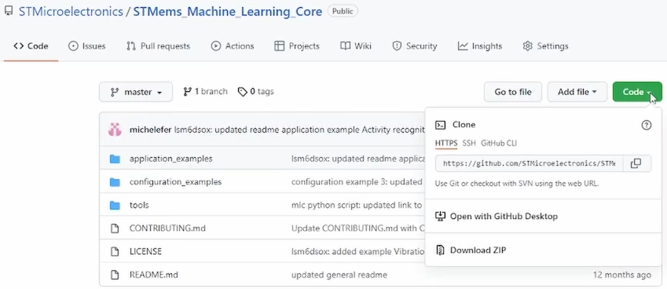

From the [Code] button it is possible to:

- clone the repository using Git

- download a ZIP file containing all the files and folders 

In the application_examples folder, the examples are divided by device. Selecting LSM6DSOX, which is the IMU available in the SensorTile.box, you can find the [activity recognition for wrist application example](https://github.com/STMicroelectronics/STMems_Machine_Learning_Core/tree/master/application_examples/lsm6dsox/Activity%20recognition%20for%20wrist), which is specific for wearable devices (wrist-worn devices, like smart watches). 

The activity recognition for wrist example recognizes the classes: stationary, walking and jogging. The accelerometer is configured at 8 *g* full scale and 26 Hz data rate. An interrupt is generated when a new class is detected. Two configuration files with the same name but different format are available: 

- A header file (.h), which can be integrated in any custom C-based project (like a driver), for this kind of integration, refer to the [platform independent driver repository](https://github.com/STMicroelectronics/STMems_Standard_C_drivers)

- A .ucf file which can be used to program the device through ST software, this is the file that will be the file used in the next steps ([lsm6dsox_activity_recognition_for_wrist.ucf](./1_mlc/lsm6dsox_activity_recognition_for_wrist.ucf)).

  

# 2. How to create a basic FSM configuration

The machine learning core is not the only feature available in the LSM6DSOX.  There is also a finite state machine, which can be programmed to work:

- in standalone, with no interaction with the machine learning core

- together with the machine learning core, for instance enabling the detection of specific gestures when the machine learning core is detecting a particular class 

Both the MLC and FSM can be configured using the Unico-GUI. In this section a basic finite state machine is configured, you just need to open the FSM tool. 

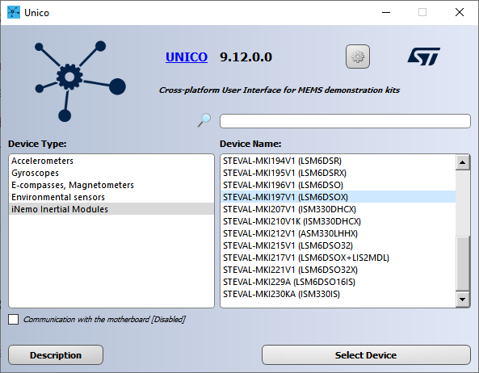

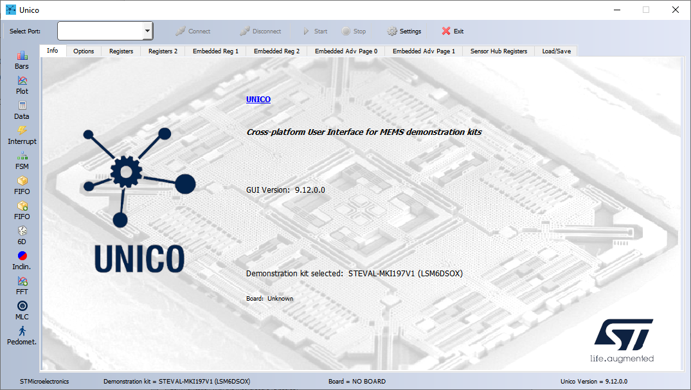

With Unico-GUI in offline mode (without any board connected) you can just generate configuration files for the device. For a complete sensor evaluation, we suggest using the professional MEMS tool board ([STEVAL-MKI109V3]( https://www.st.com/content/st_com/en/products/evaluation-tools/product-evaluation-tools/mems-motion-sensor-eval-boards/steval-mki109v3.html )), with the DIL24 ([STEVAL-MKI217V1](  https://www.st.com/content/st_com/en/products/evaluation-tools/product-evaluation-tools/mems-motion-sensor-eval-boards/steval-mki217v1.html  )) adapter board for LSM6DSOX. When using this board Unico has also the possibility to test and debug in real time the configuration you are building. 

In the LSM6DSOX, it is possible to configure up to 16 state machines. In this example state machine #1 is configured. The selected data rate is 26 Hz, the same data rate used in the machine learning core example. 

We are going to build an application based on the accelerometer X-axis data, in order to generate an interrupt when the accelerometer X-axis exceeds a certain threshold. 

Different states can be added in the state machine 1. States can be either commands or conditions. Conditions are indicated as RNC, which means reset next condition, because they are divided in two parts, a [reset] condition on the left and a [next] condition on the right, to either reset or continue the program flow.

## 2.1 Simple standalone FSM 

Here is a simple finite state machine with just two states:

S0.    NOP | GNTH1

S1.    CONTREL

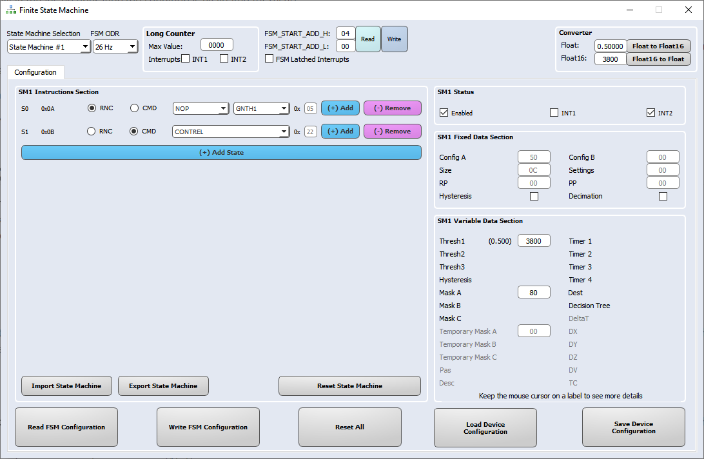

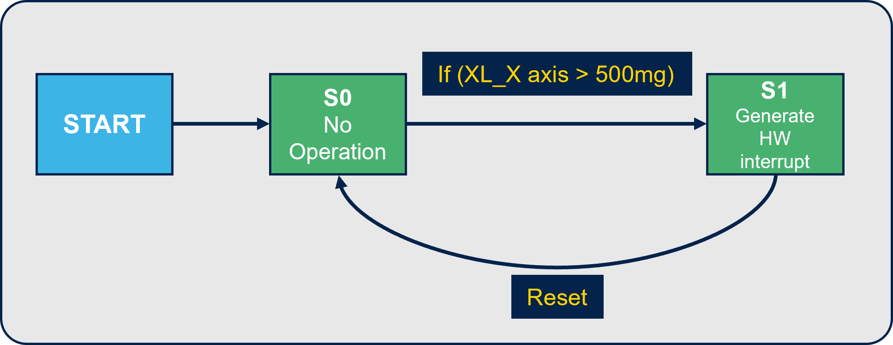

 **State S0:** 

- NOP means no operation (no condition is evaluated for reset) 

- GNTH1 means “greater than threshold 1” (this condition allows to continue the execution to the next state) 

The threshold 1 is expresses as a half-float value in hexadecimal format and can be obtained using the converter, for instance 0.5 *g* is converted to 3800h. Mask A is set to 80h in order to check the accelerometer X-axis. 

 **State S1:**

The CONTREL command allows to continue the execution from the reset point (S0).  An interrupt can be enabled on INT2 pin, which will raise when this state (S1) is reached. 

The configuration can be saved to  a .ucf file, using the [Save] button ([lsm6dsox_fsm.ucf](./2_fsm/lsm6dsox_fsm.ucf)).  

## 2.2 Simple FSM interacting with the MLC 

To make the finite state machine interact with the machine learning core configuration downloaded from GitHub, we need to add another state. By clicking the button [Add] on the state [S0], a new state [S0] will be added. In this state we can check what is the status of the decision tree, selecting the condition [CHKDT] (which means “check decision tree”). 

S0.    NOP | CHKDT

S1.    NOP | GNTH1

S2.    CONTREL

Writing the value 01, in the decision tree parameter, we are going to check when the first decision tree of the machine learning core has result 1, which means stationary in the activity recognition for wrist example.

The configuration can be saved to  a .ucf file, using the [Save] button ([lsm6dsox_fsm_chkdt.ucf](./2_fsm/lsm6dsox_fsm_chkdt.ucf)).  

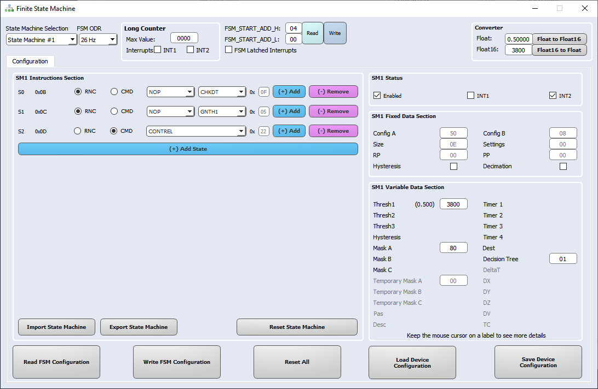

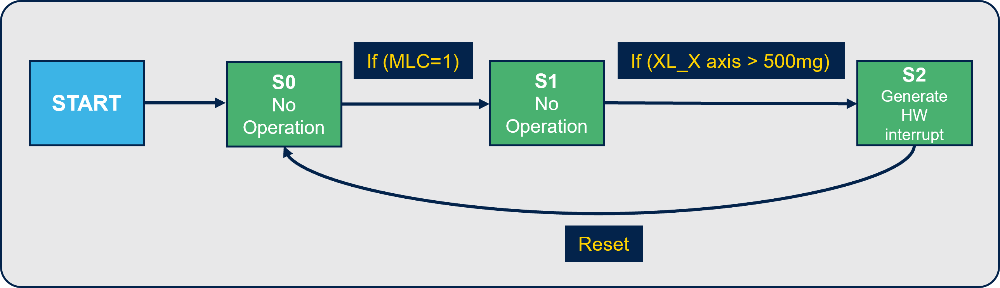

# 3. How to combine MLC and FSM configurations in a single configuration for LSM6DSOX

When both the machine learning core and finite state machine configuration files have been generated with Unico-GUI, they can be merged in a single configuration file. **Note:** This is necessary when using both features, because the two configurations share some part of memory. 

UNICO-GUI provides a tool for merging the two configurations. It is available in the [Options] tab of the main window. You need to click the button [Advanced MLC+FSM]. Then select the two files, and finally choose the name of the merged file ([lsm6dsox_mlc_fsm.ucf](./3_mlc_fsm/lsm6dsox_mlc_fsm.ucf)). 

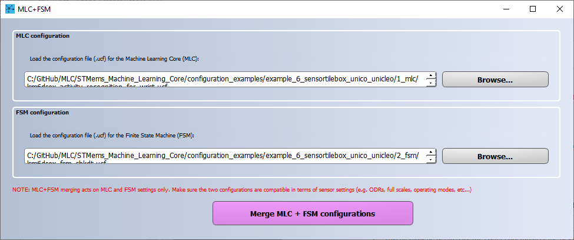

From the merged file, you can also generate the header file (.h) to be conveniently included in C projects. To do this, in the Unico-GUI main window click on the [Options] tab, select [C code generation], load the UCF file and then click on [Generate C code]. The file will be saved in the same folder containing the ucf file ([lsm6dsox_mlc_fsm.h](./3_mlc_fsm/lsm6dsox_mlc_fsm.h)).

# 4. How to configure the SensorTile.box and visualize the results

In previous steps we have generated a configuration for the LSM6DSOX including both MLC and FSM, which is now ready to be tested by programming the sensor in the SensorTile.box. There are many ways that you can exploit in the available resources on [st.com](http://st.com/) to try all the features available in SensorTile.box. In this configuration example, the  **DataLogExtended** firmware is used. It is available in the [FP-SNS-STBOX1](https://www.st.com/content/st_com/en/products/embedded-software/mcu-mpu-embedded-software/stm32-embedded-software/stm32-ode-function-pack-sw/fp-sns-stbox1.html) software package. Using this firmware, it is possible to program the board with the UCF file generated in the previous step and visualize the results in real time using Unicleo-GUI. 

The SensorTile.box can be programmed using the [STM32CubeProgrammer](https://www.st.com/content/st_com/en/products/development-tools/software-development-tools/stm32-software-development-tools/stm32-programmers/stm32cubeprog.html#overview). The steps for programming the SensorTile.box are the following: 

1. Put the SensorTile.box in **BOOT mode**: disconnect the battery and unplug the USB cable, press and hold the [BOOT] button, connect the USB cable then release the button.

   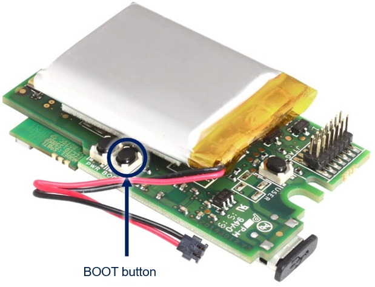

2. Run the STM32CubeProgrammer, select [USB] from the pull-down menu on the right, then press [Connect] and browse to select the **DataLogExtended** binary (for example, */Projects/STM32L4R9ZI-SensorTile.box/Applications/DataLogExtended*/Binary), then click [Start Programming].

 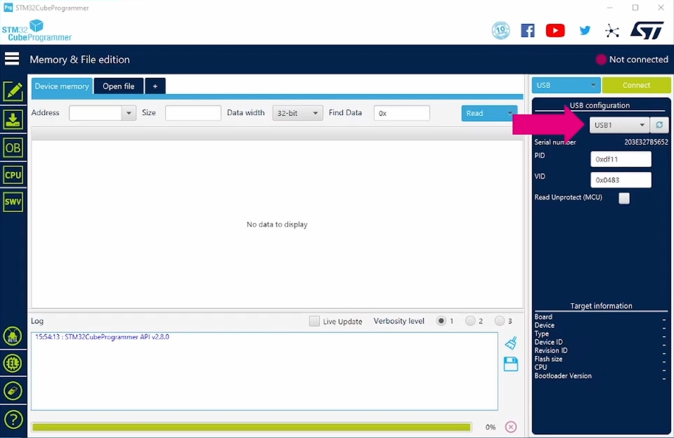

 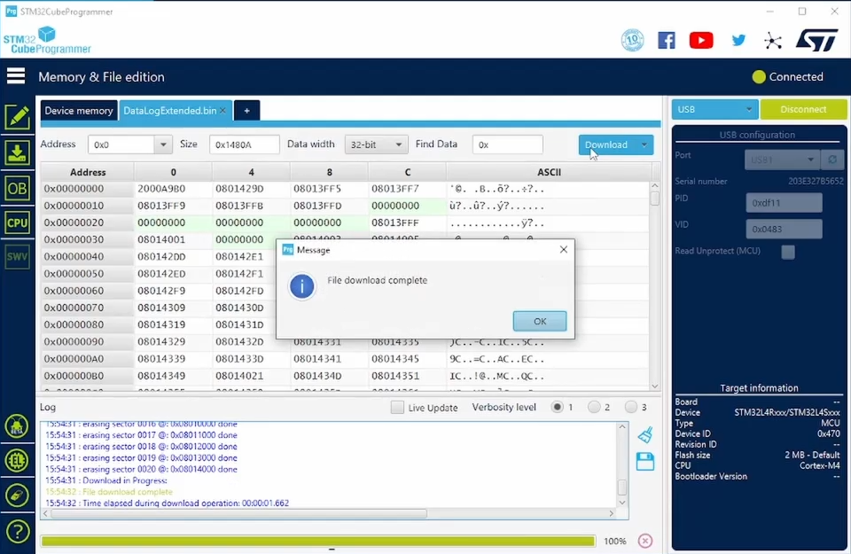

Once the SensorTile.box has been programmed with DataLogExtended firmware, you can evaluate the configuration generated in the previous step. Connect the SensorTile.box to your PC and open Unicleo-GUI. In the Unicleo options, you can enable [Accelerometer], [FSM and MLC], and [Interrupts Monitor]. 

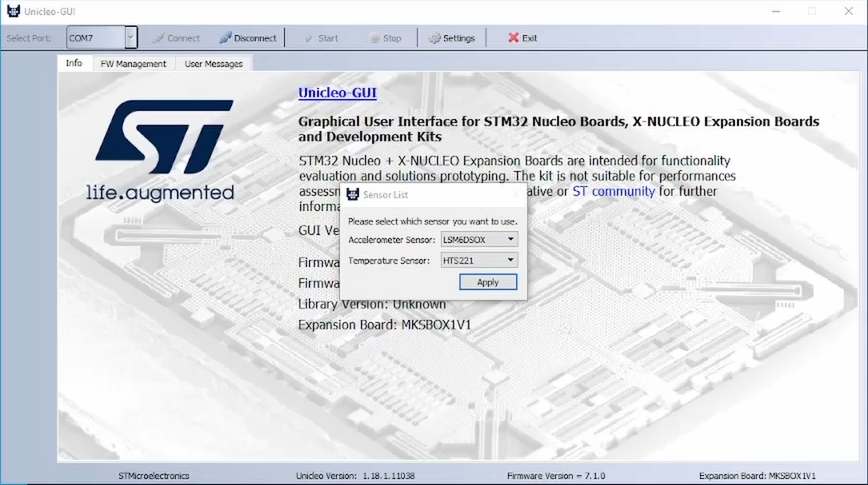

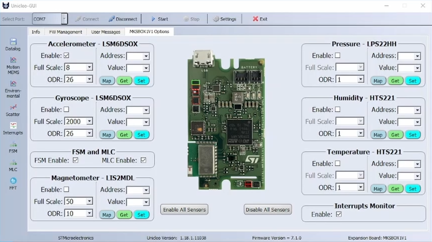

In the MLC window of Unicleo-GUI, it is possible to load the sensor configuration and evaluate the results. The machine learning core classes detected appear with their corresponding numeric values:

- 1 for stationary 

- 4 for walking  

- 8 for jogging

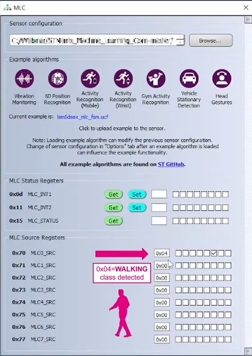

When the MLC detects the stationary condition, you can also evaluate the finite state machine interrupt (which is otherwise masked when the other classes are detected, as configured in the previous step). The interrupt can be set latched or pulsed in the [FSM] window. 

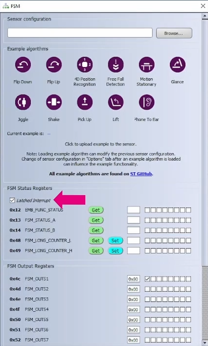

In the [Interrupts] window (also called logic analyzer), you can see that rotating the board, an interrupt is generated on INT2. This is the FSM interrupt generated when the accelerometer X-axis exceeds the 0.5 *g* threshold configured in the previous step and the machine learning core is not detecting a walking or jogging scenario. 

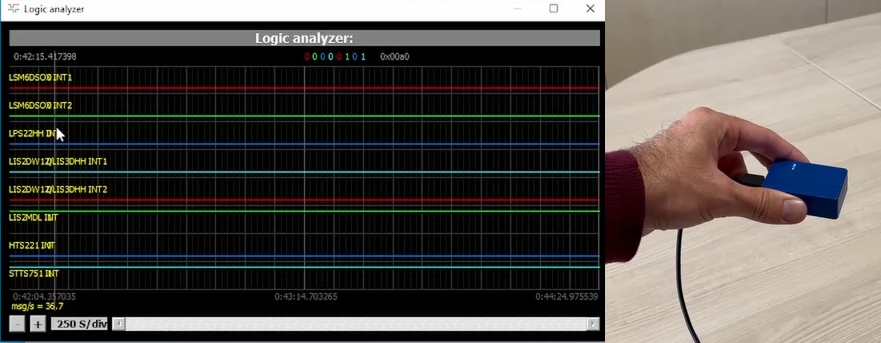

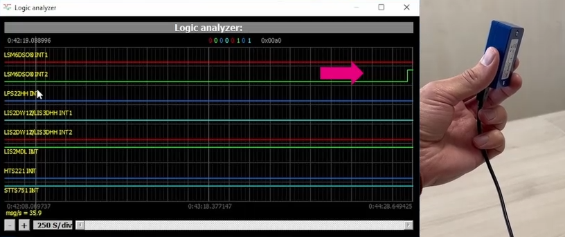

This is just a simple example of an application, since the purpose of this configuration example is to show the configuration process. However, using a similar approach, you can build more complex applications. For getting some ideas of what kind of gestures are possible to implement using FSM, visit the dedicated [Finite State Machine repository](https://github.com/STMicroelectronics/STMems_Finite_State_Machine) on GitHub. 

------

**More information: [http://www.st.com](http://st.com/MEMS)**

**Copyright © 2022 STMicroelectronics**

