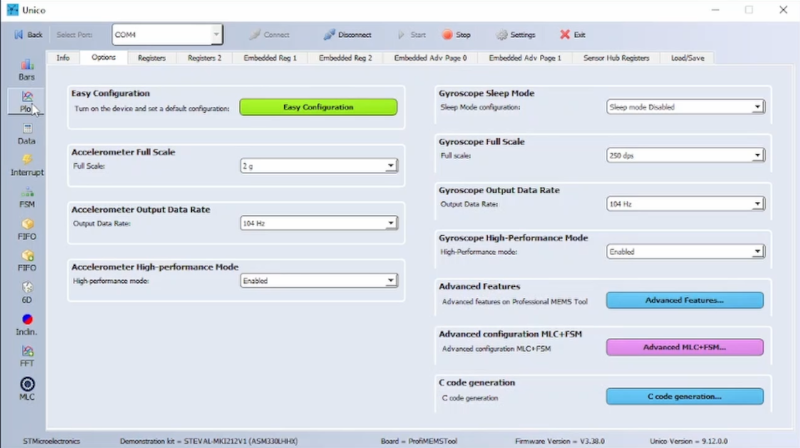
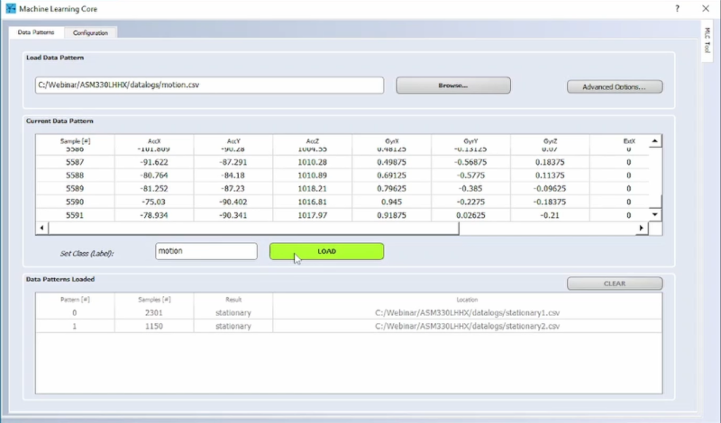
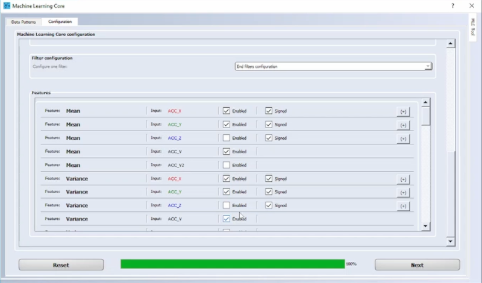
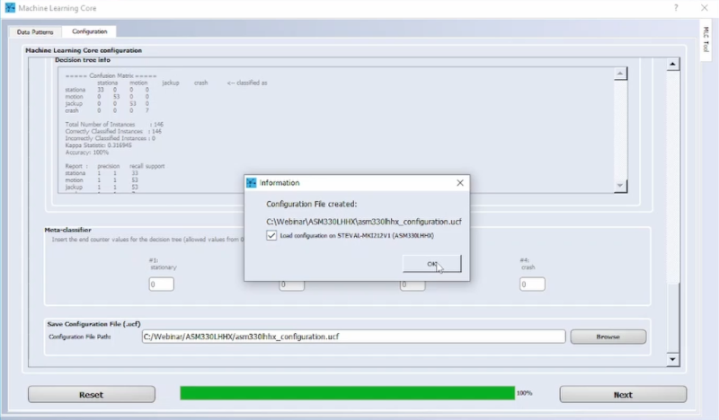
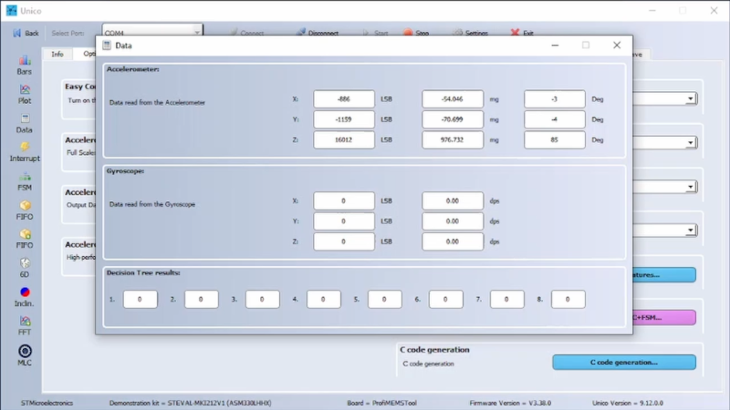

This README file describes how to use the **machine learning core (MLC)** configuration in MEMS sensors from ST. This example shows how the MLC embedded in the automotive 6-axis inertial module can be used to recognize different classes.

The **MLC** is a highly configurable and power-efficient hardware logic offered in ST sensors with part numbers ending in "X" (for example, ASM330LHHX) supporting multiple decision tree classifiers.

Note: The purpose of this example is not for the final application (dedicated [application examples](https://github.com/STMicroelectronics/STMems_Machine_Learning_Core/tree/master/application_examples) are provided for final applications). The focus is on the process to configure the MLC, starting from data logs and following all the MLC configuration steps.

This example explains the following steps:

1. How to capture the data log for each class to be classified
2. How to label each data log
3. How to design the decision tree classifier
4. How to configure the MLC to run the generated decision tree
5. How to check the decision tree output in real time when it is running in the MLC

**Software** Tools:

The graphic below shows the workflow to implement the five steps above and the different software tools that can be used.

For the example discussed here, the **Unico GUI** software tool is used.

For additional information about the software tools, consult:

- [STBLESensor](https://www.st.com/content/st_com/en/products/embedded-software/wireless-connectivity-software/stblesensor.html) app available for Android and iOS, enables real-time wireless Bluetooth LE connectivity with the target platform (for example, SensorTile.box); can be used for data capture (step 1 above) and MLC configuration and test (step 5 above)
- [Unico GUI](https://www.st.com/en/development-tools/unico-gui.html) software tool to work with the ProfiMEMS evaluation board (see the next paragraph for more details)
- [Unicleo GUI](https://www.st.com/en/development-tools/unicleo-gui.html) software tool to work with the [Nucleo](https://www.st.com/content/st_com/en/products/evaluation-tools/product-evaluation-tools/mcu-mpu-eval-tools/stm32-mcu-mpu-eval-tools/stm32-nucleo-boards.html) motherboards coupled with the X-Nucleo expansion boards and, in particular, the MEMS expansions (the latest is [X-Nucleo-IKS01A3](https://www.st.com/content/st_com/en/products/ecosystems/stm32-open-development-environment/stm32-nucleo-expansion-boards/stm32-ode-sense-hw/x-nucleo-iks01a3.html))
- [AlgoBuilder GUI](https://www.st.com/en/development-tools/algobuilder.html) software tool to design a custom processing flow and build the firmware for Nucleo boards coupled with the MEMS expansions, or form-factor evaluation boards such as [SensorTile.Box](https://www.st.com/content/st_com/en/products/evaluation-tools/product-evaluation-tools/mems-motion-sensor-eval-boards/steval-mksbox1v1.html)

**Hardware**: 

In this example we use the **ASM330LHHX inertial measurement unit (IMU)** with an accelerometer and a gyroscope sensor. However, the same procedure also applies to other sensors with MLC support. 

For additional information about the hardware tools, consult:

- ST resource page at [MEMS sensor](  https://www.st.com/mems  )
- ST resource page at [Explore Machine Learning Core in MEMS sensors]( https://www.st.com/content/st_com/en/campaigns/machine-learning-core.html )
- Application note [AN5781](  https://www.st.com/resource/en/application_note/an5781-asm330lhhx-machine-learning-core-stmicroelectronics.pdf  ) on the MLC embedded in [ASM330LHHX](https://www.st.com/en/mems-and-sensors/asm330lhhx.html) 

# 1. Capture data logs

In this example the MLC is configured to recognize four different classes: 

- *stationary* (the car is not moving)
- *motion/driving* (the car is moving forward or backward)
- *jack up* (the car is being jacked up using a jack)
- *crash* (the car is hitting another car)

Each class has to be characterized by one or more data logs in order to be classified by the decision tree. 

**Note**: During data collection it is important to acquire "clean" data. For instance, when recording the class "*motion*", the movement has to start before recording and has to finish after recording stops.

**Hardware** needed:

- [STEVAL-MKI109V3]( https://www.st.com/en/evaluation-tools/steval-mki109v3.html ), professional evaluation board for MEMS sensors, referenced as **ProfiMEMS** in ST documents. It is based on the STM32F401 microcontroller and features a DIL24 connector to plug in the daughterboard with the sensor under test. Check that the firmware is up to date (version 3.32.0 or later).

- [STEVAL-MKI212V1](  https://www.st.com/en/evaluation-tools/steval-mki212v1.html  ), daughterboard with the **ASM330LHHX** IMU sensor  (referenced as **DIL24 adapter** in ST documents). It must be plugged into the ProfiMEMS motherboard.

- Micro USB cable to connect the ProfiMEMS motherboard to the PC.

  **Note**: Although ProfiMEMS has been used in this example, other platforms are supported (see [Getting started with ST development kit and GUI](https://www.st.com/content/ccc/resource/sales_and_marketing/presentation/product_presentation/group0/f6/ab/59/ed/d8/d0/4a/47/MLC_tools_and_GUI/files/MLC_tools_and_GUI.pdf/_jcr_content/translations/en.MLC_tools_and_GUI.pdf)).

**Software** needed:

- [Unico GUI](https://www.st.com/en/development-tools/unico-gui.html),  companion software to work with the ProfiMEMS motherboard. This software tool includes the J48 algorithm to design decision trees. Check that your Unico GUI version is up to date (version 9.12.0.0 has been used for this example).

Procedure to capture data:

1. Plug in the DIL24 ASM330LHHX adapter to the ProfiMEMS motherboard, and connect the motherboard to the PC. 

2. Run the Unico GUI. **Type** **"ASM330LHHX" in the search field, select STEVAL-MKI212V1 (ASM330LHHX)** and confirm by pressing the corresponding button.

3. Click on the **Options tab** and configure the **accelerometer:** **2 *g* full scale, 104 Hz output data rate**; and the **gyroscope:** **250 *dps* full scale, 104 Hz output data rate**. 
The gyroscope might not be necessary for this application, 
but we will see it later based on the datalogs we will acquire

   

4. Click on the **Start** button on the top bar and click **Plot** to check the data in real time. Close the Plot window but **do not click the Stop button** otherwise the log will be empty.

5. Click on the **Load/Save tab**, select the **Acceleration** and **Angular Rate** checkboxes, type the filename for the log; it is very convenient to include the label as part of the filename (example: "crash1.txt").

   

6. When ready, click **Start** in the Load/Save window to start writing to the log file. When the log is complete, click **Stop** to stop writing and close the log file. The log is a tab-separated-value file which can be opened with any text editor.

In this example a few different logs have been collected for each class. Each log has been visualized and cleaned with external tools (for example, Microsoft Excel or similar), then saved as .csv format. The data logs are available in the [/1_datalogs/ folder](./1_datalogs). 

While analyzing the data logs, two things have been noticed: 
- the main changes are in the accelerometer X and Y axes;
- the gyroscope does not provide additional information compared to the accelerometer. 

# 2. Load and label data logs
The procedure to label the data logs in the MLC tool of Unico GUI is as follows:

1. The ProfiMEMS board does not need to be plugged into the PC. Unico GUI can also work standalone in "offline" mode (by unchecking the "communication with the motherboard" option when running Unico GUI).

2. **Type "ASM330LHHX" in the search field, select STEVAL-MKI212V1 (ASM330LHHX)** and confirm by pressing the corresponding button.

3. Click on the **MLC** button in the side bar. Select the **Data Patterns** tab (it should already be selected).

4. For each class, click on **Browse** to select the corresponding data log files (multiple files can be selected simultaneously in the dialog), type the label for the class, and click **LOAD**. Repeat for each class.

   

5. When all data logs are loaded, select the **Configuration** tab. For each step, select the desired configuration, then click **Next**.

In this example the accelerometer settings are the same as used for data capture (2 *g*, 104 Hz), while the gyroscope is not used during the MLC configuration (as in this case it might not provide significant  information, but it would increase current consumption). The MLC is configured to run at the same speed as the accelerometer sensor (104 Hz), and compute a new set of features every second (window length of 104 samples has been chosen to get a good tradeoff between latency and time necessary to recognize the classes).

Settings selected in the **Configuration** tab:

1. ASM330LHHX sensor

2. MLC running at 104 Hz

3. Accelerometer sensor

4. Accelerometer configured for 2 *g* full scale and 104 Hz data rate

5. One decision tree only

6. Window length of 104 samples

7. No filters selected

8. Select the following features and click **Next** when done:

   - **Mean** for accelerometer X-Y-norm
   - **Variance** for accelerometer X-Y-norm
   - **Energy** for accelerometer X-Y-norm
   - **Peak-to-peak** for accelerometer X-Y-norm

     

9. Click on **Browse** to select or type the name of the ARFF file where computed features will be saved. Click **Next** to save the file. For this example, features have been saved in the file [features.arff](./2_features/features.arff). 

10. Insert the numeric code associated with each label. This is the numeric output of the decision tree when it is run on the MLC (see the note below for details). Then click **Next**. 
    - stationary = 0
    - motion/driving = 4
    - jack up = 8
    - crash = 12

**ARFF** files are text files. The first few lines describe the attributes (extracted features), the rest of the file has one line for every window (data segment) of every log file processed by Unico GUI. Each line consists of the listed attributes (a number, or numeric class) and the corresponding label (a string, or nominal class). This file is the input for the algorithm which designs the decision tree classifier (see next paragraph).

**Note**: One can create groups of at most 4 labels and then use the meta-classifier functionality of the MLC core. The first group uses numeric codes from 0 to 3, the second group uses codes from 4 to 7, the third group uses codes from 8 to 11, and so on. In this example, each label is in a different group, this is why the numeric code is a multiple of 4.

# 3. Design the decision tree classifier

In this example *Unico GUI* is used to generate the decision tree classifier.

Press the button **GENERATE** to generate a new decision tree. The decision tree is automatically saved (same folder as the arff file).

The decision tree can also be generated using third party tools. For more details on decision tree generation using third party tools, consult the application note [AN5781](  https://www.st.com/resource/en/application_note/an5781-asm330lhhx-machine-learning-core-stmicroelectronics.pdf  ):

- Appendix A for Weka
- Appendix B for RapidMiner
- Appendix C for Matlab
- Appendix D for Python SciKit

When the decision tree has been generated using third party tools, it can be loaded using the **Browse** button.

The decision tree used in this example is available [here](./3_decisiontree/ST_decision_tree.txt).

After loading or generating the decision tree, the button **Next** has to be clicked. 

# 4. Generate the MLC configuration file

The user is first prompted to specify the meta-classifiers (which is not necessary for the purpose of this tutorial). The meta-classifiers can be left at 0.

Finally, the user is prompted to select the target [UCF file](./4_ucf/ASM330LHHX_configuration.ucf) and, by clicking **Next**, it is automatically generated by Unico GUI.

If the ProfiMEMS board with the **ASM330LHHX** DIL24 adapter is connected, and Unico is not working in "offline" mode, it is possible to immediately program this configuration into the sensor: just select the checkbox "Load configuration..." in the dialog window, as shown below: 

**UCF** stands for Unico Configuration File. It is a text file with a sequence of register addresses and corresponding values. It contains the full sensor configuration, including of course the MLC configuration. 

The UCF file can be used as-is by several software tools provided by ST: *Unico GUI*, *Unicleo GUI*, *AlgoBuilder GUI*.

**UCF files can also be converted to C source code** and saved as header *.h* files to be conveniently included in C projects: click on the **Options** tab, select **Browse** and load the UCF file, then click on **Generate C code**.

An example of how to use the generated *.h* file in a standard C driver is available in the [STMems_Standard_C_drivers repository]( https://github.com/STMicroelectronics/STMems_Standard_C_drivers/blob/master/asm330lhhx_STdC/examples/asm330lhhx_mlc_veichle_stationary.c ).

# 5. Use the MLC configuration file

The procedure to program the UCF configuration file in ASM330LHHX is as follows (steps 1 to 3 can be skipped if the sensor has been already programmed with the MLC configuration generated in the previous section):

1. Plug the DIL24 adapter into the ProfiMEMS motherboard, and connect the motherboard to the PC. 

2. Run Unico GUI. **Type "ASM330LHHX" in the search field, select STEVAL-MKI212V1 (ASM330LHHX)** and confirm by pressing the corresponding button.

3. Click on the **Load/Save** tab, click on **Load**, browse and select the UCF file. In this example, this is [asm330lhhx_configuration.ucf](./4_ucf/asm330lhhx_configuration.ucf). The MLC is now configured.

4. Click on the **Start** button on the top bar. This enables Unico GUI to continuously read data coming from the board. 

5. Click  on **Data** in the side bar and look at the accelerometer data and decision tree output.

    

Verify that the numeric output of the decision tree does correspond to what is happening to the device: 
- when the car is still, the class *stationary* is detected (value 0)
- when the car is moving, the class *motion/driving* is detected (value 4) 
- when the car is jacked up, the class *jack up* is detected (value 8) 
- when the car hits another car, the class *crash* is detected (value 12)

The decision tree result is updated at every window. In this example the window is 104 samples long, the data rate is 104 Hz, hence the output is updated every second. 

------

**More information: [ST MEMS Sensors](http://st.com/MEMS)**, **[ST MLC Ecosystem](www.st.com/mems-sensors-ml)**

**Copyright © 2022 STMicroelectronics**

