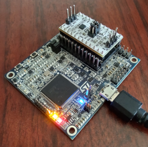

# ST Edge AI Core for MLC tutorial

During this tutorial, the complete flow for deploying a trained decision tree inside a sensor embedding the machine learning core (MLC) using [ST Edge AI Core](https://www.st.com/en/development-tools/stedgeai-core.html) will be demonstrated.

The use case consists of human activity recognition (HAR) using accelerometer data to train a small decision tree (DT) to recognize four activities: stationary, walking, running, and cycling.

## Requirements

For reproducing all the steps in this tutorial project, the following sets of software and hardware components are required.

### Hardware

- [ProfiMEMS board](https://www.st.com/en/evaluation-tools/steval-mki109v3.html): STM32-based motherboard for profiling MEMS sensors using DIL24 compatible adapters

    

- [STEVAL-MKI227KA](https://www.st.com/en/evaluation-tools/steval-mki227ka.html): adapter board for the LSM6DSV16X sensor, which embeds a 3-axis accelerometer, a 3-axis gyroscope, electrostatic sensor (Qvar), and the machine learning core (MLC), capable of running decision tree models. The adapter board must be plugged into the DIL24 socket of the ProfiMEMS board.

    

### Software

- [ST Edge AI Core](https://www.st.com/en/development-tools/stedgeai-core.html): tool to easily convert pretrained AI models for integration into ST products, which must be added to the system PATH (for detailed steps refer to the dedicated article inside the ST Edge AI installation folder: `<stedgeai_folder>/1.0/Documentation/setting_env.html`)
- [MEMS Studio](https://www.st.com/en/development-tools/MEMS-Studio.html): desktop software solution to develop and test solutions for MEMS sensors
- [STMems_Machine_Learning_Core](https://github.com/STMicroelectronics/STMems_Machine_Learning_Core): repository for MLC configuration, containing documentation, examples, and tools
- [Python](https://www.python.org): necessary to create and train the neural network model (required Python packages are listed in *requirements.txt*)
- [Jupyter Notebook](https://jupyter.org/install): interactive computing platform accessible from the web browser to run Python code

## Dataset acquisition

For the first step of this tutorial, the ProfiMEMS board (with the sensor adapter mounted on top) and MEMS Studio can be used to collect multiple data logs for each of the activities.

1. Insert the STEVAL-MKI227KA sensor adapter into the DIL24 socket on top of the ProfiMEMS board.

    

2. Connect the ProfiMEMS board to a USB port of your computer.

3. Flash the `ProfiMEMSToolV3.67.1.bin` firmware located inside the MEMS Studio installation folder at: `<mems-studio_folder>/firmware/mems-studio/steval-mki109v3` to enable the communication between MEMS Studio and the sensor (this can be achieved either through MEMS Studio or using [STM32CubeProgrammer](https://www.st.com/en/development-tools/stm32cubeprog.html)).

4. Open MEMS Studio, under *Connect*, select *Serial* as *Communication type* and the serial port the board is connected to as *Communication port*, and then press *Connect*. Then search and select *STEVAL-MKI227KA (LSM6DSV16X)*.

    

5. Go to the `Sensor Evaluation` section and select the `Quick Setup` page to configure the sensor (*Accelerometer Full Scale*: 8 g; *Accelerometer Output Data Rate*: 30 Hz), then press the `▶` button in the top left corner to start streaming data from the sensor.

    

6. Go to the `Save to File` page, select a save path for the CSV log in the `data/<id>_<activity>` folder (where <*activity*> corresponds to the desired activity name and <*id*> corresponds to the numeric identifier of the activity used for its classification), select *Accelerometer* in the *Data* section.

    

7. Use the `Start` / `Stop` buttons to start and stop data collection making sure to acquire data in the most realistic setting with only one activity type per log.

### PAMAP2 dataset

Several CSV logs are already available in the `data` folder and are sufficient to obtain good training results, however, the user is free to add new logs or customize the activities.

These logs have been originally obtained from a public HAR dataset named (Reiss, Attila. (2012). PAMAP2 Physical Activity Monitoring. UCI Machine Learning Repository. [https://doi.org/10.24432/C5NW2H](https://doi.org/10.24432/C5NW2H)) and later cleaned/pre-processed for the purpose of this tutorial. The following steps have been applied to the original dataset:

- Only keep logs acquired from the wrist-mounted sensor and only from { *lying*, *sitting*, *standing*, *watching_TV*, *walking*, *nordic_walking*, *upstairs*, *downstairs*, *running*, *cycling* } activities
- Merge { *lying*, *sitting*, *standing*, *watching_TV* } into *stationary* class, and { *walking*, *nordic_walking*, *upstairs*, *downstairs* } into *walking* class
- Visually inspect data and remove start/stop segments where no tasks are being performed
- Only keep accelerometer X, Y, and Z axes data and convert it to mg scale
- Resample data from 100 Hz to 26 Hz using Fourier method
- Segment CSV logs into multiple logs of 1 minute each
- Balance dataset by keeping the same number of logs for each class
- Export logs in MEMS Studio CSV format

## Feature extraction

To ensure a correct model training, the features comprising the training set must be aligned 1:1 to the MLC hardware. For this reason, ST Edge AI Core enables automatically extracting the features from data logs.

This is done using an MLC generation script (in JSON format) containing all settings needed for extracting the features.

For this tutorial, the following configuration is used for feature extraction:

```json
{
    "datalogs": [
        { "filename": "data/0_stationary/log_0.csv", "label": "stationary" },
        { "filename": "data/0_stationary/log_1.csv", "label": "stationary" },
        { "filename": "data/0_stationary/log_2.csv", "label": "stationary" },
        { "filename": "data/0_stationary/log_3.csv", "label": "stationary" },
        { "filename": "data/1_walking/log_0.csv",    "label": "walking"    },
        { "filename": "data/1_walking/log_1.csv",    "label": "walking"    },
        { "filename": "data/1_walking/log_2.csv",    "label": "walking"    },
        { "filename": "data/1_walking/log_3.csv",    "label": "walking"    },
        { "filename": "data/1_walking/log_4.csv",    "label": "walking"    },
        { "filename": "data/1_walking/log_5.csv",    "label": "walking"    },
        { "filename": "data/1_walking/log_6.csv",    "label": "walking"    },
        { "filename": "data/1_walking/log_7.csv",    "label": "walking"    },
        { "filename": "data/2_running/log_0.csv",    "label": "running"    },
        { "filename": "data/2_running/log_1.csv",    "label": "running"    },
        { "filename": "data/2_running/log_2.csv",    "label": "running"    },
        { "filename": "data/2_running/log_3.csv",    "label": "running"    },
        { "filename": "data/2_running/log_4.csv",    "label": "running"    },
        { "filename": "data/2_running/log_5.csv",    "label": "running"    },
        { "filename": "data/3_cycling/log_0.csv",    "label": "cycling"    },
        { "filename": "data/3_cycling/log_1.csv",    "label": "cycling"    },
        { "filename": "data/3_cycling/log_2.csv",    "label": "cycling"    },
        { "filename": "data/3_cycling/log_3.csv",    "label": "cycling"    }
    ],
    "name": "LSM6DSV16X",
    "mlc_odr": "30 Hz",
    "input_type": "accelerometer_only",
    "accelerometer_fs": "8 g",
    "accelerometer_odr": "30 Hz",
    "decision_tree_count": 1,
    "window_length": 60,
    "filters": [
        { "filter_id": "filter_1", "filter_type": "BP", "input": "Acc_V2", "a2": "-1.66", "a3": "0.81", "gain": "0.09" }
    ],
    "features": [
        { "feature_name": "MEAN",          "input": "Acc_V2",          "signed": true },
        { "feature_name": "MEAN",          "input": "Acc_V2_filter_1", "signed": true },
        { "feature_name": "VARIANCE",      "input": "Acc_V2",          "signed": true },
        { "feature_name": "VARIANCE",      "input": "Acc_V2_filter_1", "signed": true },
        { "feature_name": "ENERGY",        "input": "Acc_V2",          "signed": true },
        { "feature_name": "ENERGY",        "input": "Acc_V2_filter_1", "signed": true },
        { "feature_name": "PEAK_TO_PEAK",  "input": "Acc_V2",          "signed": true },
        { "feature_name": "PEAK_TO_PEAK",  "input": "Acc_V2_filter_1", "signed": true },
        { "feature_name": "ZERO_CROSSING", "input": "Acc_V2",          "signed": true, "threshold": "0.0" },
        { "feature_name": "ZERO_CROSSING", "input": "Acc_V2_filter_1", "signed": true, "threshold": "0.0" },
        { "feature_name": "PEAK_DETECTOR", "input": "Acc_V2",          "signed": true, "threshold": "0.0" },
        { "feature_name": "PEAK_DETECTOR", "input": "Acc_V2_filter_1", "signed": true, "threshold": "0.0" },
        { "feature_name": "MINIMUM",       "input": "Acc_V2",          "signed": true },
        { "feature_name": "MINIMUM",       "input": "Acc_V2_filter_1", "signed": true },
        { "feature_name": "MAXIMUM",       "input": "Acc_V2",          "signed": true },
        { "feature_name": "MAXIMUM",       "input": "Acc_V2_filter_1", "signed": true }
    ],
    "arff": "output/har_features.arff"
}
```

In summary, this configuration needs to specify the list of logs to process with the corresponding class labels, the sensor configuration such as data rate / full scale, the list of filters, and the list of features to compute.

For more information on all possible settings, please refer to the official MLC documentation of ST Edge AI Core located at `<stedgeai_folder>/1.0/Documentation/mlc_generation_script.html` inside the installation folder.

This tutorial provides a ready-to-go MLC generation script named `mlc_conf.json` that can be customized based on the user's needs. Using the `generate` command of ST Edge AI Core, the features can be finally extracted from the logs available in `data`. For the directory of this tutorial, run:

```powershell
stedgeai generate --target mlc --device lsm6dsv16x --json mlc_conf.json --type arff
```

Note: It is important to specify what *type* of file to generate by providing `--type arff` for feature extraction, as the same MLC generation script will be used also for generating the final sensor configuration (.ucf).

After this step, the extracted features are saved in: `output/har_features.arff` file.

## Model Training

Once a decent-sized dataset has been acquired, the training of the model on the collected data is the next step. To make this process as easy as possible, a ready-to-use notebook (`har_tutorial.ipynb`) is provided.

### Steps

By running all cells in this notebook, the following steps are performed:

1. Load feature data from the ARFF file
2. Divide dataset into training (70%), and testing (30%) sets
3. Train a small decision tree model (17 nodes)
4. Export model in Weka textual representation

At the end of the procedure, the DT model is saved in Weka format in the `models` folder.

This notebook uses scikit-learn (Python) to create and train the decision tree, but other frameworks and tools could be used instead (for example, MATLAB, Weka, and MEMS Studio).

### Customization

To customize the activities recognized by the model, the user can just add/remove activity folders in `data` and update the `mlc_conf.json` *datalogs* field. For example, for adding a new *driving* activity, the user needs to create a `data/4_driving` folder where all CSV logs corresponding to that activity will be placed and update the `mlc_conf.json` file as follows:

```json
{
    "datalogs": [
        "..."
        { "filename": "data/4_driving/log_0.csv", "label": "driving" },
        { "filename": "data/4_driving/log_1.csv", "label": "driving" },
        { "filename": "data/4_driving/log_2.csv", "label": "driving" }
    ]
}
```

Then, using ST Edge AI Core, new MLC features (.arff) can be extracted by running:

```powershell
stedgeai generate --target mlc --device lsm6dsv16x --json mlc_conf.json --type arff
```

### How to run the Jupyter Notebook

To be able to run the provided Jupyter Notebook, please follow the next steps:

1. (Optional) Create a Python virtual environment using [venv](https://docs.python.org/3/library/venv.html), [Anaconda](https://docs.conda.io/projects/conda/en/latest/user-guide/install/index.html) / [Miniconda](https://docs.conda.io/en/latest/miniconda.html) or any other similar tool to avoid conflicts with previously installed Python packages.

2. Install the required modules by using the following shell command from the folder of this tutorial:

    ```powershell
    pip install -r requirements.txt
    ```

3. Start the [Jupyter](https://jupyter.org) server by running:

    ```powershell
    jupyter notebook
    ```

    and open in a web browser the URL displayed in your shell.

    Alternatively, a [VScode extension](https://marketplace.visualstudio.com/items?itemName=ms-toolsai.jupyter) is also available for Jupyter integration in VSCode, which will take care of starting the Jupyter server in the background.

4. Run all the Jupyter Notebook cells

### Performance analysis

To assist in deciding which model is more suited for MLC integration, the `analyze` command can be used to simulate MLC behavior by inputting the previously extracted features to a given decision tree:

```powershell
stedgeai analyze --target mlc --device lsm6dsv16x --tree output/har_dectree.txt --arff output/har_features.arff
```

Here are the simulation results from the `mlc_ai_output/mlc_analyze_report.txt` report:

```
Features used:
    F1_MEAN_on_ACC_V2
    F2_MEAN_on_filter_BP_on_A_V2
    F3_VAR_on_ACC_V2
    F6_ENERGY_on_filter_BP_on_A_V2
    F7_PeakToPeak_on_ACC_V2
    F9_ZeroCross_on_ACC_V2
    F11_PeaKDet_on_ACC_V2

Decision tree info:
    Nodes  : 19
    Leaves : 10
    Depth  : 7

Results before meta-classifier:
    Class "stationary" accuracy  : 99.708878 %
                       recall    : 100.000000 %
                       precision : 98.449615 %
    Class "cycling"    accuracy  : 99.272194 %
                       recall    : 97.122299 %
                       precision : 99.264702 %
    Class "walking"    accuracy  : 99.417755 %
                       recall    : 99.134201 %
                       precision : 99.134201 %
    Class "running"    accuracy  : 99.854439 %
                       recall    : 100.000000 %
                       precision : 99.476440 %

    Global accuracy : 99.126640 %

              stationary (T)    cycling (T)    walking (T)    running (T)
stationary    127               2              0              0          
cycling       0                 135            1              0          
walking       0                 2              229            0          
running       0                 0              1              190        
```

If the user intends to run decision tree outputs through a metaclassifier stage, the `analyze` command allows specifying the metaclassifier configuration inside a dedicated file where each row is in the format:

```
<class name> <meta end counter> <meta subgroup>
...
```

For example, for this tutorial, the subgroups 0, 1, 2, 3 (one for each class output) could be used with an end counter of 2; meaning that, to be able to output a given class, at least three predictions of that class are needed:

```
stationary 2 0
walking 2 1
running 2 2
cycling 2 3
```

By providing this configuration file to the *--meta* argument, the MLC metaclassifier stage can be emulated as well:

```powershell
stedgeai analyze --target mlc --device lsm6dsv16x --tree output/har_dectree.txt --arff output/har_features.arff --meta output/har_meta.txt
```

Note: Raw predictions from the MLC used for metrics computation are also available inside the `mlc_ai_output/simulations` folder.

## Sensor configuration

A second, and final, generation step will now use the same MLC generation script (`mlc_conf.json`) as before with some additional fields and modifications to include decision tree information.

By looking at the previous `mlc_ai_output/mlc_analyze_report.txt` report, it can be noticed that the decision tree is using fewer features than those initially configured; taking this into consideration, the unnecessary features can be removed, resulting in the following list:

```json
    "features": [
        { "feature_name": "MEAN",          "input": "Acc_V2",          "signed": true },
        { "feature_name": "MEAN",          "input": "Acc_V2_filter_1", "signed": true },
        { "feature_name": "VARIANCE",      "input": "Acc_V2",          "signed": true },
        { "feature_name": "ENERGY",        "input": "Acc_V2_filter_1", "signed": true },
        { "feature_name": "PEAK_TO_PEAK",  "input": "Acc_V2",          "signed": true },
        { "feature_name": "ZERO_CROSSING", "input": "Acc_V2",          "signed": true, "threshold": "0.0" },
        { "feature_name": "PEAK_DETECTOR", "input": "Acc_V2",          "signed": true, "threshold": "0.0" },
    ],
```

Next, the names of the features used by the decision tree must be specified in the `dectree_features` field as an ordered list of names that must match the list of features in `features`:

```json
    "dectree_features": [
        "F1_MEAN_on_ACC_V2",
        "F2_MEAN_on_filter_BP_on_A_V2",
        "F3_VAR_on_ACC_V2",
        "F6_ENERGY_on_filter_BP_on_A_V2",
        "F7_PeakToPeak_on_ACC_V2",
        "F9_ZeroCross_on_ACC_V2",
        "F11_PeaKDet_on_ACC_V2"
    ],
```

Finally, the list of decision tree objects (one in this case) must be added, each specifying: file path, label string to integer mapping, and metaclassifier end counters. Also, the output path of the sensor configuration (.ucf) must be specified:

```json
    "dectrees": [
        {
            "filename": "output/har_dectree.txt",
            "results": [
                { "label": "stationary", "value": 1  },
                { "label": "walking",    "value": 4  },
                { "label": "running",    "value": 8  },
                { "label": "cycling",    "value": 12 }
            ],
            "metaclassifier": [ 2, 2, 2, 2 ]
        }
    ],
    "ucf": "output/har_tutorial.ucf"
```

By running the `generate` command again, this time with *ucf* output type, the sensor configuration (.ucf) can be generated:

```powershell
stedgeai generate --target mlc --device lsm6dsv16x --json mlc_conf.json --type ucf
```

Note: In addition to the UCF format, the sensor configuration is also automatically exported to a C header file inside the `mlc_ai_output` folder to facilitate the integration inside any custom project.

## Validation

To obtain some more information regarding model accuracy and to verify if the model works as expected in the hardware, the `validate` command can be exploited to perform a validation.

To do so, connect the ProfiMEMS board to a USB port of the PC, and run the `validate` command with the sensor configuration (.ucf), and validation data folder path as arguments:

```powershell
stedgeai validate --target mlc --device lsm6dsv16x --ucf output/har_tutorial.ucf --logs data_validate --ignore-zero
```

This command will process the data with the specified MLC configuration directly in the hardware. A special type of dataset containing accelerometer / gyroscope data in LSB format (instead of using mg/dps units) plus one or more *LABEL_{i}* columns containing the ground truth values for each decision tree must be used. The predictions collected from the MLC will be then compared to the reference values to compute prediction metrics. For details regarding the format, refer to the logs already available in `data_validate`.

Note: Prediction of value "0" from MLC can be associated both with an uninitialized state and with a decision tree output value; the user is advised to choose a different value for the decision tree outputs (as done in this tutorial) to be able to ignore "0" predictions and compute metrics correctly using the *--ignore-zero* option.

From the `mlc_ai_output/mlc_validate_report.txt` report:

```
Accuracy report for decision tree 0
--------------------------------------------------------------------------------
notes: - computed against the provided ground truth values
       - 21213 samples (4 items per sample)
       - C0 may also indicates the initial state of DT0

acc: 100.00%, rmse: 0.0, mae: 0.0, l2r: 0.0, mean: 0.0, std: 0.0, nse: 1.0, cos: 1.0

4 classes (21213 samples)
----------------------------
C1       4743   .    .    .  
C4         .  4928   .    .  
C8         .    .  5367   .  
C12        .    .    .  6175

acc  : Classification accuracy (all classes)
rmse : Root Mean Squared Error
mae  : Mean Absolute Error
l2r  : L2 relative error
nse  : Nash-Sutcliffe efficiency criteria
cos  : Cosine similarity
```

Note: Raw predictions from the MLC used for metrics computation are also available inside the `mlc_ai_output/injections` folder.

## Testing with MEMS Studio

Once the sensor configuration (.ucf) is obtained, MEMS Studio can be used for uploading the configuration inside the MLC and testing the application.

1. Connect the board, go to the `Sensor Evaluation` section, and then select the `Load/Save Configuration` page

2. Browse to the `har_tutorial.ucf` file and press the `Load` button to load the configuration inside the MLC:

    

3. Once the upload is completed, go to the `Data Monitor` page and press the `▶` button in the top left corner to start reading the `Dec Tree Output` prediction values:

    

------

**More information: [http://www.st.com](http://st.com/MEMS)**

**Copyright© 2024 STMicroelectronics**
