# Introduction

In this introduction, we will explain how the accelerometer enables the detection of the inclination angle: tilt (0-180 degrees range), pitch (±90 degrees range), or full rotation angle (±180 degrees range).

## Accelerometer measurements

When the accelerometer is resting parallel to the horizontal plane and its Z-axis is pointing up, it will report AccX = 0 g, AccY = 0 g, AccZ = 1 g. The gravity acceleration is seen on the Z-axis. The sign is positive because the gravity is pulling down which causes the same effect as accelerating up.

Rotations around the Z-axis (also known as yaw, which causes the X and Y axes to move) do <u>not</u> change the accelerometer output. In the picture below, the yaw angle is set to 0, -20, -40, and -60 degrees going from left to right. The accelerometer output is always AccX = 0 g, AccY = 0 g, AccZ = 1 g.

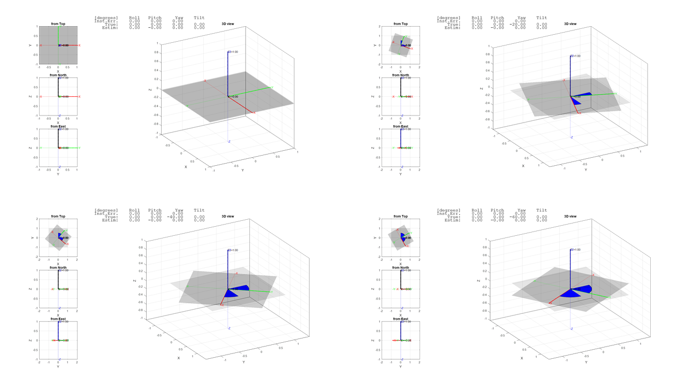

When the accelerometer is tilted in any direction, the projection of the gravity vector along the Z-axis is reduced, while the projection along the X and Y axes is increased in the positive or negative direction. The AccZ measurement is mathematically linked to the tilt angle: **AccZ = cos(tilt angle) x 1 g**. **The tilt angle is defined as the angle between the vertical and the Z-axis of the accelerometer**; it is highlighted in yellow in the pictures below. The range is from 0 to 180 degrees.

In general, any accelerometer inclination can be obtained as a sequence of two rotations. Using the flight dynamic conventions, axes named according to standard DIN 9300, the first is a rotation around the Y-axis (also known as pitch, which causes the X and Z axes to move, range ±90 degrees), the second is a rotation around the X-axis (also known as roll, which causes the Y and Z to move, range ±180 degrees). Note that the Android platform has a different naming convention: the first is a rotation around the Y-axis, parallel to the left and right edge of the smartphone (this rotation is defined as roll, range ±90 degrees), the second is a rotation around the X-axis, parallel to the bottom and top edge (this rotation is defined as pitch, range ±180 degrees).

In the picture below the pitch angle is set to 0, +15, +30, +45 degrees going from left to right. Pitch is a rotation around the Y-axis therefore the AccY measurement does <u>not</u> change. The AccZ and AccX measurements are mathematically linked to the pitch angle: **AccZ = cos(pitch angle) x 1 g** and **AccX = sin(pitch angle) x 1 g**. **The pitch angle is defined as the angle between the horizontal plane and the X-axis of the accelerometer**; it is highlighted in green in the pictures below. The range is from -90 to +90 degrees. See also Design Tip [DT0140](https://www.st.com/content/ccc/resource/technical/document/design_tip/group0/99/13/32/1e/da/07/4c/ff/DM00753522/files/DM00753522.pdf/jcr:content/translations/en.DM00753522.pdf) on www.st.com for more information on how to compute tilt angle.

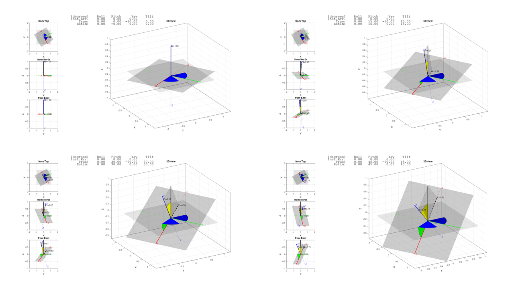

In the picture below the roll angle is set to 0, +10, +20, +30 degrees going from left to right. Roll is a rotation around the X-axis therefore the AccX measurement does <u>not</u> change. AccY = sin(roll) cos(pitch)  x 1 g and AccZ = cos(roll) cos(pitch) x 1 g. Note that the tilt angle will be affected by both roll and pitch: AccZ = cos(tilt) x 1 g = cos(roll) cos(pitch) x 1 g, **the tilt angle is identical to roll angle only if pitch is 0 degrees (rotation constrained around X), or it is identical to pitch angle only if roll is 0 degrees (rotation constrained around Y).**

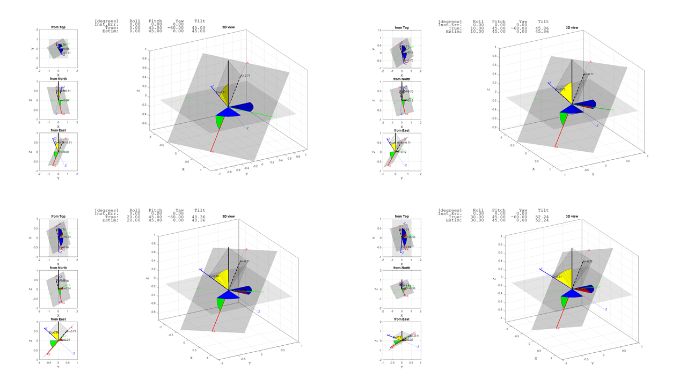

One can compute the roll from the ratio of AccY and AccZ: AccY/AccZ = sin(roll)/cos(roll) = tan(roll), roll = arctan(AccY/AccZ) or roll = arctan2(AccY, AccZ). See also Design Tip [DT0058](https://www.st.com/content/ccc/resource/technical/document/design_tip/group0/56/9a/e4/04/4b/6c/44/ef/DM00269987/files/DM00269987.pdf/jcr:content/translations/en.DM00269987.pdf) on www.st.com for more information on how to compute roll and pitch angles.

## Angle detection by Machine Learning Core

Accelerometer measurements are mathematically linked to the inclination angle as explained in the previous section:

- AccX = sin(pitch angle) x 1 g, max range is from -90 to +90 degrees.
- AccZ = cos(tilt angle) x 1 g, max range is from 0 to +180 degrees.

It is clear that for every angle interval there is a corresponding measurement interval. The C utility published here will ask for the **mode (horizontal m=0, or vertical m=1), the angle range (first angle a1 and last angle a2 in degrees), and the number of intervals N** (the maximum value of N depends on the device, for example N ≤ 16 for [LSM6DSOX](https://www.st.com/en/mems-and-sensors/lsm6dsox.html), N ≤ 256 for [ISM330DHCX](https://www.st.com/en/mems-and-sensors/ism330dhcx.html)), then it will generate a decision tree. The decision tree will be run in the Machine Learning Core in the sensor to classify the measurements, that is, to find the interval in which they fall. Each interval has an associated output code, an integer number from 0 to N-1. The angle can then be computed in the host microcontroller using the following formula: **angle = output code x  multiplication factor + base offset**, the multiplication factor and the base offset are computed and printed on the console by the C utility. The output code is a positive integer read from the MLC0_SRC register.

The feature used by the decision tree is the mean of the selected axis (horizontal or vertical). The mean is computed over a "window" of specified length L. The longer the window, the more stable and accurate the detection is: the RMS noise is reduced by a factor of sqrt(L). For increased noise performance, the mean can be computed on the filtered measurement by configuring one of the available digital filters in the Machine Learning Core (1st or 2nd order IIR).

## Full range from -180 to +180 degrees: dual and dual+ axis mode

As explained previously, the tilt angle is identical to the pitch angle **when the rotation is constrained around Y**:

- AccX = sin(angle) x 1 g.
- AccY = 0 g.
- AccZ = cos(angle) x 1 g.

This allows the max range to be extended to -180 to +180 degrees. The accuracy of the angle detection is also increased: AccX is used to detect angles close to 0 and ±180 degrees while AccZ is used to detect angles close to ±90 degrees. The best axis is the one that has the larger variation when the angle changes: the sensitivity is higher and it is more likely that the observed change is caused by the angle and not by the noise. 

The C utility automatically selects the best axis, AccX or AccZ, depending on the interval to be detected. The third axis, AccY, can also be checked to verify that it is indeed close to 0. If it is not, then the rotation is no more constrained.

This is the summary of available modes when designing a decision tree with the C utility provided here:

- Horizontal axis mode (m=0): uses AccX to detect pitch angle, that is the angle between X-axis and the horizontal plane, max range from -90 to +90 degrees.
- Vertical axis mode (m=1): uses AccZ to detect tilt angle, that is the angle between Z-axis and the vertical, max range from 0 to +180 degrees.
- Dual axis mode (m=2): uses AccX and AccZ to detect the rotation angle, rotation must be constrained around the third axis (Y), max range from -180 to +180 degrees.
- Dual+ axis mode (m=3): same as dual mode, but the decision tree is extended to check that third axis is close to 0 g as it should be for a constrained rotation: abs(Y) < threshold.

## C utility to design decision trees for inclination angle detection

The C utility has been designed to support all sensors equipped with the Machine Learning Core and to offer maximum flexibility. Here below the list of parameters that can be passed on the command line (if no parameter is specified, the utility will enter interactive mode and prompt the user).

Mandatory parameters:

- **m** mode: 0 (horizontal axis mode, AccX is used to detect the pitch angle), 1 (vertical axis mode, AccZ is used to detect the tilt angle), 2 (dual axis mode, AccX and AccZ are used to detect the full rotation angle), 3 (dual+ axis mode, like dual axis mode but also uses the third axis, AccY is checked to verify that it is close to 0 g).
- **a1** first angle in degrees: for pitch a1 ≥ -90, for tilt a1 ≥ 0, for full circle rotation a1 ≥ -180 degrees.
- **a2** last angle in degrees: for pitch a2 ≤ +90, for tilt a2 ≤ 180, for full circle rotation a2 ≤ +180 degrees (note: +180 is the same as -180 and it may be useful to set a2 < 180 when a1 = -180, or set a1 > -180 when a2 = +180, see example below).
- **N** number of intervals, leaves of the decision tree. The maximum number of intervals depends on the device. Example: N=16 for [LSM6DSOX](https://www.st.com/en/mems-and-sensors/lsm6dsox.html), and N=256 for [ISM330DHCX](https://www.st.com/en/mems-and-sensors/ism330dhcx.html) or [IIS2ICLX](https://www.st.com/en/mems-and-sensors/iis2iclx.html)).

Optional parameters:

- **opt** optimization mode: 0 for shallow tree (best for horizontal or vertical mode), 1 for noise-safe tree (best for dual axis mode). The shallow tree mode will prioritize thresholds that split the interval sets as evenly as possible to minimize the overall depth of the tree; the noise-safe mode will prioritize thresholds that have the maximum distance to the interval center, so that it is less likely to cross a boundary and misclassify because of noise.
- **g** gravity vector value: the value corresponding to 1 g depends on the device. Example: 1.0 for  [LSM6DSOX](https://www.st.com/en/mems-and-sensors/lsm6dsox.html) and  [ISM330DHCX](https://www.st.com/en/mems-and-sensors/ism330dhcx.html), 0.5 for  [LSM6DSO32X](https://www.st.com/en/mems-and-sensors/lsm6dso32x.html), 4.0 for [IIS2ICLX](https://www.st.com/en/mems-and-sensors/iis2iclx.html).
- **RMS** noise value: this value is available from the sensor datasheet. If the noise density is specified, then compute RMS = Noise Density x sqrt(Bandwidth), where Bandwidth depends on the configured lowpass filter, when no lowpass filter is configured the Bandwidth = Output Data Rate / 2. If it is specified, the C utility can verify which interval is prone to misclassification: if the distance to the threshold is less than 3 x RMS level, then the risk will be larger than 0.4% and the interval will be flagged with an asterisk in the console output.
- **ths** threshold for third axis (Y) in dual+ mode: when mode m=3 the decision tree will be extended with two additional decision nodes to verify that the third axis is close to 0: abs(Y) < th, that is Y > -th and Y < +th. If this condition holds, the rotation is constrained around the third axis and the detection of the rotation angle can be performed, otherwise the output code corresponding to invalid interval (-1) is emitted.

Additional parameters for each axis to take into account calibration parameters when they are available and to support axis remapping when the accelerometer is not installed in the horizontal plane. 

- **hofs, hsns, hstr**: offset, sensitivity, and string for the horizontal axis. Default to 0.0, 1.0, and AccX respectively.
- **vofs, vsns, vstr**: offset, sensitivity, and string for the vertical axis. Default to 0.0, 1.0, and AccZ respectively.
- **tofs, tsns, tstr**: offset, sensitivity, and string for the thirds axis. Default to 0.0, 1.0, and AccY respectively.

Actual measurement = true value x sensitivity + offset. For an ideal accelerometer sensitivity = 1.0 and offset = 0.0. The C utility takes into account the sensitivity factor and the offset when computing the thresholds for the decision tree.

If the accelerometer is not installed in the horizontal plane, then the "vertical" axis does not correspond to AccZ. For example IIS2ICLX is a 2-axis accelerometer where only AccX and AccY are available. If it is installed with AccX pointing up and AccY in the horizontal plane to support dual mode and full rotation angle detection, then one must set vstr="AccX" and hstr="AccY".

The *ism330dhcx* and *lsm6dsox* folders show the step-by-step procedure to create configurations for inclination angle detection and to integrate them onto the STWIN board and the SensorTile.box board. Similar procedures can be used to generate the configuration for other devices featuring MLC (e.g., IIS2ICLX, LSM6DSO32X).

## Decision tree examples

The examples below show simple decision trees with few leaves and a graphical representation that highlights the thresholds and the detection intervals.

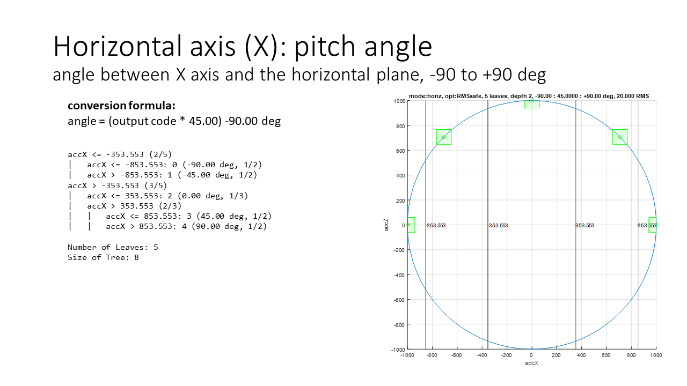

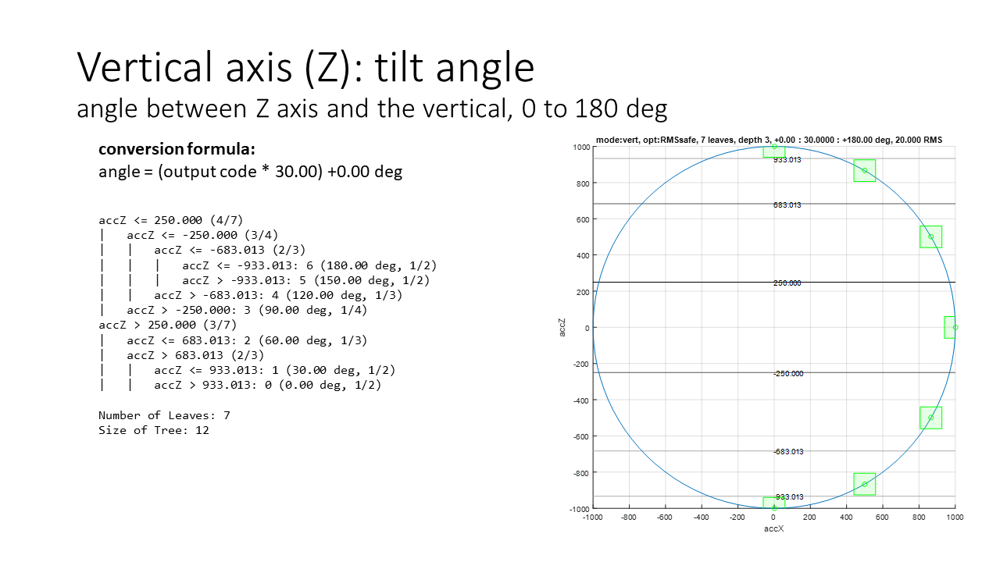

The dual axis mode supports the full rotation range, from -180 to +180 degrees. These two angles however represent the same orientation (the "upside-down" position). If one wants to detect on which side the upside-down position is, e.g., -179.9 or +179.9 degrees, then the following decision tree is to be used. Otherwise, it is better to either remove -180 or remove +180, so that the output code does not oscillate between the two values when the device is in the upside position.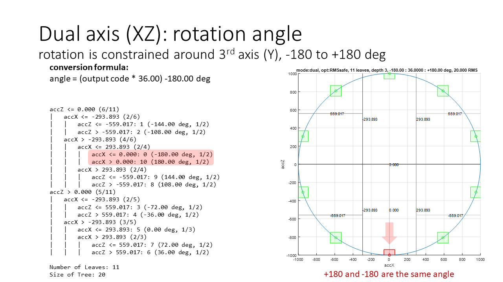

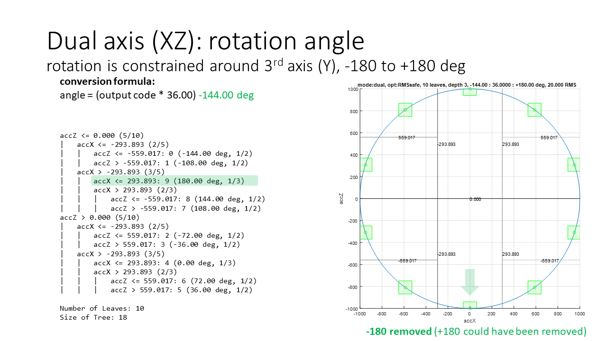

The dual+ mode can be selected to use the third axis (Y) when it is available and check that the rotation is indeed constrained (abs(Y) < threshold). The decision tree can be simplified by using the absolute value of the selected feature for AccY.

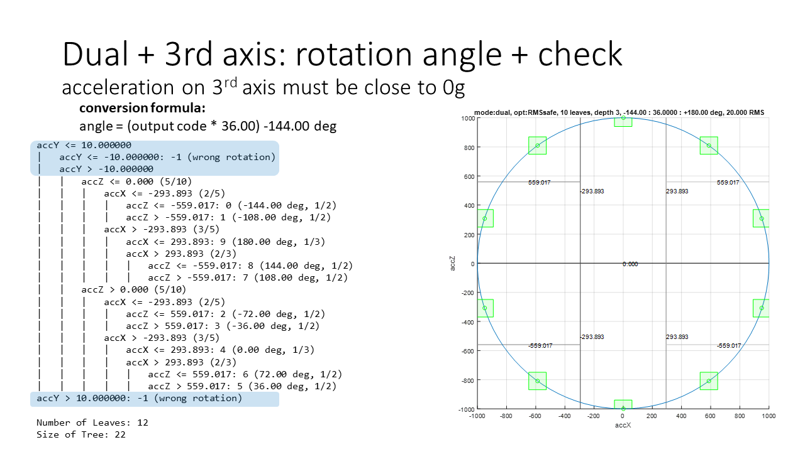

The optimization mode can provide shallower trees or decision thresholds which are farther from the interval centers, giving more robustness against RMS noise. RMS noise can always be reduced by selecting longer windows to compute the mean feature and by enabling a digital lowpass filter.

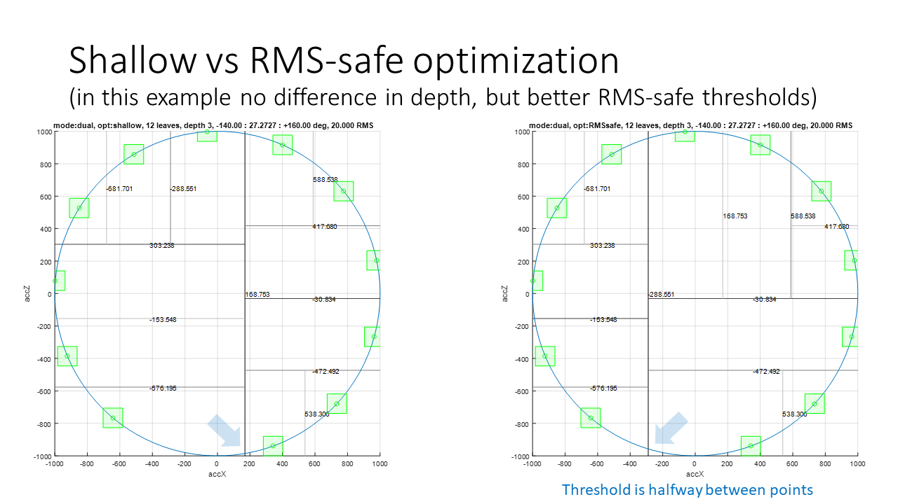

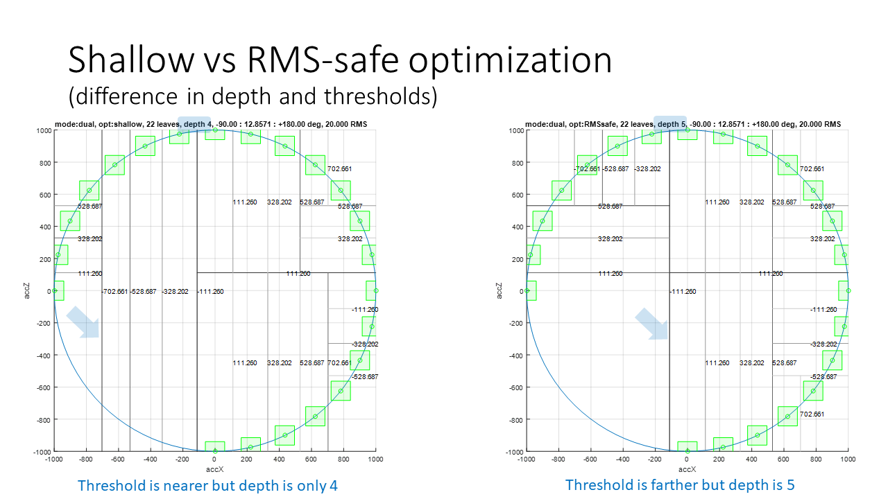

When the RMS noise level is specified, the intervals that may be subject to misclassification caused by noise are highlighted by an asterisk in the console output of the C utility and highlighted with red color in the picture below:

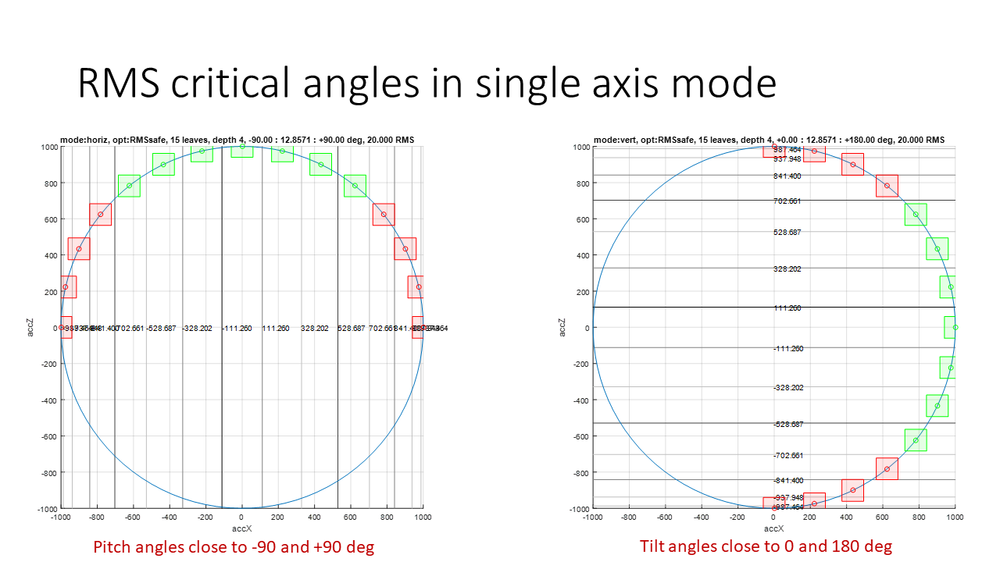

This example covers the 3-axis accelerometer [LSM6DSOX](https://www.st.com/en/mems-and-sensors/lsm6dsox.html):

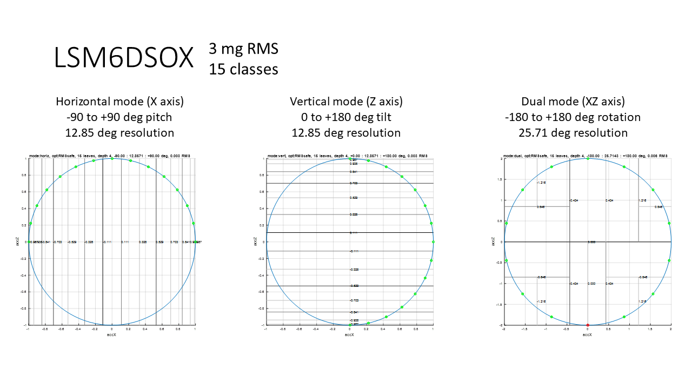

This example covers the 2-axis accelerometer [IIS2ICLX](https://www.st.com/en/mems-and-sensors/iis2iclx.html): in this case the horizontal and the vertical axis modes are prone to misclassification caused by RMS noise (set to 1.8 mg, no averaging because window length L=1 and no digital filtering).

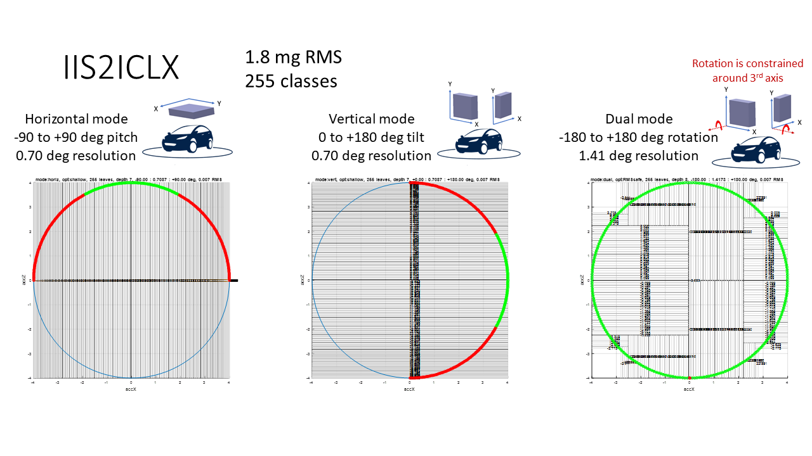

**More Information: [http://www.st.com](http://st.com/MEMS)**

**Copyright © 2022 STMicroelectronics**

