This README file describes how to build and use the **DecisionTree_for_AngleDetection.c** program to generate a decision tree for tilt sensing, how to create from the decision trees a **UCF** configuration file (.ucf) for the **Machine Learning Core (MLC)** of the [**LSM6DSOX**](https://www.st.com/en/mems-and-sensors/lsm6dsox.html) and finally how to evaluate the result.

In particular, this tutorial describes the following:

- How to build the *DecisionTree_for_AngleDetection.c* program
- How to run the program to generate customized decision trees for inclination angle measurement
- How to use the *Unico-GUI* to generate a sensor configuration file (*UCF* file) from the previously generated decision tree file
- How to create a project with *AlgoBuilder*, importing the *UCF file* and program the *SensorTile.box* evaluation platform
- How to use the *Unicleo-GUI* and evaluate the MLC results


## **Software**

The main and mandatory software tool for this tutorial is [**Unico-GUI**](https://www.st.com/en/development-tools/unico-gui.html), a graphical user interface (available for Linux, MacOS and Windows) that supports a wide range of sensors and allows building an **MLC** program (even without any board connected = offline mode) and generating a sensor configuration file (**UCF** file).

For the tutorial it is also necessary to install a C compiler. This tutorial describes the procedure of compilation with the GCC compiler on Windows (using [**Cygwin**](https://www.cygwin.com/)). Please note that the Cygwin *bin* directory (typically "*C:\cygwin64\bin*") should be added to the Windows PATH environment variable. Successful GCC installation can be checked by writing the `gcc -v` command in the Windows Command prompt (it should display the GCC configuration and its version).

To further evaluate the output of this tutorial, it is worth mentioning the following software tools:
- [**Unico-GUI**](https://www.st.com/en/development-tools/unico-gui.html), a comprehensive software package for the STEVAL-MKI109V3 evaluation board. It can be used without the board to generate the configuration for all MEMS sensors (accelerometers, gyroscopes, magnetometers and environmental sensors).
- [**AlgoBuilder**](https://www.st.com/content/st_com/en/products/embedded-software/mems-and-sensors-software/inemo-engine-software-libraries/algobuilder.html), a PC application to design a custom processing flow and build the firmware for STM32 Nucleo boards coupled with the MEMS expansions boards, or for form-factor evaluation boards such as the [SensorTile.box](https://www.st.com/en/evaluation-tools/steval-mksbox1v1.html)
- [**Unicleo-GUI**](https://www.st.com/en/development-tools/unicleo-gui.html), a PC application that connect to a **STM32 Nucleo boards** or to [SensorTile.box](https://www.st.com/en/evaluation-tools/steval-mksbox1v1.html) to display the data received in real-time.


## **Hardware**

The [SensorTile.box](https://www.st.com/en/evaluation-tools/steval-mksbox1v1.html) multi-sensor kit will be used in this tutorial and in particular the [**LSM6DSOX**](https://www.st.com/en/mems-and-sensors/lsm6dsox.html) sensor. The same procedure shown here also applies to other ST sensors equipped with the Machine Learning Core.


For more hardware details, visit:
- ST resource page on [MEMS sensor](https://www.st.com/mems)
- ST resource page on [Explore Machine Learning Core in MEMS sensors](https://www.st.com/content/st_com/en/campaigns/machine-learning-core.html)
- Application note [AN5259](https://www.st.com/resource/en/application_note/an5259-lsm6dsox-machine-learning-core-stmicroelectronics.pdf) on the Machine Learning Core embedded in the [**LSM6DSOX**](https://www.st.com/en/mems-and-sensors/lsm6dsox.html) 


# 1. Build the C program

Download the **DecisionTree_for_AngleDetection.c** file to your PC. The program may be modified according to the user's needs in a text editor. However, in many cases or for a basic evaluation, the program can be used without modifications.

Open the Windows Command Prompt (e.g. press Win+R, type cmd and press the Enter key) and go to the folder where the *DecisionTree_for_AngleDetection.c* is located. For instance, if the file is located in 

*"C:\DecisionTree_for_AngleDetection_script"*, then you can use the following command:

```
cd C:\DecisionTree_for_AngleDetection_script
```

The correct location can be verified by writing the command `dir` or `ls` as shown in the picture below (the *DecisionTree_for_AngleDetection.c* must be listed):


Execute the following command to build the **DecisionTree_for_AngleDetection.c**:
```
gcc DecisionTree_for_AngleDetection.c -lm -o DecisionTree_for_AngleDetection
```

The command creates an executable file in the current folder (in this case "**DecisionTree_for_AngleDetection.exe**"). Under Windows the .exe extension is automatically appended to the executable name.


# 2. Generate decision trees with the built program
After building the program, it can be run with the following command:
```
DecisionTree_for_AngleDetection.exe
```

If no parameter are used, the program opens in interactive mode and the user need to input the parameters to configure the *Decision Tree*. The fist parameter that need to be selected is the mode of the angle detection.

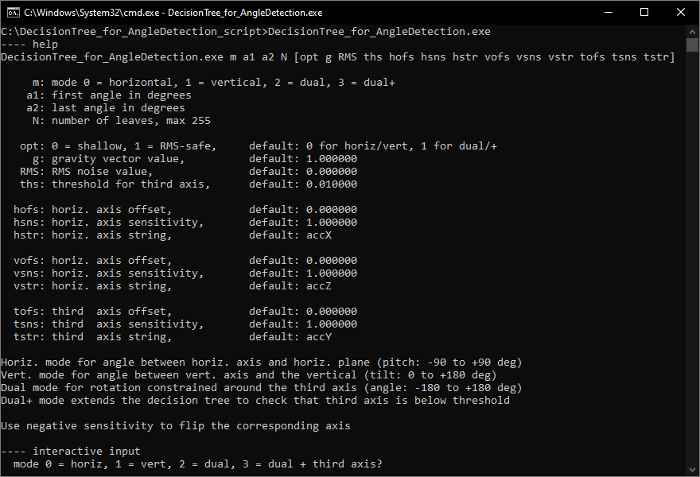

For this example, we'll select **mode 2** that will configure the Decision Tree to detect rotation constrained around the 3rd axis within a given range. The program will then ask for the following information:
- **first angle** *(in this tutorial set to -40 deg)*. It must be an integer in the range of -180 to 180 [deg].
- **last angle** *(in this tutorial set to 100 deg)*. It must be an integer in the range of -180 to 180 [deg]. This angle must be greater than the *first angle*
- **number of leaves** *(in this tutorial set to 16)*. It must be an integer in the range 2-255. The number of leaves is limited by the "Maximum number of results per decision tree" of the sensor. For the *LSM6DSOX*, the maximum number is 16:

- **opt** (*in this tutorial set to 1*). The value for determining the use of a shallow tree (*0*) or noise safe tree(1).
- **g** (*in this tutorial set to 1*). The value corresponding to 1g depends on the sensor model. 
- **RMS noise** *(in this tutorial set to 0.0018)*. It must be the value of the RMS noise reported on the datasheet for the selected full scale. For the *LSM6DSOX*, *the Acceleration RMS noise in normal/low-power mode* is 1.8 mg (0.0018 g):


In this tutorial inputs will be as shown in picture below:
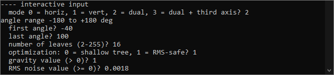

After the input of the required parameters is finished, the program will generate two files in the program folder (*dectree.txt* and *session.txt*) and a list of useful information are also displayed out in the Command Prompt.

- The file *dectree.txt* contains the decision tree that can be imported in the **Unico-GUI** software.
- The file *session.txt* contains the decision tree and more information such as:
-- **Angles and conversion formula** section: reports the angle resolution that the program has managed to get with the input parameters. It reports also a list of angles that the decision tree is able to detect. The *conversion formula for output code* is the formula that need to be applied to the MLC output code to have the corresponded angle in degrees.
-- **Output codes/labels** section: is the list of the output code that the MLC will output. It will be used to label the output in the **Unico-GUI** tool, during the generation of the *.ucf* configuration file.
-- **Other information** section: report the maximum recursion level of the decision tree and the number of angles that are prone to RMS noise.

# 3. Generate the Unico Configuration File (UCF file)

Once the decision tree files are generated by the *DecisionTree_for_AngleDetection.exe* program, open the **Unico-GUI** software tool and select the "*iNemo Inertial Modules*" from the list of Device Type and then select the "*STEVAL-MKI197V1 (LSM6DSOX)*" item from the list of Device Names. The *"Communication with the motherboard [Enabled]"* option box must be ***unchecked*** to enable the offline mode (no HW is required). Then click on the *"Select Device"* button or double click "*STEVAL-MKI197V1 (LSM6DSOX)*".


Confirm the message about limited functionality (only if the offline mode was selected) and open the MLC window:


Open the Machine Learning Core tab by clicking the MLC button:

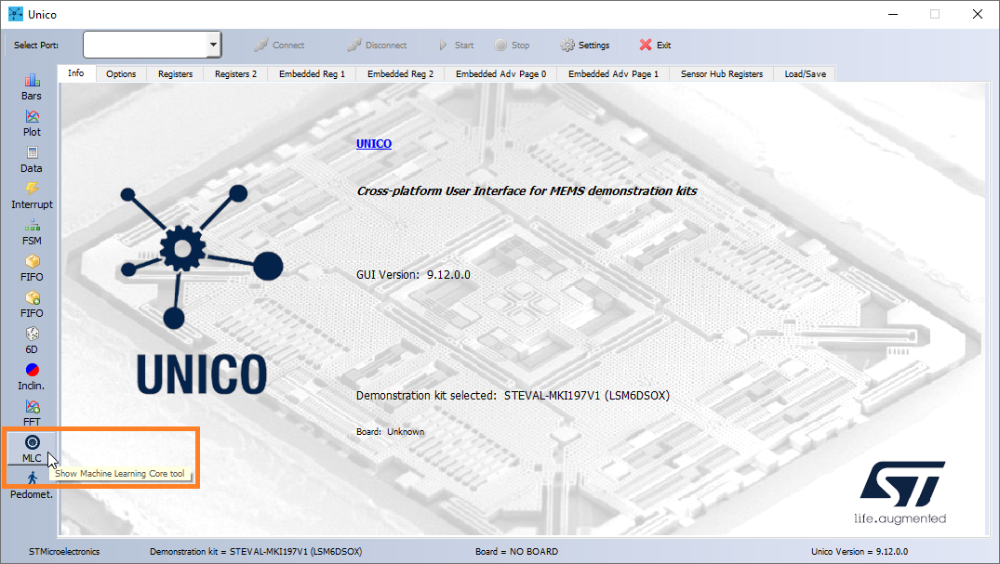

Go directly to the Configuration tab:


Select **LSM6DSOX** and choose the required parameters of the **MLC** and sensor. The chosen configuration of the sensor and MLC Output Data Rate (**ODR**) for this tutorial is visible in the picture below:


Select **one** decision tree from the list and continue configuring the MLC. The Window Length should be configured to **1 sample** to minimize the latency, the output will be updated on each sample. In this example the ODR is set to 52Hz, therefore the output is updated 52 times a second, every 19.23 ms. A longer window can be used for a less frequent but more stable output because the mean feature is selected below:


In the next step check the **Mean** feature for the accelerometer X axis (**ACC_X**) and Z axis (**ACC_Z**):

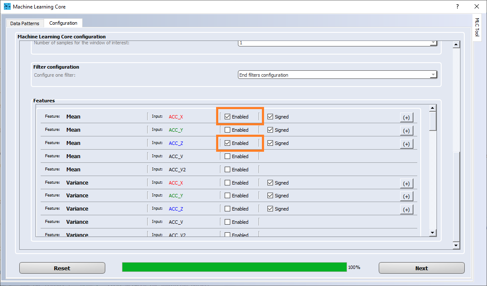

In the next section it is required to provide the **Decision Tree Attributes** names for each feature. The generated decision tree session file (*session.txt*) contains the names that needs to be used:

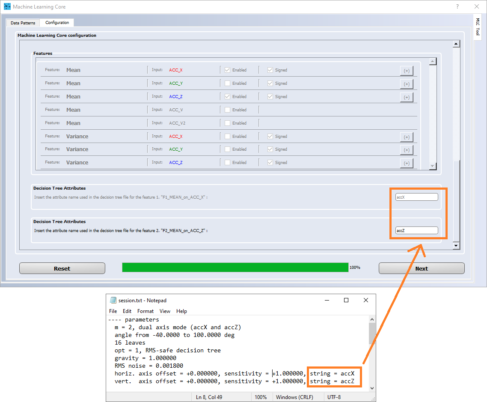

Once the attribute name is copied, the **Results labels** have to be copied as well from the decision tree session file as follow:

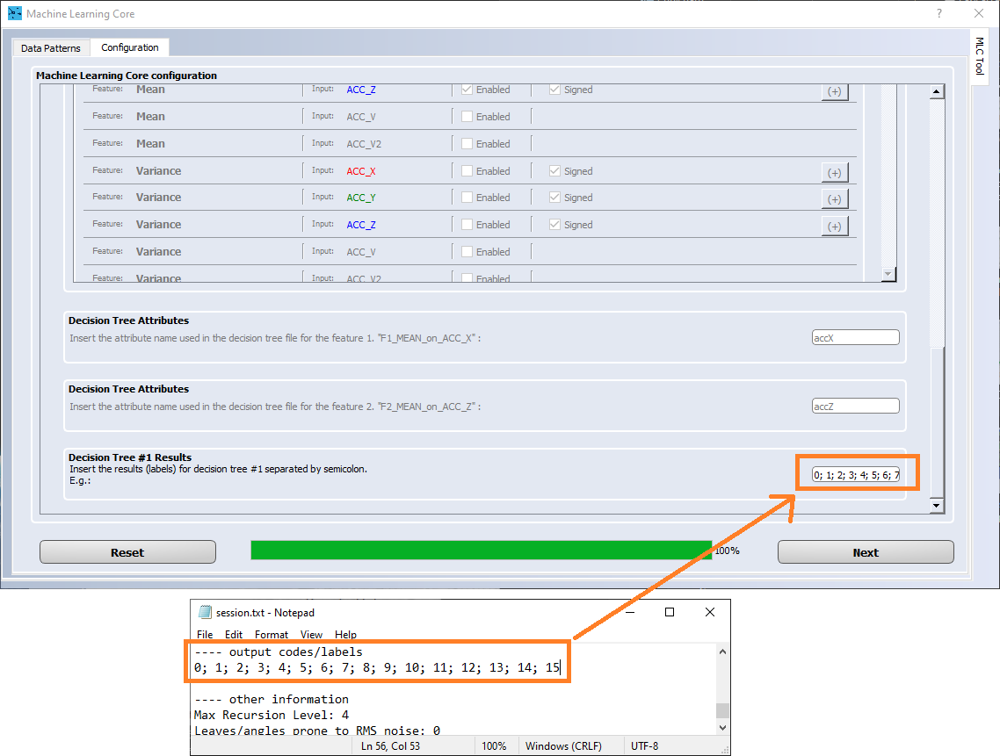

The next steps is to import the decision tree generated with the program (*dectree.txt*) and select the output name for the *.ucf* configuration file to be saved:

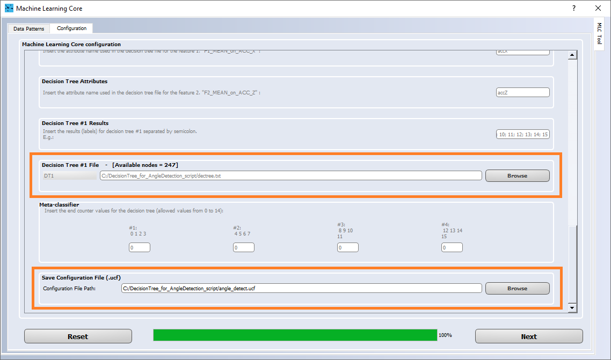

At this point the *.ucf* file has been generated and the **Unico-GUI** can be closed.


## 4. AlgoBuilder project

To test the *.ucf* file created with **Unico-GUI** in this tutorial we will create a project with **AlgoBuilder**.
Open **AlgoBuilder** and click on File -> New Design. From the *Firmware Settings* window select the firmware location, the  Toolchain and the Target platform as in picture below:


Since the ODR of the accelerometer and the ODR of the machine learning core has been set up to 52 Hz in **Unico-GUI**, then in the [Sensor Hub] building block we need to set the **Data Rate** to 52 Hz as well. To change the configuration, click on the [Sensor Hub] building block and configure it as in picture below:


At this point we need to drag-and-drop all the building blocks that are needed to build the example project. From the left list, simply drag-and-drop all the block needed which are:

1x *Sensor Hub -> Acceleration [g]*
1x *Sensor Hub -> FSM / MLC*
1x *Display -> Graph*
1x *Display -> Value*
1x *Other -> Int to Float*
2x *Constants -> Constant (Float)*
1x *Math Operators -> Multiply (\*)*
1x *Math Operators -> Add (\+)*
1x *Display -> Angle Level*

The blocks should to be placed as in picture below:


Some *display* block must be configured properly before it can be connected to other blocks, because input/output types between connected blocks must match; please see following picture to configure them properly:


Import the **.ucf** file by selecting the FSM/MLC building block, as in picture below:


The multiplication and the sum blocks have been placed to implement the computation of the angle from the value of the Machine Learning Core output register. The formula can be found in the **session.txt** in the section called *angles and conversion formula*, as shown below:

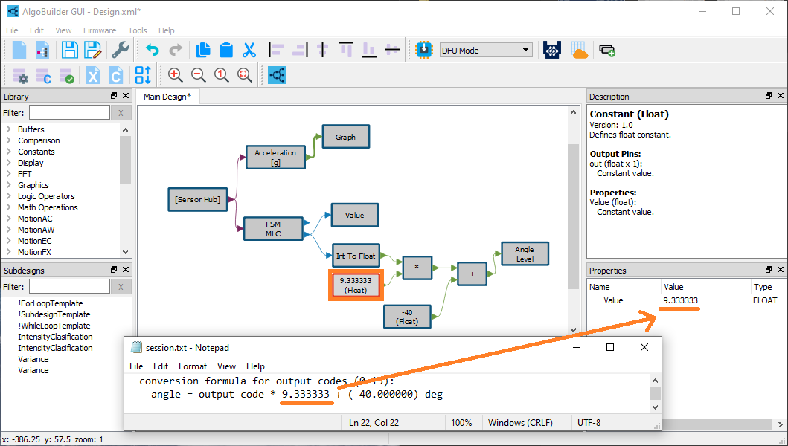
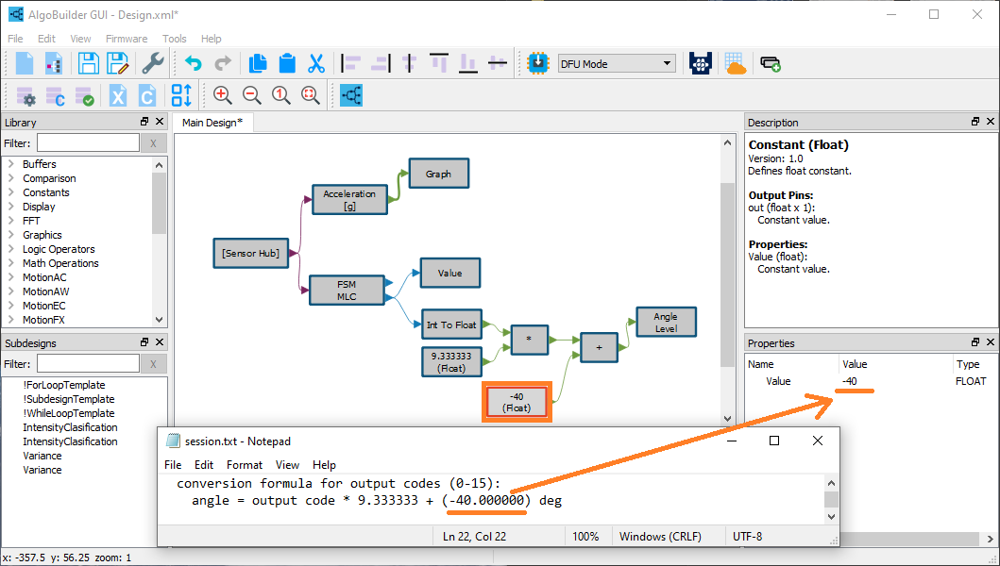

On the top menu, click on *Firmware -> Generate C Code*. After C Code generation is completed, click on *Firmware -> Build Firmware*. If there is any error, the compilation should complete successfully as in picture below:

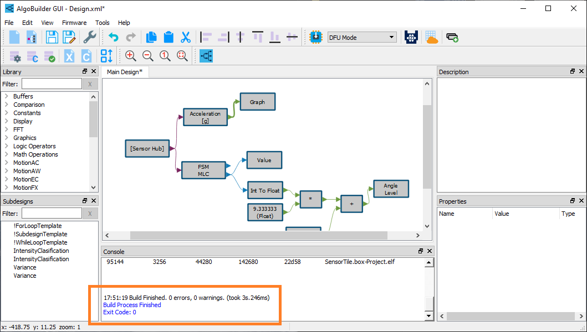

## 5. Programming SensorTile.box


The **SensorTile.box** must be in DFU (Direct Firmware Upgrade) mode before it can be programmed: disconnect the battery, press and hold the boot button, plug to USB to power the target microcontroller.


At this point click *Program Target* in **Algobuilder-GUI** as shown in the picture.


The **AlgoBuilder-GUI** should detect the SensorTile.box and program the binary generated. **AlgoBuilder-GUI** can be closed.

## 5. Testing the MLC angle detection

Open the **Unicleo-GUI** software. The software should automatically detect and connect to the *SensorTile.box*. Press the Start button to start the streaming from the *SensorTile.box*.


To see the detected Angle, click on the *Angle level* on the left panel. Move the board within +/-6 degrees respect to the horizon to see the variation detected in real time.

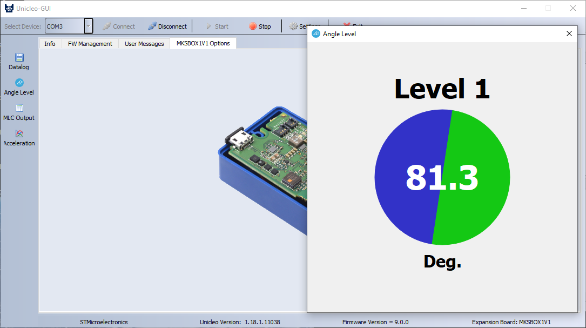

**Copyright © 2022 STMicroelectronics**